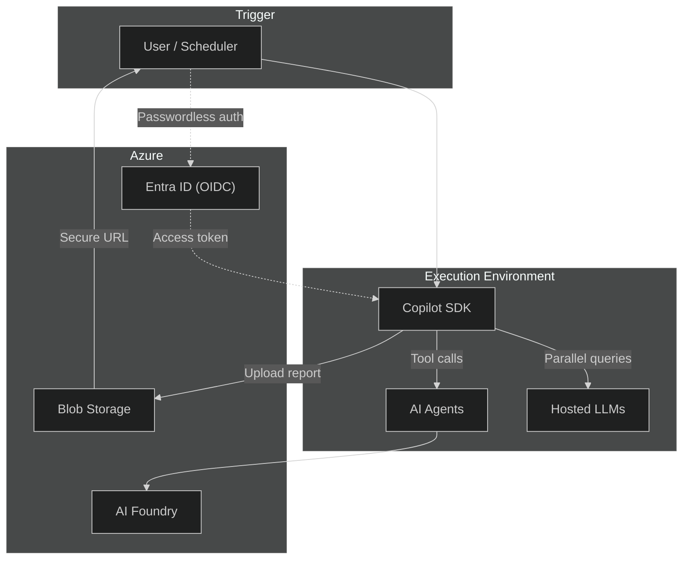

# CopilotReportForge

CopilotReportForge は、アドホックな LLM 操作を、管理された再現可能かつ監査可能なレポート生成パイプラインに変換するオープンソースプラットフォームです。ユーザーはエキスパートペルソナをシステムプロンプトとして定義し、評価クエリを入力として指定します。プラットフォームは GitHub Copilot SDK を介してすべてのペルソナを並列実行し、結果を構造化された JSON レポートに集約します。レポートは Azure Blob Storage にアップロードされ、期限付きの取り消し可能な URL を通じて共有されます。ワークフロー全体はエフェメラル（一時的）な GitHub Actions 環境でパスワードレス OIDC 認証を用いて実行されます — GPU のプロビジョニング、モデルホスティング、長期保存シークレットは一切不要です。ペルソナをコードではなく設定として扱うことで、同じパイプラインが製造品質パネルから金融リスク委員会まで、コード変更なしであらゆる業界に適応できます。インフラストラクチャは Terraform で完全管理されており、GitHub OAuth ログイン付きのブラウザベース Web UI もインタラクティブ利用向けに含まれています。

---

## コアコンセプト

CopilotReportForge は一つの中心的なアイデアに基づいています: **マルチペルソナ並列エージェント実行による自動レポート生成。**

複数の AI ペルソナ、並列処理、完全自動化パイプラインを組み合わせることで、アドホックな LLM 操作を管理された再現可能かつ監査可能なワークフローに変換します — AI インフラストラクチャの管理は不要です。

### 柱 1: マルチペルソナ並列実行

1. 単一のトピック（プロンプト）を定義する -- 例：「新しいワイヤレスヘッドホンを評価する」
2. 複数のペルソナ（品質エンジニア、消費者リサーチャー、規制スペシャリストなど）をシステムプロンプトとして定義する
3. すべてのペルソナを `asyncio.gather` で AI エージェントとして並列起動し、各エージェントが専門的な視点から構造化された JSON 出力を生成する
4. すべてのエージェント結果を一つの `ReportOutput`（Pydantic モデル）に集約する

ペルソナは**コードではなく設定**です。システムプロンプトを入れ替えるだけで、食品業界の評価パネルから金融リスク委員会、建築コンプライアンスレビューへと、コードを変更せずに切り替えることができます。

### 柱 2: 24 時間 365 日の自律運用

パイプライン全体は GitHub Actions のスケジュール（cron）、`workflow_dispatch`、または API トリガーで実行されます:

- 人手を介さず、さまざまなトピックについてレポートを継続的に生成できます
- タイムゾーンに関係なく、24 時間稼働します
- 生成されたレポートは Azure Blob Storage に保存され、SAS URL を通じて Teams/Slack に共有されます

### 柱 3: ドメインに依存しない

ペルソナ + 並列実行モデルは、あらゆる業界に適用できます。代表的な 8 つのユースケースについては、[業界横断的な適用性](#cross-industry-applicability) を参照してください。

---

## 問題を一文で

企業はコピー＆ペーストのチャットセッションを通じて LLM を使用しています — 構造化されておらず、再現不可能で、ガバナンスのない出力は、監査、スケール、ステークホルダーとの安全な共有ができません。

> 問題領域のより詳細な分析については、[課題と解決策](overview/problem_and_solution.md) を参照してください。

---

## CopilotReportForge の機能

CopilotReportForge はアドホックな LLM 操作を**管理された自動化パイプライン**に変換します:

1. **視点を定義する** — システムプロンプトをエキスパートペルソナとして割り当てます（例：「品質エンジニア」「コンプライアンスオフィサー」）。
2. **評価クエリを送信する** — 何を評価するかを指定します（例：「耐久性を評価」「規制遵守を確認」）。
3. **並列実行する** — すべてのクエリがホストされた LLM に対して同時に実行され、各クエリは割り当てられたペルソナの下で動作します。
4. **構造化された結果を生成する** — 出力は成功/失敗の追跡を含む型付き JSON レポートに収集されます。
5. **安全に共有する** — レポートは Azure Blob Storage にアップロードされ、期限付きの取り消し可能なアクセス URL で共有されます。

GPU プロビジョニングなし、モデルホスティングなし、長期保存シークレットなし。ワークフロー全体が完全な監査証跡を持つエフェメラルなサンドボックス環境で実行されます。

---

## アーキテクチャ概要



> コンポーネントレベルの詳細とデータフローについては、[アーキテクチャ](overview/architecture.md) を参照してください。

---

## 主要機能

| 機能 | 意味 |
|---|---|
| **並列マルチペルソナ実行** | N 個のクエリを同時に実行し、それぞれ異なるエキスパートペルソナで、結果を一つのレポートに集約 |
| **ゼロインフラ AI** | Copilot SDK を介してホストされた LLM を使用 — モデルデプロイや GPU 管理は不要 |
| **パスワードレスセキュリティ** | GitHub Actions と Azure 間の OIDC ベース認証 — 保存された API キーなし |
| **安全なアーティファクト共有** | 期限付き取り消し可能な URL でレポートを共有 — パブリックバケットの公開なし |
| **エージェントワークフロー** | 保存されたドキュメントを参照できる AI Foundry エージェントにドメイン固有タスクを委任 |
| **Infrastructure as Code** | すべての Azure リソース、ID、権限を Terraform で管理 |
| **Web UI** | GitHub OAuth ログイン付きのブラウザベースチャットとレポート生成 |
| **コンテナデプロイ** | GitHub Container Registry と Docker Hub のイメージを使用した Docker Compose サポート |

---

<a id="cross-industry-applicability"></a>

## 業界横断的な適用性

プラットフォームは**設計上ドメインに依存しません**。システムプロンプト（ペルソナ）とクエリ（評価軸）を変更するだけで、同じパイプラインがまったく異なる業界に対応します:

| 業界 | ペルソナ例 | 評価軸 |
|---|---|---|
| **製造** | 官能評価パネリスト、品質エンジニア | 食感、耐久性、規制遵守 |
| **不動産** | レイアウト評価者、ADA コンプライアンスレビュアー | アクセシビリティ、動線、空間利用 |
| **医療** | 臨床薬剤師、ガイドラインレビュアー | 薬物相互作用、用量、禁忌 |
| **金融** | クレジットアナリスト、コンプライアンスオフィサー | 信用エクスポージャー、市場リスク、規制遵守 |
| **教育** | カリキュラムデザイナー、アセスメントスペシャリスト | 学習目標、ルーブリック設計、授業計画 |
| **クリエイティブ** | ブランドストラテジスト、文化的感受性レビュアー | 包括性、ブランド整合性、市場共鳴 |
| **法務** | 契約アナリスト、規制コンプライアンスオフィサー | 条項分析、リスク評価、管轄レビュー |
| **小売** | マーチャンダイジングアナリスト、カスタマーエクスペリエンスレビュアー | 商品配置、価格戦略、顧客満足度 |

> 核心的な洞察: **システムプロンプトはペルソナ設定、クエリは評価軸です。** あらゆる専門家の判断を並列化、構造化し、大規模に監査できます。

---

## ビジネス価値

| 次元 | 価値 |
|---|---|
| **ゼロインフラ** | GPU クラスターやモデルホスティング不要 — ホストされた LLM と Azure AI Foundry による従量課金 |
| **数分で本番へ** | クローン → 設定 → Terraform + GitHub Actions で 1 時間以内にデプロイ |
| **エンタープライズセキュリティ** | パスワードレス OIDC、RBAC スコープアクセス、期限付き共有 URL、長期保存シークレットゼロ |
| **サンドボックス実行** | エフェメラルで使い捨ての環境 — ローカル実行より安全、認証情報の漏洩なし |
| **組み込み監査証跡** | すべての実行が誰が、何を、いつ、どのくらいで記録される — 追加ツール不要 |
| **ドメイン非依存** | コードではなく設定パラメータの変更であらゆる業界に適応 |
| **規制業界対応** | BYOK サポート、プライベートエンドポイント互換性、IaC 管理の RBAC（エアギャップ環境向け） |

---

## クイックスタート

```shell
# 1. クローンとインストール
git clone https://github.com/ks6088ts/template-github-copilot.git
cd template-github-copilot/src/python
make install-deps-dev

# 2. 環境設定
cp .env.template .env  # 設定を編集

# 3. Copilot CLI サーバーを起動
export COPILOT_GITHUB_TOKEN="your-github-pat"
make copilot

# 4. インタラクティブチャットを実行（別ターミナルで）
make copilot-app

# 5. マルチパースペクティブレポートを生成
uv run python scripts/report_service.py generate \
  --system-prompt "You are a product evaluation specialist." \
  --queries "Evaluate durability,Evaluate usability,Evaluate aesthetics" \
  --account-url "https://<account>.blob.core.windows.net" \
  --container-name "reports"
```

> 完全なセットアップ手順については、[はじめに](guide/getting_started.md) を参照してください。

---

## ドキュメント

| ドキュメント | 説明 |
|---|---|
| [課題と解決策](overview/problem_and_solution.md) | このプラットフォームが存在する理由 — エンタープライズ AI 導入のギャップとアーキテクチャによる解決 |
| [アーキテクチャ](overview/architecture.md) | システム設計、実行モデル、セキュリティモデル、拡張性 |
| [はじめに](guide/getting_started.md) | 前提条件、ローカル開発セットアップ、インフラプロビジョニング、CLI リファレンス |
| [デプロイ](operations/deployment.md) | ローカル開発から本番 GitHub Actions ワークフローまでのステップバイステップデプロイ |
| [GitHub OAuth App](guide/github_oauth_app.md) | Web UI 認証フローのための GitHub OAuth セットアップ |
| [Web UI ガイド](guide/web_ui_guide.md) | ブラウザベースのチャットとレポート生成インターフェースのウォークスルー |
| [コンテナ実行](operations/container_local_run.md) | Docker Compose によるプラットフォーム実行（ローカルビルド、Docker Hub、GHCR） |
| [責任ある AI](appendix/responsible_ai.md) | 公平性、透明性、安全性、プライバシーガイドラインとデプロイチェックリスト |
| [参考文献](appendix/references.md) | 外部リンクとさらなる参考情報 |

## インフラストラクチャ（Terraform シナリオ）

| シナリオ | 目的 |
|---|---|
| [Azure GitHub OIDC](https://github.com/ks6088ts/template-github-copilot/blob/main/infra/scenarios/azure_github_oidc/README.md) | GitHub Actions と Azure 間のパスワードレス信頼を確立 |
| [GitHub Secrets](https://github.com/ks6088ts/template-github-copilot/blob/main/infra/scenarios/github_secrets/README.md) | GitHub 環境とシークレット設定を自動化 |
| [Azure Microsoft Foundry](https://github.com/ks6088ts/template-github-copilot/blob/main/infra/scenarios/azure_microsoft_foundry/README.md) | モデルエンドポイントとストレージ付き AI Foundry をデプロイ |
| [Azure Container Apps](https://github.com/ks6088ts/template-github-copilot/blob/main/infra/scenarios/azure_container_apps/README.md) | モノリスサービス（Copilot CLI + API）を Azure Container App としてデプロイ（スタンドアロン） |

## ライセンス

[MIT](https://github.com/ks6088ts/template-github-copilot/blob/main/LICENSE)
