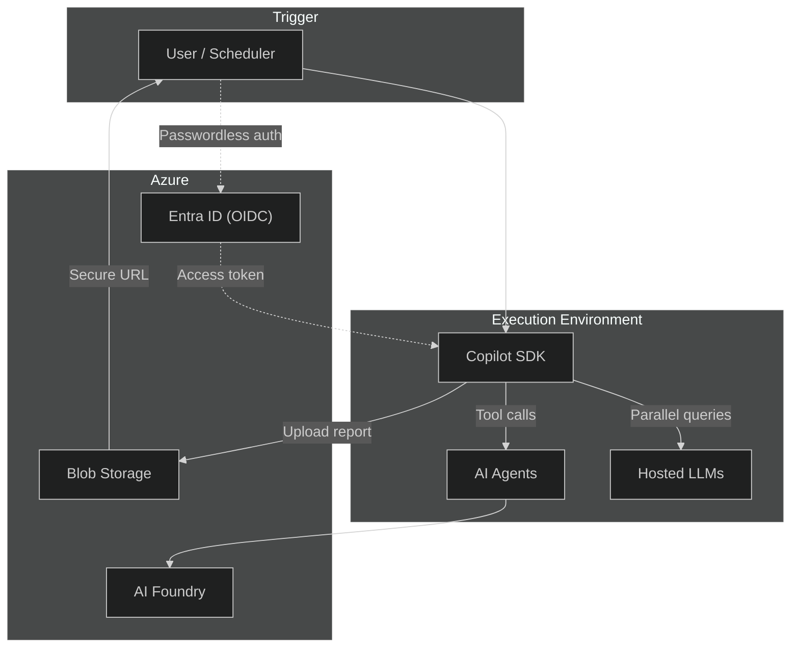

# CopilotReportForge

> **Navigation:** [README](../../README.md) > **CopilotReportForge (index)**

CopilotReportForge is an open-source platform that transforms ad-hoc LLM interactions into governed, repeatable, and auditable report-generation pipelines. Users define expert personas as system prompts and evaluation queries as input; the platform executes all personas in parallel via the GitHub Copilot SDK and aggregates the results into structured JSON reports. Reports are uploaded to Azure Blob Storage and shared through time-limited, revocable URLs. The entire workflow runs in ephemeral GitHub Actions environments with passwordless OIDC authentication — no GPU provisioning, no model hosting, and no long-lived secrets. By treating personas as configuration rather than code, the same pipeline adapts to any industry — from manufacturing quality panels to financial risk committees — without code changes. Infrastructure is fully managed via Terraform, and a browser-based Web UI with GitHub OAuth login is included for interactive use.

---

## Core Concept

CopilotReportForge is built on one central idea: **automated report generation through multi-persona parallel agent execution.**

By combining multiple AI personas, parallel processing, and fully automated pipelines, the platform transforms ad-hoc LLM interactions into governed, repeatable, and auditable workflows -- without managing any AI infrastructure.

### Pillar 1: Multi-Persona Parallel Execution

1. Define a single topic (prompt) -- for example, "Evaluate the new wireless headphones"
2. Define multiple personas (quality engineer, consumer researcher, regulatory specialist, etc.) as system prompts
3. Launch all personas as AI agents in parallel using `asyncio.gather`, with each agent producing structured JSON output from its specialized perspective
4. Aggregate all agent results into one `ReportOutput` (Pydantic model)

Personas are **configuration, not code**. By simply swapping system prompts, you can switch from a food industry evaluation panel to a financial risk committee to an architectural compliance review -- without changing the code.

### Pillar 2: 24/7 Autonomous Operation

The entire pipeline runs via GitHub Actions schedule (cron), `workflow_dispatch`, or API triggers:

- Reports can be continuously generated on different topics without human intervention
- The system operates 24 hours a day, regardless of time zone
- Generated reports are stored in Azure Blob Storage and shared to Teams/Slack via SAS URL

### Pillar 3: Domain Agnostic

The persona + parallel execution model can be applied to any industry. See [Cross-Industry Applicability](#cross-industry-applicability) for eight representative use cases.

---

## The Problem in One Sentence

Enterprises use LLMs through copy-paste chat sessions — producing unstructured, unreproducible, and ungoverned outputs that cannot be audited, scaled, or safely shared with stakeholders.

> For a deeper analysis of the problem space, see [Problem & Solution](problem_and_solution.md).

---

## What CopilotReportForge Does

CopilotReportForge converts ad-hoc LLM interactions into a **governed, automated pipeline**:

1. **Define perspectives** — Assign system prompts as expert personas (e.g., "Quality Engineer", "Compliance Officer").
2. **Submit evaluation queries** — Specify what to evaluate (e.g., "Assess durability", "Check regulatory compliance").
3. **Execute in parallel** — All queries run concurrently against hosted LLMs, each under its assigned persona.
4. **Produce structured results** — Outputs are collected into a typed JSON report with success/failure tracking.
5. **Share securely** — Reports are uploaded to Azure Blob Storage with time-limited, revocable access URLs.

No GPU provisioning, no model hosting, no long-lived secrets. The entire workflow runs in ephemeral sandbox environments with full audit trails.

---

## Architecture Overview



> For component-level details and data flows, see [Architecture](architecture.md).

---

## Key Capabilities

| Capability | What It Means |
|---|---|
| **Parallel Multi-Persona Execution** | Run N queries concurrently, each with a different expert persona, and aggregate results into one report |
| **Zero-Infrastructure AI** | Use hosted LLMs via the Copilot SDK — no model deployment or GPU management |
| **Passwordless Security** | OIDC-based authentication between GitHub Actions and Azure — no stored API keys |
| **Secure Artifact Sharing** | Reports shared via time-limited, revocable URLs — no public bucket exposure |
| **Agentic Workflows** | Delegate domain-specific tasks to AI Foundry Agents that can reference stored documents |
| **Infrastructure as Code** | All Azure resources, identities, and permissions managed via Terraform |
| **Web UI** | Browser-based chat and report generation with GitHub OAuth login |
| **Container Deployment** | Docker Compose support with images on GitHub Container Registry and Docker Hub |

---

## Cross-Industry Applicability

The platform is **domain-agnostic by design**. By changing only the system prompt (persona) and queries (evaluation dimensions), the same pipeline serves entirely different industries:

| Industry | Persona Example | Evaluation Dimensions |
|---|---|---|
| **Manufacturing** | Sensory panelist, Quality engineer | Texture, durability, regulatory compliance |
| **Real Estate** | Layout evaluator, ADA compliance reviewer | Accessibility, traffic flow, space utilization |
| **Healthcare** | Clinical pharmacist, Guideline reviewer | Drug interactions, dosage, contraindications |
| **Finance** | Credit analyst, Compliance officer | Credit exposure, market risk, regulatory adherence |
| **Education** | Curriculum designer, Assessment specialist | Learning objectives, rubric design, lesson plans |
| **Creative** | Brand strategist, Cultural sensitivity reviewer | Inclusivity, brand alignment, market resonance |
| **Legal** | Contract analyst, Regulatory compliance officer | Clause analysis, risk assessment, jurisdictional review |
| **Retail** | Merchandising analyst, Customer experience reviewer | Product placement, pricing strategy, customer satisfaction |

> The core insight: **system prompts are persona configuration, queries are evaluation dimensions.** Any expert judgment can be parallelized, structured, and audited at scale.

---

## Business Value

| Dimension | Value |
|---|---|
| **Zero Infrastructure** | No GPU clusters or model hosting — pay-per-use via hosted LLMs and Azure AI Foundry |
| **Minutes to Production** | Clone → configure → deploy in under an hour with Terraform + GitHub Actions |
| **Enterprise Security** | Passwordless OIDC, RBAC-scoped access, time-bounded sharing URLs, zero long-lived secrets |
| **Sandbox Execution** | Ephemeral, disposable environments — more secure than local execution, no credential leakage |
| **Built-in Audit Trail** | Every execution is logged with who, what, when, and how long — no additional tooling required |
| **Domain Agnostic** | Adapt to any industry by changing configuration parameters, not code |
| **Regulated Industry Ready** | BYOK support, private endpoint compatibility, IaC-managed RBAC for air-gapped environments |

---

## Quick Start

```shell
# 1. Clone and install
git clone https://github.com/ks6088ts/template-github-copilot.git
cd template-github-copilot/src/python
make install-deps-dev

# 2. Configure environment
cp .env.template .env  # Edit with your settings

# 3. Start the Copilot CLI server
export COPILOT_GITHUB_TOKEN="your-github-pat"
make copilot

# 4. Run the interactive chat (in another terminal)
make copilot-app

# 5. Generate a multi-perspective report
uv run python scripts/report_service.py generate \
  --system-prompt "You are a product evaluation specialist." \
  --queries "Evaluate durability,Evaluate usability,Evaluate aesthetics" \
  --account-url "https://<account>.blob.core.windows.net" \
  --container-name "reports"
```

> For full setup instructions, see [Getting Started](getting_started.md).

---

## Documentation

| Document | Description |
|---|---|
| [Problem & Solution](problem_and_solution.md) | Why this platform exists — the enterprise AI adoption gap and how the architecture addresses it |
| [Architecture](architecture.md) | System design, execution model, security model, and extensibility |
| [Getting Started](getting_started.md) | Prerequisites, local development setup, infrastructure provisioning, and CLI reference |
| [Deployment](deployment.md) | Step-by-step deployment from local dev to production GitHub Actions workflows |
| [GitHub OAuth App](github_oauth_app.md) | Setting up GitHub OAuth for the web UI authentication flow |
| [Web UI Guide](web_ui_guide.md) | Walkthrough of the browser-based chat and report generation interface |
| [Running Containers](container_local_run.md) | Running the platform via Docker Compose (local build, Docker Hub, or GHCR) |
| [Responsible AI](responsible_ai.md) | Fairness, transparency, safety, privacy guidelines, and deployment checklist |
| [References](references.md) | External links and further reading |

## Infrastructure (Terraform Scenarios)

| Scenario | Purpose |
|---|---|
| [Azure GitHub OIDC](../../infra/scenarios/azure_github_oidc/README.md) | Establish passwordless trust between GitHub Actions and Azure |
| [GitHub Secrets](../../infra/scenarios/github_secrets/README.md) | Automate GitHub environment and secrets configuration |
| [Azure Microsoft Foundry](../../infra/scenarios/azure_microsoft_foundry/README.md) | Deploy AI Foundry with model endpoints and storage |
| [Azure Container Apps](../../infra/scenarios/azure_container_apps/README.md) | Deploy monolith service (Copilot CLI + API) as Azure Container App (standalone) |

## License

[MIT](../../LICENSE)
