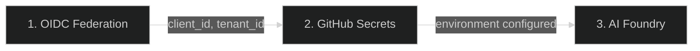
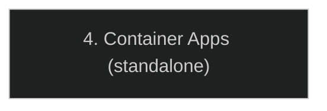

# デプロイ

---

## 概要

CopilotReportForge は、**Terraform**（Azure と GitHub のインフラストラクチャ用）と **GitHub Actions**（AI ワークフロー実行用）の組み合わせでデプロイされます。デプロイにより、GitHub Actions ワークフローが OIDC を介して Azure に認証し、AI 評価を実行し、結果を Azure Blob Storage に保存する完全自動化パイプラインが作成されます。

---

## 前提条件

| 要件 | 目的 |
|---|---|
| Azure サブスクリプション | AI サービス、ストレージ、ID のホスト |
| GitHub リポジトリ | コード、Actions ワークフロー、環境のホスト |
| Terraform 1.0+ | インフラプロビジョニング |
| Azure CLI (`az`) | Terraform の Azure 認証 |
| GitHub CLI (`gh`) | GitHub 環境とシークレットの設定 |

---

## インフラストラクチャデプロイ

### デプロイ順序

3 つの Terraform シナリオは、各ステップが前のステップの出力に依存するため、順番にデプロイする必要があります:



アプリケーションを Azure Container Apps にデプロイするための追加のスタンドアロンシナリオも利用可能です:



### ステップ 1: OIDC フェデレーション（`azure_github_oidc`）

GitHub リポジトリと Azure 間の信頼関係を作成します。このステップの後、GitHub Actions は保存された認証情報なしで Azure に認証できます。

```bash
cd infra/scenarios/azure_github_oidc
terraform init
terraform plan -out=tfplan
terraform apply tfplan
```

**主要出力:** `client_id`、`tenant_id`、`subscription_id`

### ステップ 2: GitHub Secrets（`github_secrets`）

OIDC の出力を取得し、GitHub リポジトリの暗号化された環境シークレットとして注入します。Copilot トークンや Slack Webhook URL などのランタイムシークレットも設定します。

```bash
cd infra/scenarios/github_secrets
# terraform.tfvars を値で編集
terraform init
terraform plan -out=tfplan
terraform apply tfplan
```

### ステップ 3: AI Foundry（`azure_microsoft_foundry`）

Azure AI Hub、モデルエンドポイント、Storage Account、オプションの AI Search インデックスをデプロイします。このステップは**オプション** — 参照データアクセス付きのドメイン固有 AI エージェントが必要な場合にのみ必要です。

```bash
cd infra/scenarios/azure_microsoft_foundry
terraform init
terraform plan -out=tfplan
terraform apply tfplan
```

### ステップ 4（スタンドアロン）: Container Apps（`azure_container_apps`）

モノリスコンテナ（単一イメージに Copilot CLI + API サーバー）を Azure Container App としてデプロイします。`compose.docker.yaml` の `monolith` サービスをクラウドで実行するのと同等です。コンテナは内部的に supervisord を使用して両方のプロセスを管理します。このステップは他の 3 つのシナリオから**独立**しています。

```bash
cd infra/scenarios/azure_container_apps
export ARM_SUBSCRIPTION_ID=$(az account show --query id --output tsv)
terraform init
terraform plan -out=tfplan
terraform apply tfplan
```

**主要出力:** `app_url`、`app_fqdn`

> **GitHub OAuth App コールバック URL:** Container Apps にデプロイした後、GitHub OAuth App 設定の **Authorization callback URL** を更新する必要があります。`app_url` 出力値に `/auth/callback` を追加してください。例: `https://app-azurecontainerapps.grayocean-38a4ba3f.japaneast.azurecontainerapps.io/auth/callback`。詳細は [GitHub OAuth App セットアップ](../guide/github_oauth_app.md#deploying-to-azure-container-apps) を参照してください。

完全な設定詳細（環境変数を含む）については、[azure_container_apps/README.md](https://github.com/ks6088ts/template-github-copilot/blob/main/infra/scenarios/azure_container_apps/README.md) を参照してください。

---

## GitHub Actions ワークフロー

インフラストラクチャがデプロイされると、AI 評価は GitHub Actions ワークフローとして実行されます。以下でトリガーできます:

| トリガー | 例 |
|---|---|
| **手動ディスパッチ** | Actions タブで「Run workflow」をクリック |
| **スケジュール** | 定期評価のための cron 式 |
| **Push/PR** | CI/CD の一部として評価を実行 |
| **API 呼び出し** | 外部システムからのプログラム的なトリガー |

### 利用可能なワークフロー

リポジトリには以下の CI/CD と自動化ワークフローが含まれています:

| ワークフロー | ファイル | 目的 |
|---|---|---|
| **Test** | `test.yaml` | Python CI テストの実行（フォーマットチェック、lint、テスト） |
| **Docker** | `docker.yaml` | Docker イメージのビルド、lint、スキャン |
| **Infrastructure** | `infra.yaml` | Terraform 設定の検証 |
| **Report Service** | `report-service.yaml` | AI 評価の実行とレポート生成 |
| **Copilot CLI** | `github-copilot-cli.yaml` | Copilot CLI ベースのワークフロー実行 |
| **Copilot SDK** | `github-copilot-sdk.yaml` | Copilot SDK ベースのワークフロー実行 |
| **Docker Release** | `docker-release.yaml` | Docker Hub への Docker イメージ公開 |
| **GHCR Release** | `ghcr-release.yaml` | GitHub Container Registry への Docker イメージ公開 |

### ワークフロー実行

各ワークフロー実行は:
1. OIDC を介して Azure に認証（認証情報の保存なし）
2. Copilot SDK を使用して並列 LLM クエリを実行
3. 結果を構造化レポートに集約
4. レポートを Azure Blob Storage にアップロード
5. オプションで Slack に通知

### `report-service` ワークフロー

メインのレポート生成ワークフロー（`report-service.yaml`）は**手動ディスパッチ**（`workflow_dispatch`）でトリガーされます。インフラストラクチャ関連の設定（ストレージアカウント、BYOK 設定など）は **GitHub 環境シークレット**から読み取られます — ランタイムで必要なのはタスク固有の入力のみです:

| 入力 | 型 | 説明 |
|---|---|---|
| `system_prompt` | string | AI ペルソナを定義するシステムプロンプト |
| `queries` | string | カンマ区切りの評価クエリ |
| `auth_method` | choice | `github_copilot` または `foundry_entra_id` |
| `model` | choice | Copilot CLI のモデル（`gpt-5-mini`、`claude-sonnet-4.6`、`claude-opus-4.6`、`claude-opus-4.6-fast`） |
| `sas_expiry_hours` | number | レポートダウンロード URL の有効期限（時間） |
| `save_artifacts` | boolean | ワークフローアーティファクトを保存するかどうか |
| `retention_days` | number | アーティファクトの保持日数 |

以下の値は **環境シークレット**（`github_secrets` Terraform シナリオで設定）から取得され、ランタイムで提供する必要はありません:

`ARM_CLIENT_ID`、`ARM_SUBSCRIPTION_ID`、`ARM_TENANT_ID`、`COPILOT_GITHUB_TOKEN`、`SLACK_WEBHOOK_URL`、`AZURE_BLOB_STORAGE_ACCOUNT_URL`、`AZURE_BLOB_STORAGE_CONTAINER_NAME`、`MICROSOFT_FOUNDRY_PROJECT_ENDPOINT`、`BYOK_PROVIDER_TYPE`、`BYOK_BASE_URL`、`BYOK_API_KEY`、`BYOK_MODEL`、`BYOK_WIRE_API`

---

## ドメイン適応

プラットフォームを新しいドメインに適応させるには、設定の変更のみが必要です — コード変更は不要です:

1. **システムプロンプトを更新** — ドメインの AI ペルソナを定義
2. **クエリを更新** — 評価基準を定義
3. **AI エージェントをデプロイ**（オプション）— ドメイン固有の参照データ付き Foundry Agent を作成

例: 製品評価から臨床ガイドラインレビューへの切り替え:

```bash
uv run python scripts/report_service.py generate \
  --system-prompt "You are an expert clinical guideline reviewer." \
  --queries "Evaluate evidence quality,Check recommendation consistency,Assess applicability" \
  --account-url "https://<account>.blob.core.windows.net" \
  --container-name "reports"
```

---

## ローカル開発セットアップ

GitHub Actions にデプロイする前のローカル開発とテスト:

```bash
cd src/python

# 依存関係のインストール
make install-deps-dev

# 環境変数の設定
cp .env.template .env  # 設定を編集
export COPILOT_GITHUB_TOKEN="your-github-pat"

# Copilot CLI サーバーを起動
make copilot

# 別ターミナルで: インタラクティブチャットを実行
make copilot-app

# または: レポートを生成
uv run python scripts/report_service.py generate \
  --system-prompt "You are a product evaluator." \
  --queries "Evaluate durability,Evaluate usability" \
  --account-url "https://<account>.blob.core.windows.net" \
  --container-name "reports"
```

詳細なローカルセットアップ手順については、[はじめに](../guide/getting_started.md) を参照してください。

---

## 検証

| チェック | 検証方法 |
|---|---|
| OIDC 信頼が確立済み | GitHub Actions ワークフローがシークレットなしで認証 |
| シークレットが設定済み | GitHub 環境にすべての期待されるシークレットが表示 |
| AI モデルがデプロイ済み | Azure AI Hub にモデルエンドポイントが表示 |
| レポート生成が動作 | ワークフローが完了し、blob URL を出力 |
| 通知が動作 | Slack チャネルがレポートサマリーを受信 |

---

## トラブルシューティング

| 問題 | 考えられる原因 | 解決策 |
|---|---|---|
| OIDC 認証が失敗 | フェデレーション資格情報の不一致 | `subject` クレームがブランチ/環境と一致することを確認 |
| Terraform ステートの競合 | 複数ユーザーが同時に apply | リモートステートバックエンド（Azure Storage）を使用 |
| モデルエンドポイントが利用不可 | モデルが未デプロイまたはクォータ超過 | AI Hub のデプロイメントとサブスクリプションのクォータを確認 |
| Blob アップロード権限拒否 | RBAC ロールの欠落 | `Storage Blob Data Contributor` ロールが割り当てられていることを確認 |
| ワークフローがタイムアウト | 並列クエリが多すぎる | クエリ数を減らすかタイムアウトを延長 |

---

## 更新とロールバック

### アプリケーションの更新

実行中の Container Apps デプロイメントを更新するには:

1. 新しいコンテナイメージをビルドしてプッシュ（`docker-release.yaml` または `ghcr-release.yaml` ワークフロー経由）
2. `azure_container_apps` Terraform シナリオを再実行 — 最新のイメージがプルされます

```bash
cd infra/scenarios/azure_container_apps
export ARM_SUBSCRIPTION_ID=$(az account show --query id --output tsv)
terraform apply
```

### ロールバック

以前のバージョンにロールバックするには、Terraform 変数で以前のイメージタグを指定して再適用します。すべての以前のイメージは Docker Hub と GHCR に Git タグバージョンで利用可能です。
