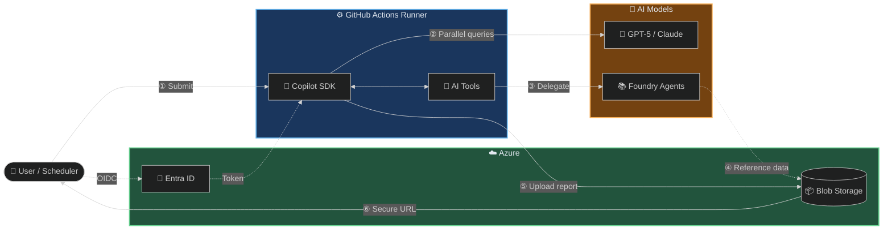
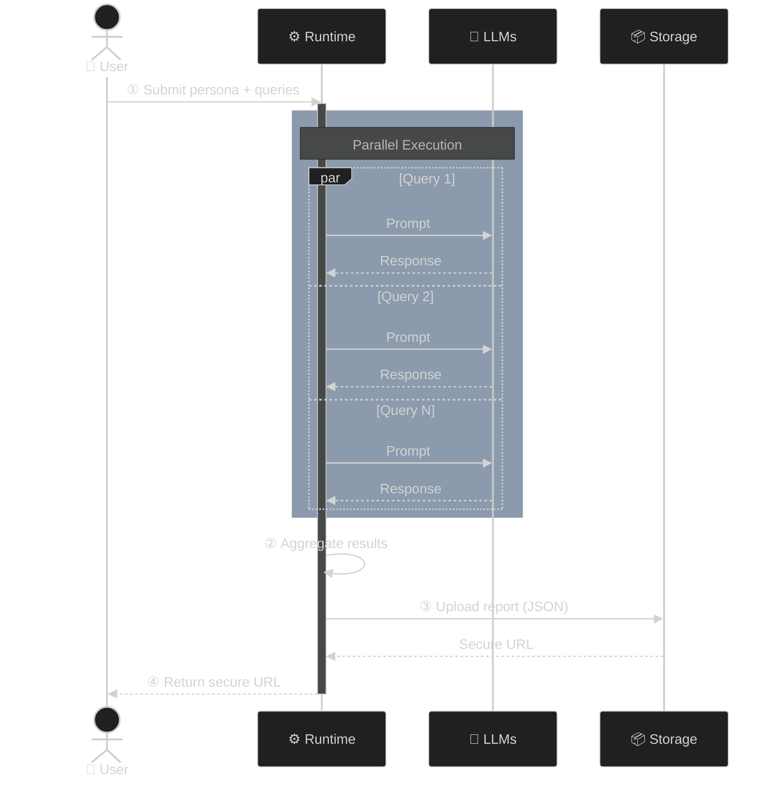
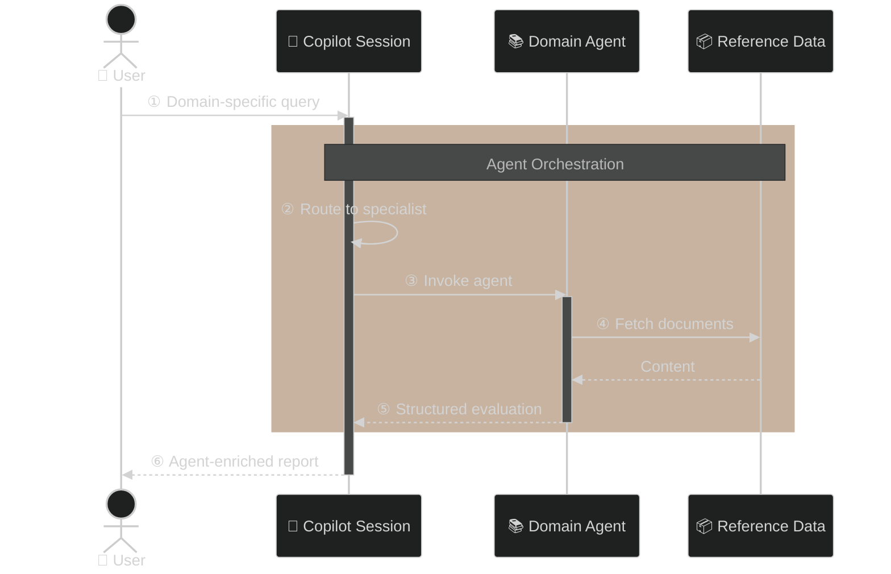
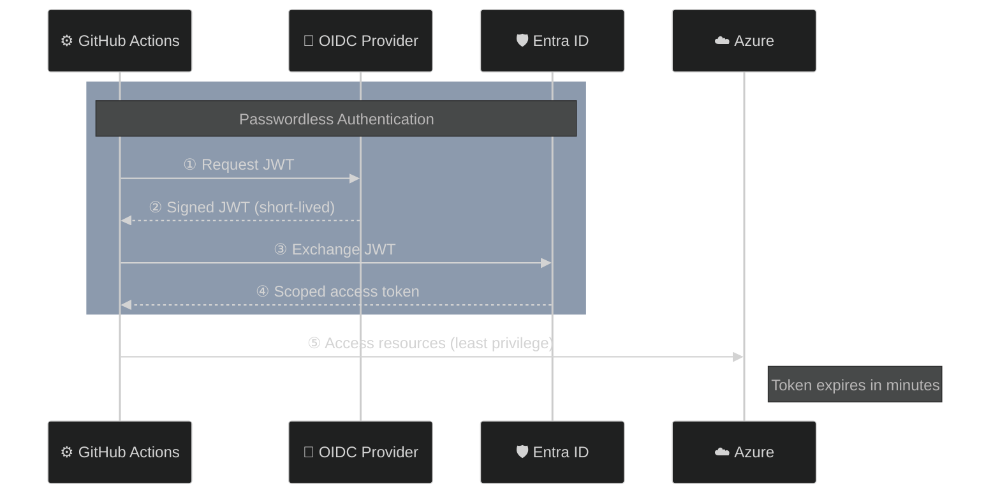
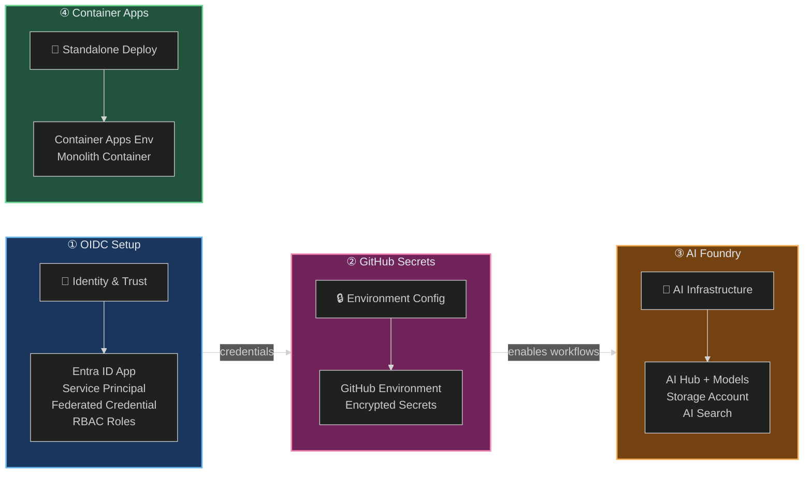

# アーキテクチャ

---

## 設計哲学

CopilotReportForge は、[エンタープライズ AI 導入で特定された課題](problem_and_solution.md) に直接対処する 4 つの原則に基づいて構築されています:

| 原則 | 意味 |
|---|---|
| **合成可能性** | すべてのビルディングブロック（LLM クエリ、AI エージェント、ストレージ、通知）は独立しています。システムプロンプトを入れ替えてドメインを変更、ツールを追加して機能を追加できます。 |
| **ゼロインフラ AI** | Copilot SDK を通じてホストされた LLM を利用。GPU プロビジョニング、モデル管理、推論サーバーは不要です。 |
| **デフォルトでセキュア** | OIDC フェデレーション、スコープ付き RBAC、期限付き共有 URL、エフェメラル実行環境。どこにも長期保存シークレットなし。 |
| **監査可能な実行** | すべての実行が完全な入出力コンテキスト、実行メタデータ、来歴と共に記録されます — 設定ではなくデフォルトで。 |

---

## 実行モデル: なぜ GitHub Actions か?

重要なアーキテクチャの決定として、**すべての AI エージェント実行は開発者のローカルマシンではなく GitHub Actions ランナー内で実行**されます。この選択は 3 つの問題を同時に解決します:

### エフェメラルな分離

各ワークフロー実行はクリーンなサンドボックス環境を起動し、完了時に破棄します。シークレット、中間ファイル、モデル出力は実行期間中のみ存在します。これは本質的に、開発者のワークステーションで AI エージェントを実行するよりも安全です。ワークステーションではシェル履歴、ファイルシステムのアーティファクト、マルウェアを通じて認証情報が漏洩する可能性があります。

### 環境の一貫性

すべてのチームメンバー、すべてのワークフロー、すべてのドメインが同じランナー設定を使用します。これにより「自分のマシンでは動く」問題が排除され、チーム間の環境ドリフトが防止され、誰がトリガーしたかに関係なく AI 評価結果が再現可能になります。

### 組み込みガバナンス

GitHub Actions は、誰が何をいつ、どのくらいの時間、どのような入出力で実行したかをネイティブに記録します。完全な実行ログが保持され、検索可能です。組織では、すべてのワークフロー活動が企業監査ログに記録されます — 追加のツールなしでコンプライアンス対応の監査証跡を提供します。

---

## システムアーキテクチャ



### コンポーネントの責務

| コンポーネント | 役割 |
|---|---|
| **Copilot SDK Client** | LLM セッションの管理、クエリの並列送信、ツールコールの処理、結果の集約 |
| **ホストされた LLM** | テキスト生成機能の提供（GPT-5-mini、GPT-5、Claude Sonnet/Opus 4.6）— セルフホスティング不要 |
| **AI Foundry Agents** | 参照データ（ドキュメント、画像、仕様書）にアクセスできるドメイン固有の AI ペルソナ |
| **Entra ID** | OIDC フェデレーションを介した短期アクセストークンの発行 — 保存された認証情報なし |
| **Blob Storage** | レポートと参照データの保存、期限付き共有 URL の生成 |
| **GitHub Actions** | エフェメラル実行、OIDC 認証、監査ログの提供 |

---

## コアデータフロー: レポート生成



**このフローの主要特性:**
- 各クエリは**独立したセッション**で実行されます — ペルソナ間の会話的な相互汚染なし。
- 結果は**型付けされ検証**されます — 出力スキーマはクエリ総数、成功数、失敗数を追跡します。
- レポートはアップロード後**不変**です — 評価のポイントインタイムの記録を提供します。

---

## エージェントデータフロー: ドメイン固有の評価

参照データ（フロアプラン、製品仕様、臨床ガイドライン）へのアクセスを必要とする評価のために、プラットフォームは AI Foundry Agents を統合します:



Copilot セッションはクエリのコンテキストに基づいて、Foundry Agent に委任するタイミングを自律的に判断します。これにより、単一セッション内での**マルチエージェントオーケストレーション**が可能になります — ユーザーは高レベルのクエリを送信し、システムが適切なドメインスペシャリストにルーティングします。

---

## 認証モデル



### なぜ OIDC フェデレーションか?

従来の CI/CD 認証は長期有効な API キーをリポジトリシークレットとして保存します。これらのキーはローテーションが困難で、漏洩しやすく、広範なアクセスを付与します。OIDC フェデレーションはこのパターンを完全に排除します:

- **Azure アクセスのための保存シークレットなし** — トークンはワークフロー実行ごとに発行され、数分で期限切れになります。
- **最小権限スコーピング** — 各トークンは特定の RBAC ロールにスコープされます（下記参照）。
- **ローテーションオーバーヘッドなし** — ローテーションする認証情報がありません。

### RBAC ロール

| ロール | 目的 |
|---|---|
| Contributor | Terraform を介した Azure リソース管理 |
| Storage Blob Data Contributor | レポートと参照データの読み書き |
| Storage Blob Delegator | 安全な共有 URL のためのユーザー委任キー生成 |
| Cognitive Services OpenAI User | ホストされたモデルエンドポイントへのアクセス |

---

## インフラストラクチャアーキテクチャ

すべてのインフラストラクチャは Terraform を通じてコードとして管理され、再利用可能なモジュールとデプロイシナリオに整理されています。



| シナリオ | 目的 | 主要リソース |
|---|---|---|
| `azure_github_oidc` | GitHub と Azure 間のパスワードレス信頼の確立 | Entra ID アプリ、サービスプリンシパル、フェデレーション資格情報、RBAC ロール |
| `github_secrets` | GitHub 環境設定の自動化 | GitHub 環境、暗号化されたシークレット |
| `azure_microsoft_foundry` | AI 機能とストレージのデプロイ | AI Hub、モデルデプロイメント、Storage Account、オプションの AI Search |
| `azure_container_apps` | モノリスサービスの Azure へのデプロイ | リソースグループ、Container Apps 環境、モノリスコンテナ（Copilot CLI + API） |

> 最初の 3 つのシナリオは順番にデプロイする必要があります: OIDC → Secrets → Foundry。Container Apps シナリオはスタンドアロンです。ステップバイステップの手順については、[デプロイ](../operations/deployment.md) を参照してください。

---

## アプリケーションアーキテクチャ

プラットフォームは AI 実行パイプラインとやり取りするための 3 つのインターフェースを提供します:

### CLI ツール

チャット、レポート生成、エージェント管理、ストレージ操作、通知のためのコマンドラインインターフェース。すべての CLI は同じパターンに従います: 環境変数で設定し、型付きコマンドで実行。

### Web アプリケーション

GitHub OAuth ログイン、インタラクティブチャット、並列レポート生成パネルを備えたブラウザベースのインターフェース。ユーザーは GitHub ID で認証し、アプリケーションがユーザーに代わって Copilot リクエストを行います。

### GitHub Actions ワークフロー

スケジュール、手動ディスパッチ、または API 呼び出しでトリガーされる自動ワークフロー。これらはプライマリの本番実行パスであり、完全な監査証跡を持つエフェメラル環境を提供します。

| インターフェース | 最適な用途 |
|---|---|
| CLI | ローカル開発、スクリプティング、自動化 |
| Web UI | インタラクティブな探索、アドホック評価 |
| GitHub Actions | 本番実行、スケジュールレポート、管理されたワークフロー |

---

## LLM プロバイダーモデル

プラットフォームは統一されたプロバイダーインターフェースを通じて複数の LLM バックエンド設定をサポートします:

| モード | 認証 | ユースケース |
|---|---|---|
| **Copilot**（デフォルト） | Copilot CLI 経由の GitHub トークン | 標準使用 — API キー管理なしでホストされたモデルにアクセス |
| **API Key** | 静的 API キー | Copilot が利用できない場合の直接モデル API アクセス |
| **Entra ID** | Azure Entra ID ベアラートークン | プライベートエンドポイントとマネージド ID を使用したエンタープライズデプロイメント |

モード間の切り替えにはコードではなく設定パラメータの変更が必要です。これにより、異なるセキュリティ要件を持つ環境（オープンインターネット開発からエアギャップ企業ネットワークまで）へのデプロイが可能になります。

### プロバイダー拡張性

プロバイダーシステムは `template_github_copilot/providers.py` で 3 つのコンポーネントで実装されています:

- **`AuthMethod` enum** — 利用可能な認証方法を定義: `GITHUB_COPILOT`、`API_KEY`、`FOUNDRY_ENTRA_ID`。
- **`create_provider()` ファクトリ** — 選択された `AuthMethod` に基づいて、`ProviderConfig`（BYOK モードの場合、またはデフォルト Copilot バックエンドの場合は `None`）とターゲットモデル名を含む `ProviderResult` を返します。
- **`register_provider()` フック** — コアコードを変更せずにカスタムプロバイダービルダーを追加できます。同じ引数を受け取り `ProviderResult` を返す callable を登録します。

```python
from template_github_copilot.providers import AuthMethod, register_provider, ProviderResult

def my_custom_provider(**kwargs) -> ProviderResult:
    # Build your custom ProviderConfig / model here
    ...

# Note: register_provider requires an AuthMethod enum value, not a string
register_provider(AuthMethod.API_KEY, my_custom_provider)
```

---

## カスタム Copilot ツール

プラットフォームは Copilot SDK セッションに追加機能を拡張するカスタムツールをサポートします。ツールは `template_github_copilot/tools/` で定義され、Copilot セッション作成時に自動的に登録されます。

### 組み込みツール

| ツール | 説明 | 入力 |
|---|---|---|
| `list_foundry_agents` | Microsoft Foundry 上のすべての利用可能なエージェントを一覧表示 | `endpoint`（オプション、デフォルトは環境変数） |
| `call_foundry_agent` | 指定された Foundry エージェントをユーザーメッセージで呼び出す | `agent_name`、`user_message`、`conversation_id`（オプション）、`endpoint`（オプション） |

### カスタムツールの追加

1. `template_github_copilot/tools/` に新しいファイルを作成します（例: `my_tool.py`）。
2. Pydantic 入力モデルを定義し、`copilot.tools` の `@define_tool` デコレーターを使用してツール関数を実装します。
3. `template_github_copilot/tools/__init__.py` の `get_custom_tools()` でツールをエクスポートします。

```python
from copilot.tools import define_tool
from pydantic import BaseModel, Field

class MyToolInput(BaseModel):
    query: str = Field(description="The query to process")

@define_tool(
    description="Description visible to the LLM",
)
def my_tool(params: MyToolInput) -> str:
    return f"Processed: {params.query}"
```

Copilot SDK セッションは自動的にツールを検出し、LLM がユーザーのクエリに関連すると判断したときにそれを呼び出します。

---

## 拡張性

アーキテクチャは 5 つのレベルでの拡張を想定して設計されています:

| 拡張ポイント | 拡張方法 | 例 |
|---|---|---|
| **新しいドメイン** | システムプロンプトとクエリを変更 | 製品評価から臨床ガイドラインレビューへの適応 |
| **新しい AI 機能** | `tools/` に Copilot ツールを追加 | Web スクレイパー、データベース検索、計算エンジン |
| **新しい AI エージェント** | ドメイン指示付きの Foundry Agent を作成 | フロアプランデータにアクセスできる特化型不動産鑑定士 |
| **新しい LLM プロバイダー** | `register_provider()` で登録 | 独自認証を持つカスタムモデルエンドポイント |
| **新しい出力チャネル** | レポート JSON を後処理 | Slack、メール、ダッシュボード、PowerBI への送信 |

---

## 技術スタック

| レイヤー | 技術 |
|---|---|
| 言語 | Python 3.13+ |
| AI SDK | GitHub Copilot SDK、Azure AI Projects SDK |
| LLM クライアント | OpenAI Python SDK |
| Web フレームワーク | FastAPI |
| HTTP クライアント | httpx |
| データバリデーション | Pydantic、pydantic-settings |
| CLI フレームワーク | Typer |
| 環境 | python-dotenv |
| クラウドストレージ | Azure Blob Storage |
| 認証 | Azure Identity（OIDC、DefaultAzureCredential） |
| インフラストラクチャ | Terraform |
| CI/CD | GitHub Actions |
| コンテナ化 | Docker、Docker Compose |
| テスト | pytest、pytest-cov |
