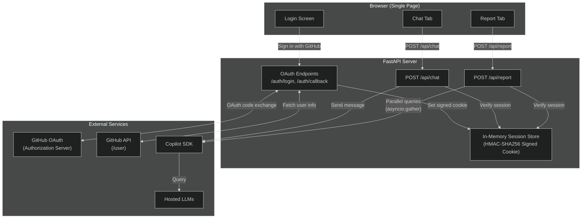
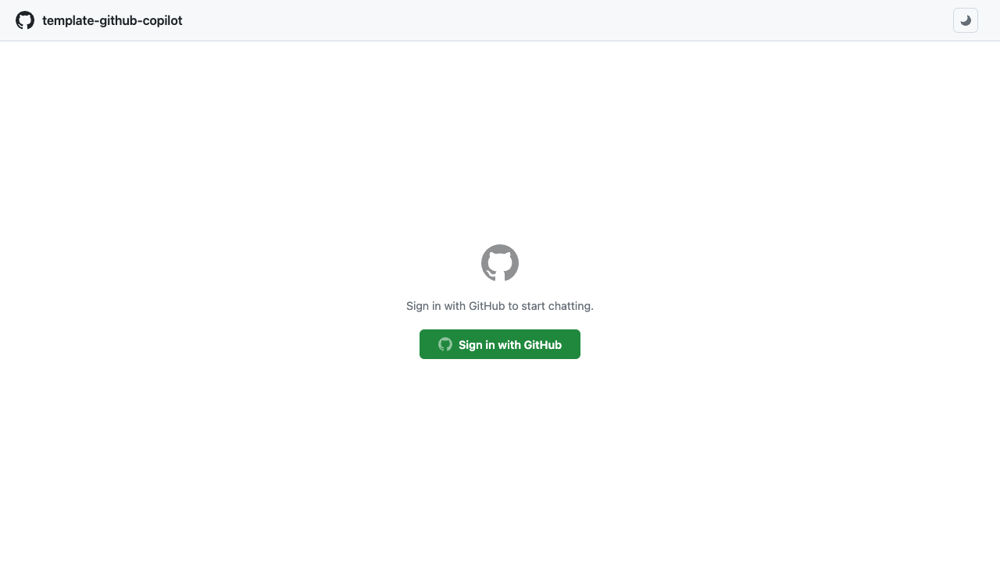
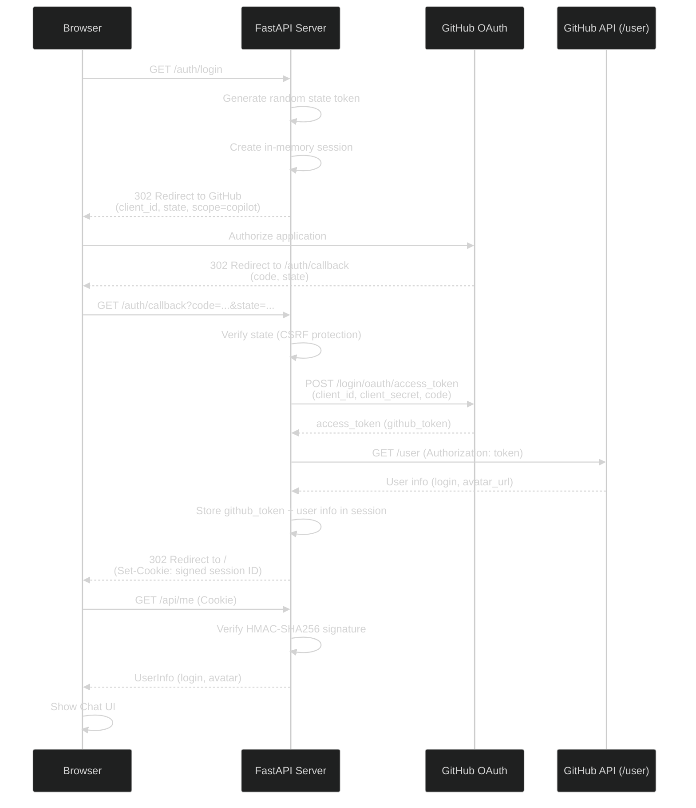
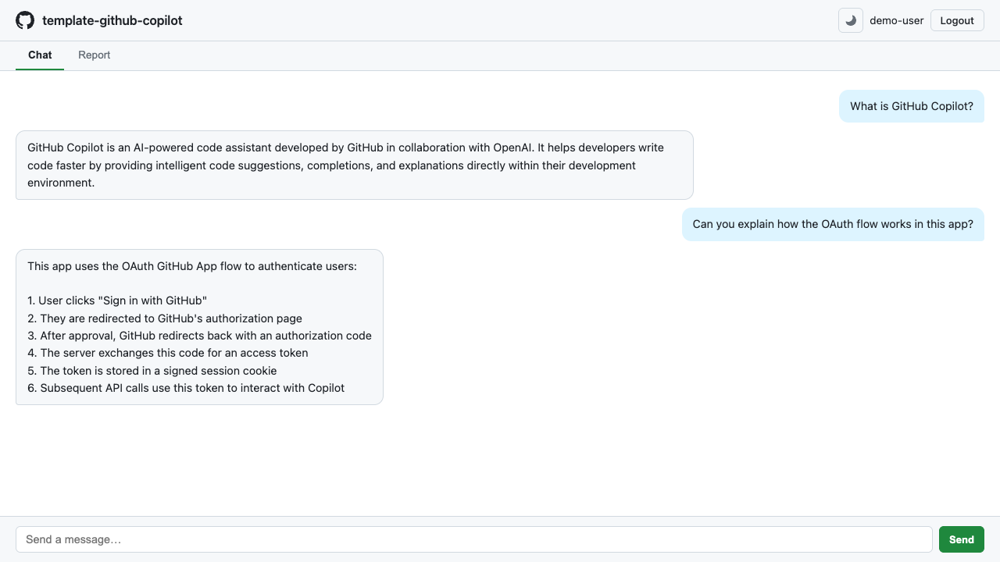
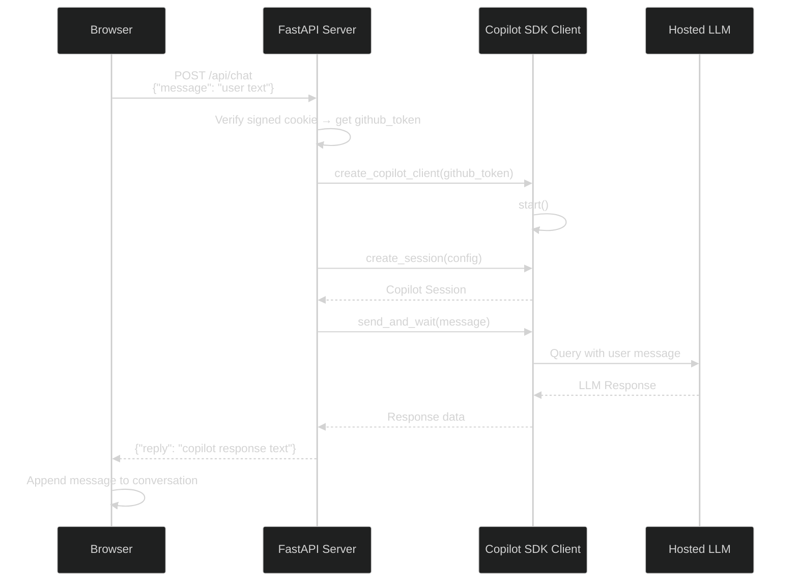
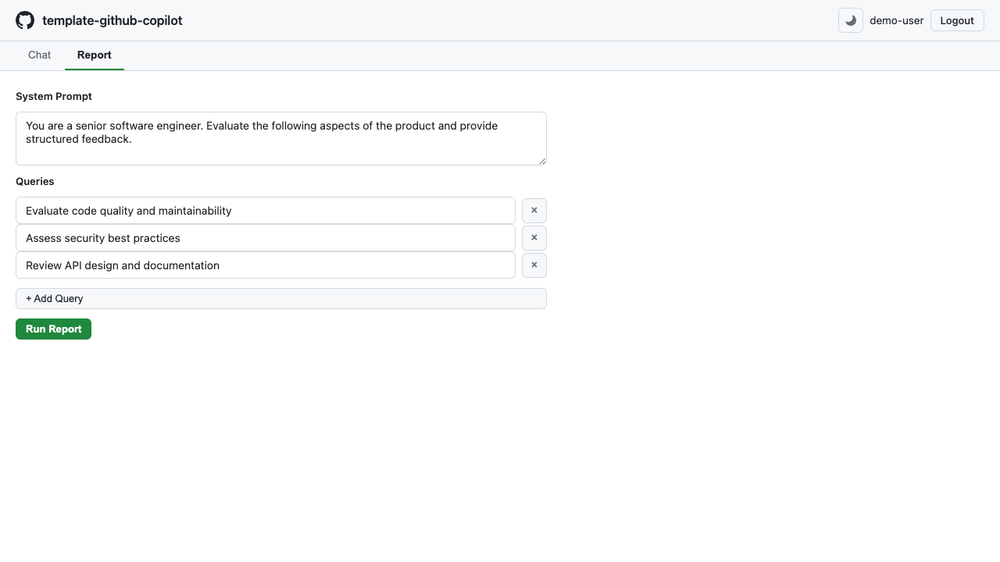
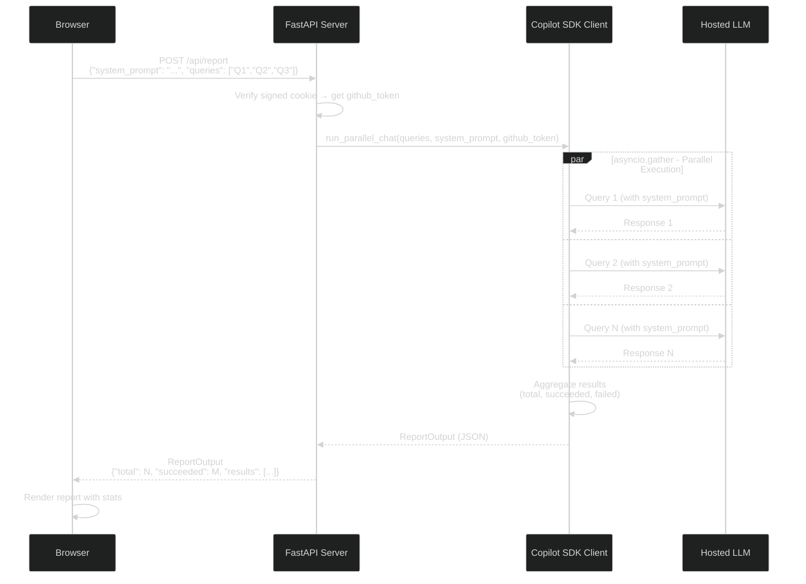

# Web UI Guide

> **Navigation:** [CopilotReportForge](index.md) > **Web UI Guide**
>
> **See also:** [Getting Started](getting_started.md) · [GitHub OAuth App Setup](github_oauth_app.md)

---

## Overview

CopilotReportForge includes a browser-based interface for interactive AI chat and parallel report generation. The Web UI is powered by the same Copilot SDK used in CLI and GitHub Actions workflows, providing a consistent experience across all interfaces.

### Web UI Architecture



### Key Features

| Feature | Description |
|---|---|
| **GitHub OAuth Login** | Authenticate with your GitHub identity — no API keys needed |
| **Interactive Chat** | Real-time conversational interface with hosted LLMs |
| **Report Panel** | Configure and execute parallel multi-query evaluations |
| **Theme Toggle** | Switch between light and dark themes |
| **Swagger UI** | Built-in API documentation at `/docs` |

---

## Login Screen

When you open the application, you see a login page with a **"Sign in with GitHub"** button. Clicking it initiates the GitHub OAuth flow (see [GitHub OAuth App Setup](github_oauth_app.md)).



### GitHub OAuth Authentication Flow



After successful authentication, you are redirected to the chat interface.

---

## Chat Interface

The chat interface provides a conversational experience with hosted LLMs.



| Element | Description |
|---|---|
| **Message input** | Type your prompt and press Enter or click Send |
| **Conversation history** | Messages are displayed in chronological order |
| **Model indicator** | Shows which LLM model is being used |
| **Clear button** | Reset the conversation |

Each message creates an independent Copilot SDK session. Responses are streamed in real time.

### Chat Communication Flow



---

## Report Panel

The report panel enables parallel execution of multiple LLM queries with a configurable system prompt.



### How to Use

1. **Set the system prompt** — Define the AI persona (e.g., "You are a senior architect reviewing system designs")
2. **Enter queries** — One per line, each will execute in a separate LLM session
3. **Click Generate** — All queries execute in parallel
4. **Review results** — Each query shows its response and success/failure status

### Report Output

The generated report includes:
- Total number of queries executed
- Per-query results with success/failure indicators
- Aggregated summary
- Option to download as JSON

### Report Generation Flow



---

## Theme Toggle

Click the theme toggle button (sun/moon icon) in the navigation bar to switch between light and dark modes. The preference is saved in your browser's local storage.

---

## API Documentation

The application includes auto-generated API documentation accessible at:

| URL | Interface |
|---|---|
| `/docs` | Swagger UI — interactive API explorer |
| `/redoc` | ReDoc — alternative API documentation |

### Key API Endpoints

| Method | Endpoint | Description |
|---|---|---|
| `GET` | `/` | Login page |
| `GET` | `/auth/login` | Initiate GitHub OAuth flow |
| `GET` | `/auth/callback` | OAuth callback handler |
| `GET` | `/auth/logout` | Clear session and redirect to login |
| `GET` | `/api/me` | Return authenticated user info (login, avatar) |
| `POST` | `/api/chat` | Send a chat message |
| `POST` | `/api/report` | Generate a parallel report |
| `POST` | `/api/report/generate` | Generate a report, upload to Azure Blob Storage, and return a SAS URL |
| `POST` | `/api/report/upload` | Upload an existing report to Azure Blob Storage and return a SAS URL |

---

## Running the Web UI

### Local Development

```bash
cd src/python
export GITHUB_CLIENT_ID="your-client-id"
export GITHUB_CLIENT_SECRET="your-client-secret"
export SESSION_SECRET="a-random-secret-string"
make copilot-api
```

Then open `http://localhost:8000`.

### Docker

```bash
cd src/python
docker compose up --build
```

See [Running Containers Locally](container_local_run.md) for detailed container usage.
