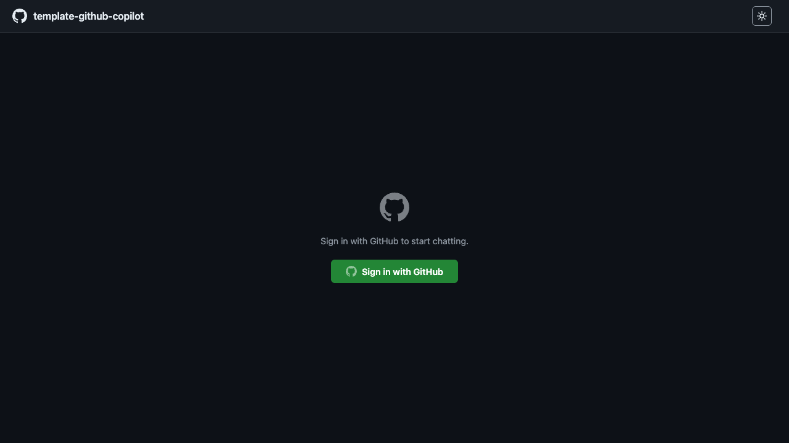
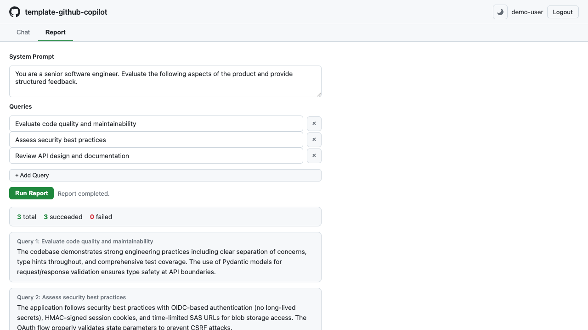
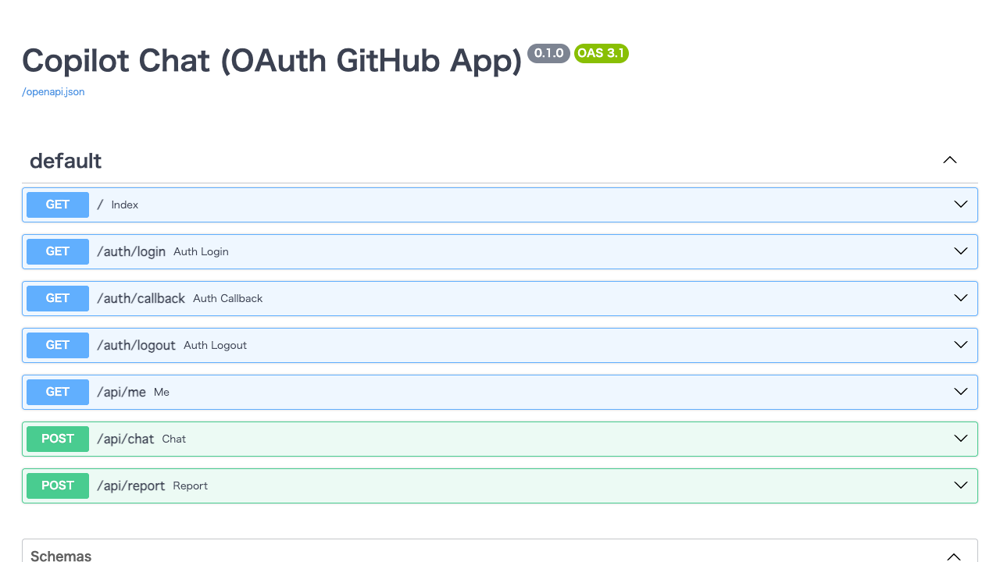
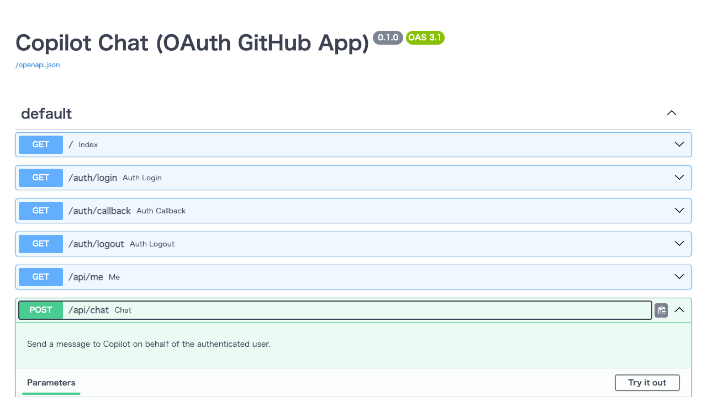

# Web UI Guide

> **Navigation:** [README](../../README.md) > **Web UI Guide**
>
> **See also:** [Getting Started](getting_started.md) · [GitHub OAuth App Setup](github_oauth_app.md) · [Architecture](architecture.md) · [API Reference](#api-endpoints)

---

CopilotReportForge ships with a built-in web UI that provides an interactive chat interface and a parallel report generation panel — all powered by the GitHub Copilot SDK. This guide walks you through every screen and feature of the web application.

## Table of Contents

- [Overview](#overview)
- [Login Screen](#login-screen)
- [Chat Interface](#chat-interface)
- [Report Panel](#report-panel)
- [Theme Toggle](#theme-toggle)
- [API Documentation (Swagger UI)](#api-documentation-swagger-ui)
- [API Endpoints](#api-endpoints)

---

## Overview

The web UI is a single-page application served by a FastAPI backend at `http://127.0.0.1:8000/`. It provides two main features:

| Feature | Description |
|---|---|
| **Chat** | Interactive one-on-one conversation with GitHub Copilot, authenticated via your GitHub account |
| **Report** | Run multiple queries in parallel with a shared system prompt and receive a structured report |

The UI is built with plain HTML/CSS/JavaScript (no framework dependencies) and supports both light and dark themes with automatic system preference detection.

---

## Login Screen

When you first visit the application, you are presented with the login screen. Authentication is handled through the GitHub OAuth App flow — no API keys or tokens need to be managed manually.


**How to sign in:**

1. Click the **"Sign in with GitHub"** button
2. You will be redirected to GitHub's authorization page
3. Review and approve the requested permissions (the `copilot` scope)
4. GitHub redirects you back to the application
5. Your session is stored in a signed, HTTP-only cookie

> **Note:** You need an active [GitHub Copilot](https://github.com/features/copilot) subscription to use the chat and report features.

The login screen also supports dark mode:



---

## Chat Interface

After signing in, the application displays the **Chat** tab by default. This tab provides a familiar chat interface for conversing with GitHub Copilot.


### Features

- **Real-time messaging** — Type a message in the input field and press **Enter** or click **Send**. The assistant's response appears in the conversation thread.
- **Typing indicator** — A "Thinking…" animation is displayed while waiting for the Copilot response.
- **Copy to clipboard** — Hover over any assistant reply to reveal a **Copy** button for quick clipboard access.
- **Session persistence** — Your authentication session lasts for 1 hour (configurable via `SESSION_SECRET` and cookie settings).
- **User info** — Your GitHub username (and avatar, if available) is displayed in the header along with a **Logout** button.

### How It Works (Under the Hood)

1. Your message is sent via `POST /api/chat` with the request body `{"message": "..."}`.
2. The server retrieves your GitHub OAuth token from the session.
3. A `CopilotClient` is instantiated with your token and connected to the Copilot CLI server.
4. The Copilot response is returned as `{"reply": "..."}`.

---

## Report Panel

The **Report** tab enables you to run multiple queries in parallel, each evaluated under a shared system prompt. This is ideal for multi-perspective evaluations, batch analysis, and structured report generation.

### Configuring a Report


1. **System Prompt** — Define the persona or instruction set for all queries (e.g., *"You are a senior software engineer. Evaluate the following aspects..."*).
2. **Queries** — Add one or more evaluation queries. Click **"+ Add Query"** to add additional rows, or click the **×** button to remove a query.
3. **Run Report** — Click the **"Run Report"** button to execute all queries in parallel.

### Viewing Results



Once the report completes, the results are displayed below the form:

- **Summary bar** — Shows the total number of queries, how many succeeded, and how many failed.
- **Individual results** — Each query is displayed with its label and the corresponding response. Failed queries show an error message in red.
- **Copy support** — Each result item has a **Copy** button for quick clipboard access.

### How It Works (Under the Hood)

1. The frontend sends a `POST /api/report` request with:
   ```json
   {
     "queries": ["Query 1", "Query 2", "Query 3"],
     "system_prompt": "You are a ..."
   }
   ```
2. The server creates parallel Copilot sessions via `asyncio.gather`, each with the shared system prompt.
3. Results are aggregated into a structured `ReportOutput` object:
   ```json
   {
     "results": [
       {"query": "Query 1", "response": "...", "error": null},
       {"query": "Query 2", "response": "...", "error": null}
     ],
     "total": 2,
     "succeeded": 2,
     "failed": 0
   }
   ```

---

## Theme Toggle

The application includes a light/dark theme toggle accessible from the header. Click the moon/sun icon to switch between themes.

| Theme | Description |
|---|---|
| **Light** (default) | Clean white background with GitHub-inspired styling |
| **Dark** | Dark background optimized for low-light environments |

- The theme choice is persisted in `localStorage` and applies immediately.
- If no preference is saved, the app follows the system's color scheme preference automatically.

---

## API Documentation (Swagger UI)

The FastAPI backend provides auto-generated interactive API documentation at `/docs` (Swagger UI) and `/redoc` (ReDoc).



Access it at: `http://127.0.0.1:8000/docs`

The Swagger UI allows you to:

- Browse all available endpoints and their request/response schemas
- View the data models (`ChatRequest`, `ChatResponse`, `ReportRequest`, `ReportOutput`, etc.)
- Try out API calls directly from the browser (though authentication is session-based)



---

## API Endpoints

| Method | Path | Auth Required | Description |
|---|---|---|---|
| `GET` | `/` | No | Serve the HTML chat frontend |
| `GET` | `/auth/login` | No | Initiate GitHub OAuth authorization flow |
| `GET` | `/auth/callback` | No | Handle the OAuth callback from GitHub |
| `GET` | `/auth/logout` | No | Clear the session and redirect to login |
| `GET` | `/api/me` | Yes | Return the current authenticated user's info |
| `POST` | `/api/chat` | Yes | Send a message to Copilot and receive a reply |
| `POST` | `/api/report` | Yes | Run parallel queries and return a structured report |
| `GET` | `/docs` | No | Interactive Swagger UI documentation |
| `GET` | `/redoc` | No | Alternative ReDoc documentation |

### Chat Request/Response

**Request:**
```json
POST /api/chat
Content-Type: application/json

{
  "message": "What is GitHub Copilot?"
}
```

**Response:**
```json
{
  "reply": "GitHub Copilot is an AI-powered code assistant..."
}
```

### Report Request/Response

**Request:**
```json
POST /api/report
Content-Type: application/json

{
  "queries": [
    "Evaluate code quality",
    "Assess security practices"
  ],
  "system_prompt": "You are a senior software engineer."
}
```

**Response:**
```json
{
  "results": [
    {
      "query": "Evaluate code quality",
      "response": "The codebase demonstrates strong engineering practices...",
      "error": null
    },
    {
      "query": "Assess security practices",
      "response": "The application follows security best practices...",
      "error": null
    }
  ],
  "total": 2,
  "succeeded": 2,
  "failed": 0
}
```

---

## Next Steps

- **Set up the OAuth App:** Follow the [GitHub OAuth App Setup](github_oauth_app.md) guide to configure authentication.
- **Run with containers:** See [Running Containers Locally](container_local_run.md) for Docker-based deployment.
- **Understand the architecture:** Read the [Architecture](architecture.md) document for a deep dive into the system design.
- **Deploy to production:** Check the [Deployment](deployment.md) guide for production deployment instructions.
