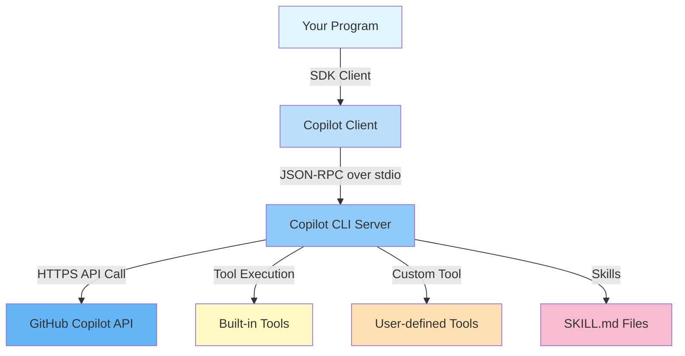
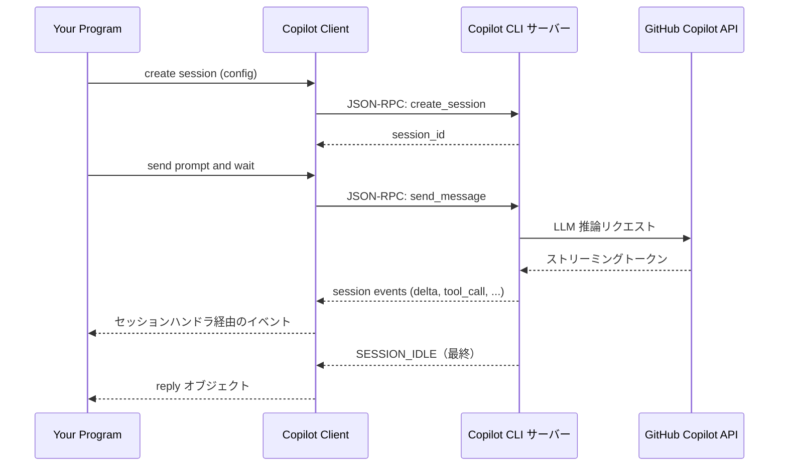
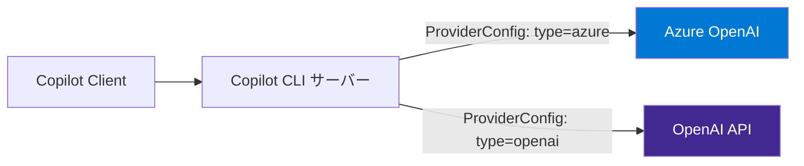

# アーキテクチャ

このページでは、GitHub Copilot SDK、Copilot CLI サーバー、GitHub Copilot API がどのように相互作用するかを説明します。これらの概念はどの言語の SDK を使っても同じです。具体的なコードは各版のチュートリアルに掲載しています。

---

## 高レベルアーキテクチャ



---

## コンポーネント

### Copilot クライアント

**クライアント**は SDK のエントリーポイントです（Python は `CopilotClient`、Go は `copilot.Client`）。デフォルトでは `copilot` CLI をサブプロセスとして起動し、**JSON-RPC over stdio** で通信します。すでに起動している Copilot CLI に **TCP ソケット**（例: `localhost:3000`）で接続することもできます。

クライアントの生成と起動処理の具体コードは、各版の CLI チャットボットチュートリアル（[Python](python/tutorials/01_chat_bot.md) · [Go](go/tutorials/01_chat_bot.md)）を参照してください。

### セッション

**セッション**はステートフルな会話コンテキストです。各セッションは以下を独自に持ちます。

- システムメッセージ（ペルソナ）
- ツールレジストリ
- パーミッションハンドラ
- ストリーミング設定
- オプションのプロバイダーオーバーライド（BYOK 用）
- オプションのセッションメモリ（オプトイン。エージェントがターンをまたいで情報を記憶できます）

セッションはクライアントから生成され、プロンプトの送信とイベントの受信を行う場所です。セッションメモリは**オプトイン**です。セッションの作成または再開時にセッション設定で有効化します。省略した場合はランタイムの既定値が適用されます（[Copilot SDK v1.0.2](https://github.com/github/copilot-sdk/releases/tag/v1.0.2)）。

### Copilot CLI サーバー

Copilot CLI（`copilot` バイナリ）は以下を担当するアウトオブプロセスのエージェントランタイムです。

1. GitHub トークンを使って GitHub Copilot API に認証
2. JSON-RPC チャネルを通じて SDK からリクエストを受信
3. Copilot API（LLM 推論）を呼び出す
4. ツール呼び出し（組み込みまたはユーザー定義）を実行
5. 結果を SDK にストリームで返す

SDK はこのサーバーと通信します — **GitHub API と直接通信するわけではありません**。

### ツール

ツールはエージェントの能力を拡張します。ツールには 2 種類あります。

| 種類 | 定義方法 | 例 |
|------|---------|-----|
| 組み込みツール | Copilot CLI サーバーが提供 | ファイルシステム、Web 検索 |
| カスタムツール | カスタムツール API（Python は `@define_tool`、Go は `DefineTool`） | GitHub API 呼び出し、データベースクエリ |

カスタムツールはセッション作成時にセッションごとに登録されます。ツール定義は `defer` オプションも受け付けます。`"auto"`（既定値）は大量のツールセットをツール検索経由で遅延的に提示し、`"never"` はツールを常にプリロードします（[Copilot SDK v1.0.2](https://github.com/github/copilot-sdk/releases/tag/v1.0.2)）。

### スキル

スキルは特化したエージェント動作を定義する Markdown ファイル（`SKILL.md`）です。セッション作成時に渡される**スキルディレクトリ**から読み込まれます。

```text
skills/
├── docgen/
│   └── SKILL.md
└── coding-standards/
    └── SKILL.md
```

---

## リクエスト/レスポンスフロー



---

## BYOK フロー

BYOK を使用する場合、Copilot CLI サーバーはデフォルトの Copilot API ではなく**あなたの**モデルエンドポイントにリクエストをルーティングします。



プロバイダー設定はセッション作成時に渡され、CLI サーバーがどのエンドポイントと認証情報を使うかを指示します。

---

## 主要な設計原則

1. **アウトオブプロセス実行** — Copilot CLI サーバーは独立したプロセスで動作し、SDK は IPC で通信します。これにより認証情報がプログラムから分離されます。

2. **イベント駆動** — すべてのセッションアクティビティはイベントとしてモデル化されます。ハンドラはイベントが届くたびに受信し、リアルタイムストリーミングが可能です。

3. **パーミッションゲート** — すべてのツール実行はパーミッションハンドラを通ります。各操作を承認するか拒否するかはあなたが制御します。

4. **セッション独立性** — 各セッションは独立しています。同じプロセス内で複数のセッションを同時に実行できます（並列ワークロードに便利）。

---

## 関連項目

- [はじめに](getting_started.md) — 共通セットアップ（CLI のインストール、認証）
- [CLI サーバーモード](server_mode.md) — Copilot CLI を単独 TCP サーバーとして起動する
- Python 版: [CLI チャットボットチュートリアル](python/tutorials/01_chat_bot.md)
- Go 版: [CLI チャットボットチュートリアル](go/tutorials/01_chat_bot.md)
