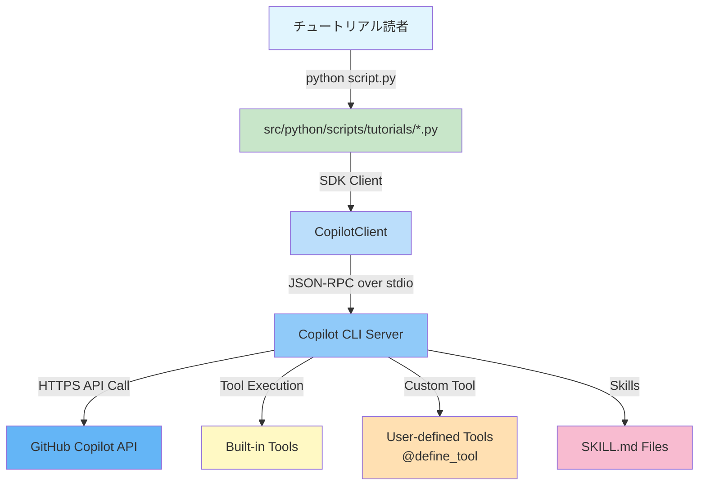
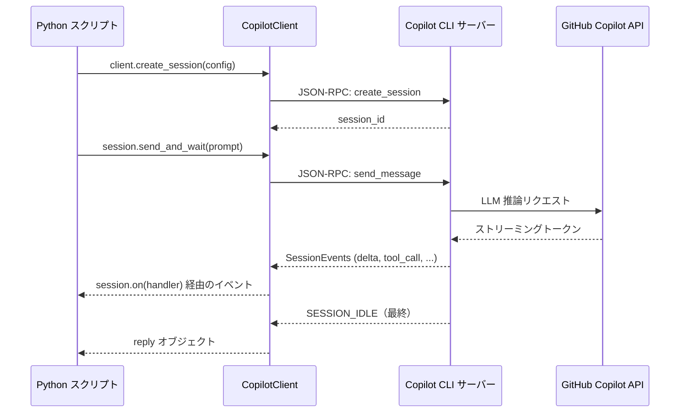

# アーキテクチャ

このページでは、GitHub Copilot SDK、Copilot CLI サーバー、GitHub Copilot API がどのように相互作用するか、そして Python スクリプトがその全体像にどのように位置づけられるかを説明します。

---

## 高レベルアーキテクチャ



---

## コンポーネント

### CopilotClient

`CopilotClient` クラスは SDK のエントリーポイントです。デフォルトでは `copilot` CLI をサブプロセスとして起動し、**JSON-RPC over stdio** で通信します。`cli_url` オプション経由で、既に起動している Copilot CLI に **TCP ソケット**（例: `localhost:3000`）で接続することもできます。

```python
from copilot import CopilotClient
from copilot.types import CopilotClientOptions

# デフォルト: stdio サブプロセス
client = CopilotClient()

# オプション: TCP で外部 CLI サーバーに接続
# client = CopilotClient(options=CopilotClientOptions(cli_url="localhost:3000"))

await client.start()
```

### セッション

**セッション**はステートフルな会話コンテキストです。各セッションは以下を独自に持ちます。

- システムメッセージ（ペルソナ）
- ツールレジストリ
- パーミッションハンドラ
- ストリーミング設定
- オプションのプロバイダーオーバーライド（BYOK 用）

```python
session = await client.create_session(SessionConfig(...))
```

### Copilot CLI サーバー

Copilot CLI（`copilot` バイナリ）は以下を担当するアウトオブプロセスのエージェントランタイムです。

1. GitHub トークンを使って GitHub Copilot API に認証
2. JSON-RPC チャネルを通じて SDK からリクエストを受信
3. Copilot API（LLM 推論）を呼び出す
4. ツール呼び出し（組み込みまたはユーザー定義）を実行
5. 結果を SDK にストリームで返す

SDK はこのサーバーと通信します — **GitHub API と直接通信するわけではありません**。

### ツール

ツールはエージェントの能力を拡張します。ツールには 2 種類あります。

| 種類 | 定義方法 | 例 |
|------|---------|-----|
| 組み込みツール | Copilot CLI サーバーが提供 | ファイルシステム、Web 検索 |
| カスタムツール | `@define_tool` デコレータ | GitHub API 呼び出し、データベースクエリ |

カスタムツールは `SessionConfig(tools=[...])` でセッションごとに登録されます。

### スキル

スキルは特化したエージェント動作を定義する Markdown ファイル（`SKILL.md`）です。`CopilotClientOptions` で設定した**スキルディレクトリ**から読み込まれます。

```
skills/
├── docgen/
│   └── SKILL.md
└── coding-standards/
    └── SKILL.md
```

---

## リクエスト/レスポンスフロー



---

## BYOK フロー

BYOK を使用する場合、Copilot CLI サーバーはデフォルトの Copilot API ではなく**あなたの**モデルエンドポイントにリクエストをルーティングします。


`ProviderConfig` は `SessionConfig` で渡され、CLI サーバーがどのエンドポイントと認証情報を使うかを指示します。

---

## 主要な設計原則

1. **アウトオブプロセス実行** — Copilot CLI サーバーは独立したプロセスで動作し、SDK は IPC で通信します。これにより認証情報がスクリプトから分離されます。

2. **イベント駆動** — すべてのセッションアクティビティは `SessionEventType` のイベントとしてモデル化されます。ハンドラはイベントが届くたびに受信し、リアルタイムストリーミングが可能です。

3. **パーミッションゲート** — すべてのツール実行は `on_permission_request` を通ります。各操作を承認するか拒否するかはあなたが制御します。

4. **セッション独立性** — 各セッションは独立しています。同じプロセス内で複数のセッションを同時に実行できます（並列ワークロードに便利）。
