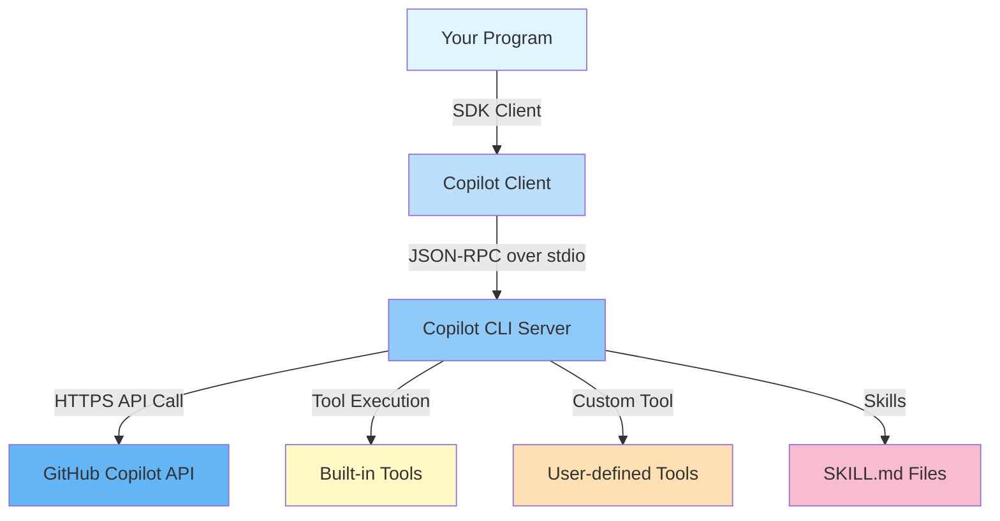
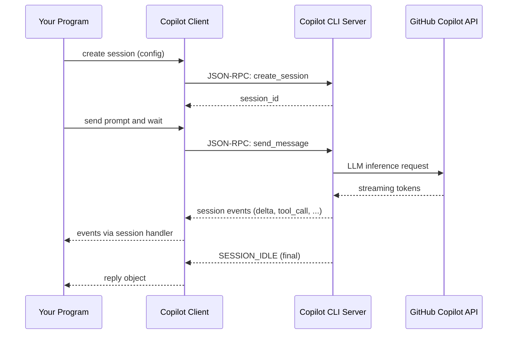
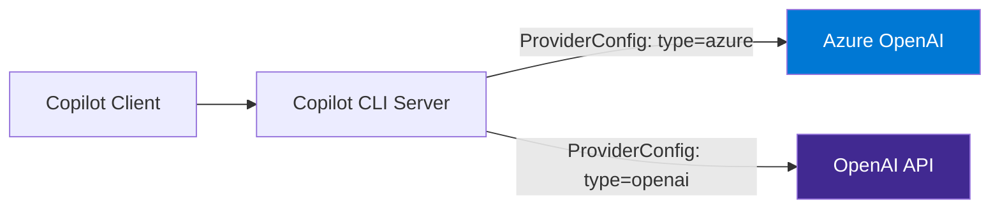

# Architecture

This page explains how the GitHub Copilot SDK, the Copilot CLI server, and the GitHub Copilot API interact with each other. These concepts are the same regardless of which language SDK you use; concrete code appears in each edition's tutorials.

---

## High-Level Architecture



---

## Components

### Copilot Client

The **client** is the entry point of the SDK (`CopilotClient` in Python, `copilot.Client` in Go). By default, it spawns the `copilot` CLI as a subprocess and communicates over **JSON-RPC on stdio**. Alternatively, it can connect to an already-running Copilot CLI over a **TCP socket** (for example `localhost:3000`).

See each edition's CLI Chatbot tutorial (linked under [See Also](#see-also)) for the exact client construction and startup call.

### Session

A **session** is a stateful conversation context. Each session has its own:

- System message (persona)
- Tool registry
- Permission handler
- Streaming configuration
- Optional provider override (for BYOK)
- Optional session memory (opt-in; lets the agent recall information across turns)

A session is created from the client and is where prompts are sent and events are received. Session memory is **opt-in**: enable it in the session configuration when you create or resume a session; when omitted, the runtime default applies ([Copilot SDK v1.0.2](https://github.com/github/copilot-sdk/releases/tag/v1.0.2)).

### Copilot CLI Server

The Copilot CLI (`copilot` binary) acts as an out-of-process agent runtime that:

1. Authenticates with the GitHub Copilot API using your GitHub token
2. Receives requests from the SDK over the JSON-RPC channel
3. Calls the Copilot API (LLM inference)
4. Executes tool calls (built-in or user-defined)
5. Streams results back to the SDK

The SDK communicates with this server — **not** directly with the GitHub API.

### Tools

Tools extend the agent's capabilities. There are two kinds:

| Type | How to define | Example |
|------|--------------|---------|
| Built-in | Provided by the Copilot CLI server | File system, web search |
| Custom | A custom-tool API (`@define_tool` in Python, `DefineTool` in Go) | GitHub API calls, database queries |

Custom tools are registered per-session when the session is created. Tool definitions also accept a `defer` option — `"auto"` (the default) lets large tool sets surface lazily through tool search, while `"never"` keeps a tool pre-loaded ([Copilot SDK v1.0.2](https://github.com/github/copilot-sdk/releases/tag/v1.0.2)).

### Skills

Skills are Markdown files (`SKILL.md`) that define specialized agent behaviours. They are loaded from a **skills directory** passed to the session at creation time.

```text
skills/
├── docgen/
│   └── SKILL.md
└── coding-standards/
    └── SKILL.md
```

---

## Request/Response Flow



---

## BYOK Flow

When BYOK is used, the Copilot CLI server routes requests to **your** model endpoint instead of the default Copilot API:



A provider configuration is passed when the session is created and tells the CLI server which endpoint and credentials to use.

---

## Key Design Principles

1. **Out-of-process execution** — The Copilot CLI server runs in a separate process; the SDK communicates via IPC. This isolates credentials and authentication from your program.

2. **Event-driven** — All session activity is modelled as events. Your handler receives events as they arrive — enabling real-time streaming.

3. **Permission gates** — Every tool execution passes through a permission handler. You control whether to approve or deny each operation.

4. **Session isolation** — Each session is independent. Multiple sessions can run concurrently in the same process (useful for parallel workloads).

---

## See Also

- [Getting Started](getting_started.md) — common setup (install the CLI, authenticate)
- [CLI Server Mode](server_mode.md) — run the Copilot CLI as a standalone TCP server
- Python edition: [CLI Chatbot tutorial](python/tutorials/01_chat_bot.md)
- Go edition: [CLI Chatbot tutorial](go/tutorials/01_chat_bot.md)
