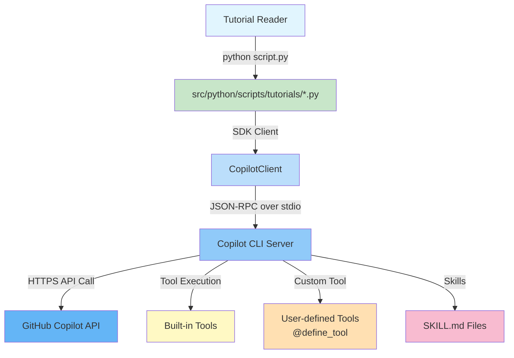
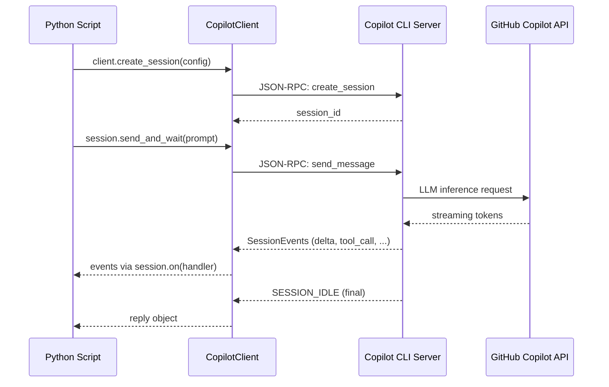

# Architecture

This page explains how the GitHub Copilot SDK, the Copilot CLI server, and the GitHub Copilot API interact with each other — and how your Python scripts fit into the picture.

---

## High-Level Architecture



---

## Components

### CopilotClient

The `CopilotClient` class is the entry point of the SDK. It connects to the Copilot CLI server via **JSON-RPC over stdio** (when spawning a subprocess) or over a **TCP socket** (when connecting to an existing server on `localhost:3000`).

```python
from copilot import CopilotClient
from copilot.types import CopilotClientOptions

client = CopilotClient(
    options=CopilotClientOptions(cli_url="localhost:3000")
)
await client.start()
```

### Session

A **session** is a stateful conversation context. Each session has its own:

- System message (persona)
- Tool registry
- Permission handler
- Streaming configuration
- Optional provider override (for BYOK)

```python
session = await client.create_session(SessionConfig(...))
```

### Copilot CLI Server

The Copilot CLI server (`gh copilot serve`) is an out-of-process daemon that:

1. Authenticates with the GitHub Copilot API using your GitHub token
2. Receives requests from the SDK over the JSON-RPC channel
3. Calls the Copilot API (LLM inference)
4. Executes tool calls (built-in or user-defined)
5. Streams results back to the SDK

The SDK communicates with this server — **not** directly with the GitHub API.

### Tools

Tools extend the agent's capabilities. There are two kinds:

| Type | How to define | Example |
|------|--------------|---------|
| Built-in | Provided by the Copilot CLI server | File system, web search |
| Custom | `@define_tool` decorator | GitHub API calls, database queries |

Custom tools are registered per-session in `SessionConfig(tools=[...])`.

### Skills

Skills are Markdown files (`SKILL.md`) that define specialized agent behaviours. They are loaded from a **skills directory** configured in `CopilotClientOptions`.

```
skills/
├── docgen/
│   └── SKILL.md
└── coding-standards/
    └── SKILL.md
```

---

## Request/Response Flow



---

## BYOK Flow

When BYOK is used, the Copilot CLI server routes requests to **your** model endpoint instead of the default Copilot API:


The `ProviderConfig` is passed in the `SessionConfig` and tells the CLI server which endpoint and credentials to use.

---

## Key Design Principles

1. **Out-of-process execution** — The Copilot CLI server runs in a separate process; the SDK communicates via IPC. This isolates credentials and authentication from your script.

2. **Event-driven** — All session activity is modelled as events (`SessionEventType`). Your handler receives events as they arrive — enabling real-time streaming.

3. **Permission gates** — Every tool execution passes through `on_permission_request`. You control whether to approve or deny each operation.

4. **Session isolation** — Each session is independent. Multiple sessions can run concurrently in the same process (useful for parallel workloads).
