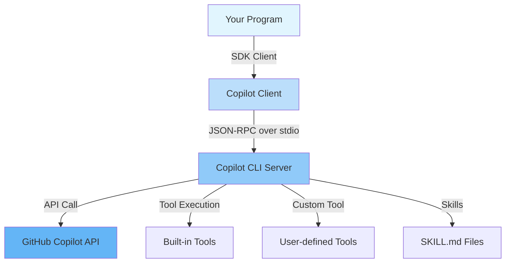

# GitHub Copilot SDK チュートリアル

**GitHub Copilot SDK** を使って実際のアプリケーションを構築するためのステップバイステップガイドです。**Python** 版と **Go** 版の両方を提供しています。

> このページでは、すべての版に共通する言語非依存の概念（SDK とは何か、どのように動作するか、Copilot CLI のセットアップ方法）を扱います。SDK 固有の API・コード・実行手順は、下記から言語を選択してください。

---

## GitHub Copilot SDK とは？

GitHub Copilot SDK は、**GitHub Copilot CLI** を動かすのと同じエージェントランタイムへのプログラマブルなインタフェースです。LLM 推論、ツール呼び出し、ストリーミング、スキル実行など Copilot の機能を独自のプログラムに直接組み込むことができます。

### SDK であるもの

- Copilot を独自コードに統合するための**ライブラリ**（Python は `github-copilot-sdk`、Go は `github.com/github/copilot-sdk/go`）
- セッション作成、プロンプト送信、レスポンス受信を**プログラマブルに**行う手段
- **カスタムツール**、**スキル**（SKILL.md）、**ストリーミング**、**BYOK** のサポート
- Copilot CLI が使うのと同じランタイム — 再利用可能な API として公開

### SDK でないもの

- Copilot Chat UI や GitHub.com の Copilot インタフェースの代替品
- 独自モデルのファインチューニングやホスティング手段
- 汎用的な OpenAI 互換 HTTP クライアント
- REST API や Web アプリケーションを構築するためのフレームワーク

コンポーネントとリクエストフローの詳細は [アーキテクチャ](architecture.md) を参照してください。

---

## 言語を選択する

チュートリアルは両版でミラーリングされており、各レシピが 1 対 1 で対応するため、同じタスクをどちらの言語でも比較できます。

| 版 | ここから始める | チュートリアル |
|----|----------------|----------------|
| **Python** | [Python はじめに](python/getting_started.md) | [Python チュートリアル](python/index.md) — チャットボット、カスタムツール、ストリーミング、スキル、フック、BYOK |
| **Go** | [Go はじめに](go/getting_started.md) | [Go チュートリアル](go/index.md) — CLI チャットボット、ストリーミング、インタラクティブセッション |

> SDK が初めてですか？ まずは下記の**共通セットアップ**を済ませてから、お好みの版に進んでください。

---

## 共通セットアップ

どの版も、同じ **Copilot CLI** バイナリと GitHub 認証を使用します。[はじめに](getting_started.md) で次の共通手順を一度だけ完了してください。

1. Copilot CLI のインストール
2. GitHub で認証する

その後、SDK のインストールとチュートリアルの実行については各言語版の「はじめに」に従ってください。

共通セットアップの完全なガイドは [はじめに](getting_started.md) を参照してください。

---

## スコープ

**含めるもの:**

- GitHub Copilot SDK の概念説明（何であるか／何でないか）
- アーキテクチャと動作原理
- 言語ごとの SDK API 設計、サンプルコード、ステップバイステップガイド
- カスタムツール、スキル、セッションフック、パーミッションハンドリング、ストリーミング、BYOK

**含めないもの:**

- TypeScript / .NET SDK の詳細（[参考文献](appendix/references.md) を参照）
- Copilot CLI 単体の使い方ガイド
- 本番運用・スケーリング・インフラ構築の詳細
- GitHub OAuth App 認証フロー（[CopilotReportForge ドキュメント](../copilot_report_forge/guide/github_oauth_app.md) を参照）

---

## さらに読む

| ドキュメント | 説明 |
|-------------|------|
| [はじめに](getting_started.md) | 共通セットアップ: Copilot CLI のインストールと認証 |
| [アーキテクチャ](architecture.md) | SDK、CLI サーバー、Copilot API の相互作用 |
| [CLI サーバーモード](server_mode.md) | Copilot CLI を単独 TCP サーバーとして起動する |
| [Python チュートリアル](python/index.md) | Python 版 |
| [Go チュートリアル](go/index.md) | Go 版 |
| [参考文献](appendix/references.md) | API リファレンスと外部リンク |
