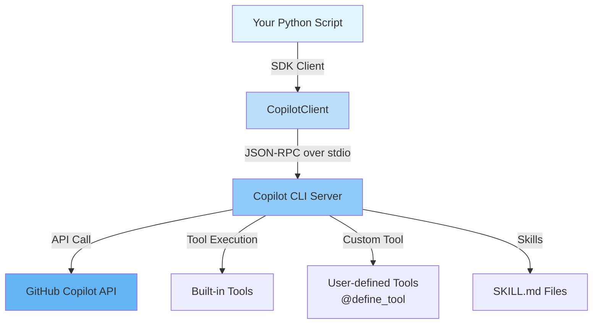

# GitHub Copilot SDK チュートリアル

Python 向け **GitHub Copilot SDK** を使って実際のアプリケーションを構築するためのステップバイステップガイドです。

---

## GitHub Copilot SDK とは？

GitHub Copilot SDK は、**GitHub Copilot CLI** を動かすのと同じエージェントランタイムへのプログラマブルなインタフェースです。LLM 推論、ツール呼び出し、ストリーミング、スキル実行など Copilot の機能を独自の Python プログラムに直接組み込むことができます。



### SDK であるもの

- Copilot を独自コードに統合するための **Python ライブラリ**（`github-copilot-sdk`）
- セッション作成、プロンプト送信、レスポンス受信を**プログラマブルに**行う手段
- **カスタムツール**（`@define_tool`）、**スキル**（SKILL.md）、**ストリーミング**、**BYOK** のサポート
- Copilot CLI が使うのと同じランタイム — 再利用可能な API として公開

### SDK でないもの

- Copilot Chat UI や GitHub.com の Copilot インタフェースの代替品
- 独自モデルのファインチューニングやホスティング手段
- 汎用的な OpenAI 互換 HTTP クライアント（それには `openai` ライブラリを使用）
- REST API や Web アプリケーションを構築するためのフレームワーク

---

## チュートリアル構成

各チュートリアルは**解説ドキュメント**とそのまま実行できる**独立した CLI スクリプト**をペアで提供します。

| # | チュートリアル | スクリプト | 学べること |
|---|----------------|----------|------------|
| 1 | [CLI チャットボット](tutorials/01_chat_bot.md) | [`01_chat_bot.py`](https://github.com/ks6088ts/template-github-copilot/blob/main/src/python/scripts/tutorials/01_chat_bot.py) | CopilotClient、セッション、プロンプト送信、インタラクティブループ |
| 2 | [Issue トリアージボット](tutorials/02_custom_tools.md) | [`02_issue_triage.py`](https://github.com/ks6088ts/template-github-copilot/blob/main/src/python/scripts/tutorials/02_issue_triage.py) | `@define_tool` によるカスタムツール、Pydantic I/O |
| 3 | [ストリーミングレビュー](tutorials/03_streaming.md) | [`03_streaming_review.py`](https://github.com/ks6088ts/template-github-copilot/blob/main/src/python/scripts/tutorials/03_streaming_review.py) | `ASSISTANT_MESSAGE_DELTA` によるストリーミング |
| 4 | [スキルによるドキュメント生成](tutorials/04_skills.md) | [`04_skills_docgen.py`](https://github.com/ks6088ts/template-github-copilot/blob/main/src/python/scripts/tutorials/04_skills_docgen.py) | `SKILL.md` によるエージェントスキル |
| 5 | [監査ログ](tutorials/05_hooks_permissions.md) | [`05_audit_hooks.py`](https://github.com/ks6088ts/template-github-copilot/blob/main/src/python/scripts/tutorials/05_audit_hooks.py) | セッションフック、パーミッションハンドラ |
| 6 | [BYOK Azure OpenAI](tutorials/06_byok.md) | [`06_byok_azure_openai.py`](https://github.com/ks6088ts/template-github-copilot/blob/main/src/python/scripts/tutorials/06_byok_azure_openai.py) | Azure OpenAI を使った Bring Your Own Key |

> すべてのスクリプトは [`src/python/scripts/tutorials/`](https://github.com/ks6088ts/template-github-copilot/blob/main/src/python/scripts/tutorials/) にあります。

---

## クイックスタート

```bash
# 1. SDK とチュートリアルの依存関係をインストール（src/python/pyproject.toml を利用）
cd src/python
uv sync --all-groups

# 2. Copilot CLI をインストールして認証（SDK がオンデマンドで起動します）
npm install -g @github/copilot       # または: gh copilot （初回実行時にダウンロード）
gh auth login                        # または: export COPILOT_GITHUB_TOKEN="<pat>"

# 3. チュートリアルスクリプトを実行
uv run python scripts/tutorials/01_chat_bot.py --prompt "Hello, Copilot!"
```

詳細なセットアップ手順については [はじめに](getting_started.md) を参照してください。

---

## スコープ

**含めるもの:**

- GitHub Copilot SDK の概念説明（何であるか／何でないか）
- アーキテクチャと動作原理
- Python SDK の API 設計とインタフェース
- 具体的なユースケースに基づくサンプルコードとステップバイステップガイド
- Agent Skills、カスタムツール、セッションフック、パーミッションハンドリング、ストリーミング、BYOK

**含めないもの:**

- TypeScript / Go / .NET SDK の詳細（[参考文献](appendix/references.md) を参照）
- Copilot CLI 単体の使い方ガイド
- 本番運用・スケーリング・インフラ構築の詳細
- GitHub OAuth App 認証フロー（[CopilotReportForge ドキュメント](../copilot_report_forge/guide/github_oauth_app.md) を参照）
- `template_github_copilot` パッケージ内部（チュートリアルスクリプトは自己完結）

---

## さらに読む

| ドキュメント | 説明 |
|-------------|------|
| [アーキテクチャ](architecture.md) | SDK、CLI サーバー、Copilot API の相互作用 |
| [はじめに](getting_started.md) | 環境構築と最初の実行 |
| [参考文献](appendix/references.md) | API リファレンスと外部リンク |
