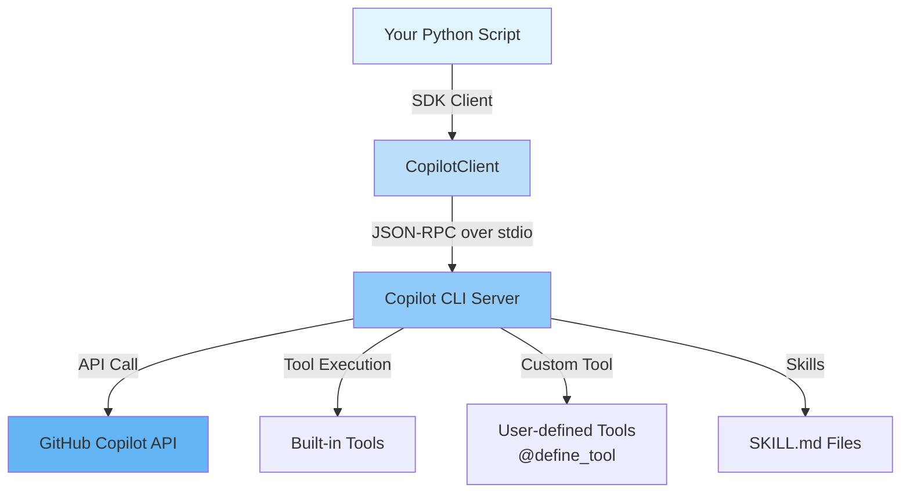

# GitHub Copilot SDK Tutorial

A step-by-step guide to building real applications with the **GitHub Copilot SDK** for Python.

---

## What Is the GitHub Copilot SDK?

The GitHub Copilot SDK is a programmable interface to the same agent runtime that powers **GitHub Copilot CLI**. It lets you embed Copilot capabilities — LLM inference, tool calling, streaming, skill execution — directly into your own Python programs.



### What it IS

- A **Python library** (`github-copilot-sdk`) for integrating Copilot into your own code
- A way to **programmatically** create sessions, send prompts, and receive responses
- Support for **custom tools** (`@define_tool`), **skills** (SKILL.md), **streaming**, and **BYOK**
- The same runtime used by the Copilot CLI — exposed as a reusable API

### What it is NOT

- A replacement for the Copilot Chat UI or the GitHub.com Copilot interface
- A way to fine-tune or host your own models
- A general-purpose OpenAI-compatible HTTP client (use the `openai` library for that)
- A framework for building REST APIs or web applications

---

## Tutorial Structure

Each tutorial pairs a **documentation page** with a **self-contained CLI script** that you can run directly:

| # | Tutorial | Script | What You Learn |
|---|----------|--------|----------------|
| 1 | [CLI Chatbot](tutorials/01_chat_bot.md) | [`01_chat_bot.py`](https://github.com/ks6088ts/template-github-copilot/blob/main/src/python/scripts/tutorials/01_chat_bot.py) | CopilotClient, sessions, single prompt, interactive loop |
| 2 | [Issue Triage Bot](tutorials/02_custom_tools.md) | [`02_issue_triage.py`](https://github.com/ks6088ts/template-github-copilot/blob/main/src/python/scripts/tutorials/02_issue_triage.py) | Custom tools with `@define_tool`, Pydantic I/O |
| 3 | [Streaming Review](tutorials/03_streaming.md) | [`03_streaming_review.py`](https://github.com/ks6088ts/template-github-copilot/blob/main/src/python/scripts/tutorials/03_streaming_review.py) | Streaming with `ASSISTANT_MESSAGE_DELTA` |
| 4 | [Skills Doc Generation](tutorials/04_skills.md) | [`04_skills_docgen.py`](https://github.com/ks6088ts/template-github-copilot/blob/main/src/python/scripts/tutorials/04_skills_docgen.py) | Agent Skills via `SKILL.md` files |
| 5 | [Audit Log](tutorials/05_hooks_permissions.md) | [`05_audit_hooks.py`](https://github.com/ks6088ts/template-github-copilot/blob/main/src/python/scripts/tutorials/05_audit_hooks.py) | Session hooks, permission handling |
| 6 | [BYOK Azure OpenAI](tutorials/06_byok.md) | [`06_byok_azure_openai.py`](https://github.com/ks6088ts/template-github-copilot/blob/main/src/python/scripts/tutorials/06_byok_azure_openai.py) | Bring Your Own Key with Azure OpenAI |

> All scripts live in [`src/python/scripts/tutorials/`](https://github.com/ks6088ts/template-github-copilot/blob/main/src/python/scripts/tutorials/).

---

## Quick Start

```bash
# 1. Install the SDK
pip install github-copilot-sdk

# 2. Install and authenticate the Copilot CLI (the SDK launches it on demand)
npm install -g @github/copilot       # or: gh copilot (downloads on first run)
gh auth login                        # or: export COPILOT_GITHUB_TOKEN="<pat>"

# 3. Run your first tutorial script
python src/python/scripts/tutorials/01_chat_bot.py --prompt "Hello, Copilot!"
```

For detailed setup instructions, see [Getting Started](getting_started.md).

---

## Scope

**In scope:**

- GitHub Copilot SDK concepts (what it is / is not)
- Architecture and operation principles
- Python SDK API design and interfaces
- Sample code and step-by-step guides for concrete use cases
- Agent Skills, Custom Tools, Session Hooks, Permission Handling, Streaming, BYOK

**Out of scope:**

- TypeScript / Go / .NET SDK details (see [References](appendix/references.md))
- Copilot CLI standalone usage guide
- Production scaling and infrastructure
- GitHub OAuth App authentication flow (see [CopilotReportForge docs](../copilot_report_forge/guide/github_oauth_app.md))
- `template_github_copilot` package internals (tutorial scripts are self-contained)

---

## Further Reading

| Document | Description |
|----------|-------------|
| [Architecture](architecture.md) | How the SDK, CLI server, and Copilot API interact |
| [Getting Started](getting_started.md) | Environment setup and first run |
| [References](appendix/references.md) | API reference and external links |
