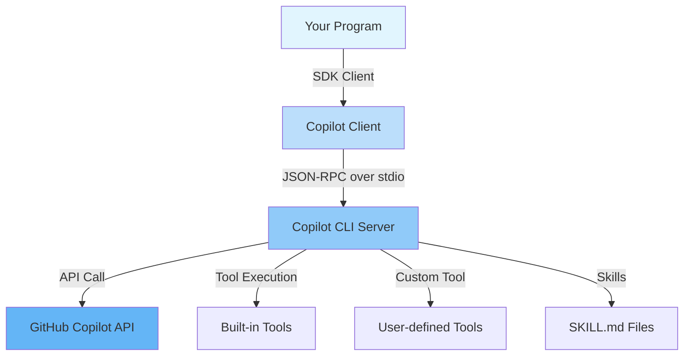

# GitHub Copilot SDK Tutorial

A step-by-step guide to building real applications with the **GitHub Copilot SDK**, available in both **Python** and **Go** editions.

> This page covers the language-agnostic concepts shared by every edition: what the SDK is, how it works, and how to set up the Copilot CLI. Pick a language below for the SDK-specific API, code, and run instructions.

---

## What Is the GitHub Copilot SDK?

The GitHub Copilot SDK is a programmable interface to the same agent runtime that powers **GitHub Copilot CLI**. It lets you embed Copilot capabilities — LLM inference, tool calling, streaming, skill execution — directly into your own programs.

### What it IS

- A **library** for integrating Copilot into your own code (`github-copilot-sdk` for Python, `github.com/github/copilot-sdk/go` for Go)
- A way to **programmatically** create sessions, send prompts, and receive responses
- Support for **custom tools**, **skills** (SKILL.md), **streaming**, and **BYOK**
- The same runtime used by the Copilot CLI — exposed as a reusable API

### What it is NOT

- A replacement for the Copilot Chat UI or the GitHub.com Copilot interface
- A way to fine-tune or host your own models
- A general-purpose OpenAI-compatible HTTP client
- A framework for building REST APIs or web applications

For a deeper look at the components and request flow, see [Architecture](architecture.md).

---

## Choose Your Language

The tutorials are mirrored across both editions — each recipe maps 1:1, so you can compare the same task in either language.

| Edition | Start here | Tutorials |
|---------|------------|-----------|
| **Python** | [Python Getting Started](python/getting_started.md) | [Python tutorials](python/index.md) — chatbots, custom tools, streaming, skills, hooks, BYOK |
| **Go** | [Go Getting Started](go/getting_started.md) | [Go tutorials](go/index.md) — CLI chatbot, streaming, interactive sessions |

> New to the SDK? Start with the **common setup** below, then jump into the edition of your choice.

---

## Common Setup

Every edition relies on the same **Copilot CLI** binary and GitHub authentication. Complete these shared steps once:

1. [Install the Copilot CLI](getting_started.md#install-the-copilot-cli)
2. [Authenticate with GitHub](getting_started.md#authenticate-with-github)

Then follow your language edition's Getting Started for SDK installation and running the tutorials.

See [Getting Started](getting_started.md) for the full common setup guide.

---

## Scope

**In scope:**

- GitHub Copilot SDK concepts (what it is / is not)
- Architecture and operation principles
- Per-language SDK API design, sample code, and step-by-step guides
- Custom Tools, Skills, Session Hooks, Permission Handling, Streaming, BYOK

**Out of scope:**

- TypeScript / .NET SDK details (see [References](appendix/references.md))
- Copilot CLI standalone usage guide
- Production scaling and infrastructure
- GitHub OAuth App authentication flow (see [CopilotReportForge docs](../copilot_report_forge/guide/github_oauth_app.md))

---

## Further Reading

| Document | Description |
|----------|-------------|
| [Getting Started](getting_started.md) | Common setup: install the Copilot CLI and authenticate |
| [Architecture](architecture.md) | How the SDK, CLI server, and Copilot API interact |
| [CLI Server Mode](server_mode.md) | Run the Copilot CLI as a standalone TCP server |
| [Python Tutorial](python/index.md) | The Python edition |
| [Go Tutorial](go/index.md) | The Go edition |
| [References](appendix/references.md) | API reference and external links |
