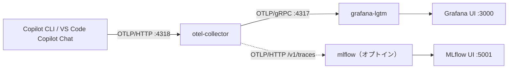

# OpenTelemetry によるオブザーバビリティ

Copilot SDK は、内部で動作する Copilot CLI から
[OpenTelemetry](https://opentelemetry.io/) のトレースを出力できます。本ページ
では、**Go** と **Python** のチュートリアルでトレースを有効化し、最小構成
（2 サービス）の Docker Compose スタックを使って Grafana でスパンを確認する
方法を説明します。

参考:
[Copilot SDK 用の OpenTelemetry インストルメンテーション](https://docs.github.com/ja/copilot/how-tos/copilot-sdk/observability/opentelemetry)

---

## 仕組み



テレメトリは **オプトイン** です。エンドポイントを設定しない限り
チュートリアルの挙動は従来どおり変わりません。Python スクリプトは共通の
`--otel-*` オプションを公開し、Go チュートリアルサブコマンドは同じオプションを
`tutorial` の persistent flag として公開します。どちらの言語でも同等の環境変数を使えます
（VS Code の Copilot Chat は
`.vscode/settings.json` で別途設定します。
[VS Code の Copilot Chat メトリックを可視化する](#vs-code-の-copilot-chat-メトリックを可視化する)
を参照）。

| 環境変数 | CLI オプション | 説明 |
|----------|----------------|------|
| `OTEL_EXPORTER_OTLP_ENDPOINT` | `--otel-endpoint` | OTLP HTTP エンドポイント（例: `http://localhost:4318`）。未設定の場合テレメトリは無効。 |
| `OTEL_INSTRUMENTATION_GENAI_CAPTURE_MESSAGE_CONTENT` | `--otel-capture-content` | スパンにプロンプト/応答の内容を含めるか（`true`/`false`、任意）。 |
| `OTEL_BSP_SCHEDULE_DELAY` | `--otel-bsp-schedule-delay` | スパンのバッチフラッシュ間隔（ms）。低く設定する（例: `500`）。[トラブルシューティング](#トラブルシューティング-スパンが届かない) を参照。 |

`TelemetryConfig` を組み立てる共有ヘルパー:

- **Python** — [`src/python/scripts/tutorials/_telemetry.py`](https://github.com/ks6088ts/template-github-copilot/blob/main/src/python/scripts/tutorials/_telemetry.py)（`make_client()`）
- **Go** — [`src/go/cmd/tutorial/telemetry.go`](https://github.com/ks6088ts/template-github-copilot/blob/main/src/go/cmd/tutorial/telemetry.go)（`newClientOptions()`）

### オブザーバビリティの考慮事項

チュートリアルの構成を実アプリケーションに広げるときは、次を確認してください:

- `TelemetryConfig` が SDK 側のスイッチです。公式ガイドでは、OTLP
  エンドポイント、エクスポーター種別（`"otlp-http"` または `"file"`）、
  JSON Lines 形式のファイルパス、計装スコープ名、メッセージ内容の取得を
  言語ごとのオプション名で示しています。本リポジトリの共有ヘルパーでは、
  意図的にエンドポイントと内容取得の設定だけを公開しています。Python スクリプトと
  Go チュートリアル CLI では、これらの設定を `--otel-*` オプションとして指定できます。
- 内容取得は既定で無効のままにしてください。スパンにプロンプト、応答、
  ツール引数が含まれる可能性があるため、信頼できる環境でのみ有効化します。
- このチュートリアルのようにコレクターへ送る構成では、OTLP/HTTP を優先します。
  ファイル出力はローカル診断や切断環境での確認に限定し、出力ファイルは機密情報を
  含み得るログとして扱ってください。
- トレースコンテキストの伝播は高度な統合ポイントとして扱います。CLI のスパンを
  収集するだけなら `TelemetryConfig` で十分です。アプリケーション自身がスパンを作成し、
  それを CLI と同じ分散トレースに含めたい場合だけ、明示的な伝播を追加します。
- コスト帰属を確認する場合は、トレースに加えて `assistant.usage` のストリーミング
  イベントを購読し、`apiEndpoint` の値からそのターンを処理した推論 API を確認します。

> **SDK v1.0.2 以降のテレメトリオプション。** `TelemetryConfig` に OTLP エクスポートのトランスポートを選択する `otlpProtocol` オプション（`http/json` または `http/protobuf`）が追加されました。また、通常停止時にクライアントが `runtime.shutdown` を呼び出すようになり、プロセス終了前にテレメトリが確定的にフラッシュされます（[Copilot SDK v1.0.2](https://github.com/github/copilot-sdk/releases/tag/v1.0.2)）。

---

## 1. オブザーバビリティスタックを起動

Docker 関連のファイルはすべて [`docker/`](https://github.com/ks6088ts/template-github-copilot/tree/main/docker) 配下にまとめています。

```bash
# リポジトリのルートで実行
docker compose -f docker/compose.yaml up -d
```

2 つのサービスが起動します:

| サービス | イメージ | 公開ポート |
|----------|----------|------------|
| `otel-collector` | `otel/opentelemetry-collector-contrib` | `4317`（gRPC）, `4318`（HTTP） |
| `grafana-lgtm` | `grafana/otel-lgtm`（Loki + Grafana + Tempo + Prometheus） | `3000`（Grafana UI） |

3 つ目のサービスとして、MLflow トラッキングサーバーを 2 つ目のトレースシンクとして
オプションで有効化できます。[MLflow へのトレース転送](#mlflow-へのトレース転送)
を参照してください。

---

## 2. チュートリアルをコレクターに向ける

```bash
export OTEL_EXPORTER_OTLP_ENDPOINT=http://localhost:4318
# スパンを素早くフラッシュ（後述の「トラブルシューティング」参照）
export OTEL_BSP_SCHEDULE_DELAY=500
# 任意:
export OTEL_INSTRUMENTATION_GENAI_CAPTURE_MESSAGE_CONTENT=true
```

### Python

```bash
cd src/python
uv run python scripts/tutorials/01_chat_bot.py \
  --otel-endpoint http://localhost:4318 \
  --otel-bsp-schedule-delay 500 \
  --prompt "Hello, Copilot!"
```

### Go

```bash
cd src/go
make build
./dist/template-github-copilot-go tutorial chat-bot \
  --otel-endpoint http://localhost:4318 \
  --otel-bsp-schedule-delay 500 \
  --prompt "Hello, Copilot!"
```

---

## 3. トレースを確認

[http://localhost:3000](http://localhost:3000)（ログイン `admin` / `admin`）で
Grafana を開き、**Explore → Tempo** から直近のトレースを検索します。

コレクターのログからスパンの流れを確認することもできます:

```bash
docker compose -f docker/compose.yaml logs -f otel-collector
```

---

## 4. SDK がスパンを出力しているかを確認する

**Python** と **Go** のスクリプトで OpenTelemetry の配線が端から端まで動作している
ことを、Grafana を使わずに確認する方法です。コレクターの `debug` エクスポーターが、
受信したスパンのバッチごとに 1 行のサマリーをログ出力することを利用します。

テレメトリを有効にしてスクリプトを実行します。

### Python

```bash
cd src/python
uv run python scripts/tutorials/01_chat_bot.py \
  --otel-endpoint http://localhost:4318 \
  --otel-bsp-schedule-delay 500 \
  --prompt "OTEL check (python)"
```

### Go

```bash
cd src/go
make build
./dist/template-github-copilot-go tutorial chat-bot \
  --otel-endpoint http://localhost:4318 \
  --otel-bsp-schedule-delay 500 \
  --prompt "OTEL check (go)"
```

続いてコレクターのログを確認し、`spans` が 0 でない `traces` のバッチを探します:

```bash
docker compose -f docker/compose.yaml logs otel-collector | grep '"otelcol.signal": "traces"'
```

正常に動作していれば、`spans` の値が 1 以上の行が出力されます:

```text
otel-collector-1 | ... Traces {... "otelcol.component.id": "debug", "otelcol.signal": "traces", "resource spans": 1, "spans": 2}
```

次の点を確認します:

1. スクリプトが終了コード `0` で終了し、アシスタントの応答を表示する。応答がない（`(no response)` または `[Error] ...`）場合は、テレメトリではなく CLI または認証の問題です。
2. 実行直後にコレクターのログへ `"spans": N`（`N` は 1 以上）が出力される。`traces` の行が出ない場合は [トラブルシューティング](#トラブルシューティング-スパンが届かない) を参照してください。多くは CLI がフラッシュ前に停止されることが原因で、`--otel-bsp-schedule-delay 500` で解消します。
3. 必要に応じて、前の手順どおり **Grafana → Explore → Tempo** で同じトレースが表示されることを確認する。

---

## 5. 後片付け

```bash
docker compose -f docker/compose.yaml down
```

---

## VS Code の Copilot Chat メトリックを可視化する

同じコレクターで、**VS Code 上の GitHub Copilot Chat** が出力する
OpenTelemetry の**トレース・メトリック・ログ**もそのまま受信できます。追加の
サービスや依存関係は不要で、現状の 2 コンテナ構成で充足します。

本リポジトリには、ローカルのコレクターに接続済みの
[`.vscode/settings.json`](https://github.com/ks6088ts/template-github-copilot/blob/main/.vscode/settings.json)
を同梱しています:

```json
{
  "github.copilot.chat.otel.enabled": true,
  "github.copilot.chat.otel.exporterType": "otlp-http",
  "github.copilot.chat.otel.otlpEndpoint": "http://localhost:4318",
  "github.copilot.chat.otel.captureContent": false
}
```

手順:

1. スタックを起動: `docker compose -f docker/compose.yaml up -d`
2. このフォルダーを VS Code で開く（上記のワークスペース設定が自動適用されます）。
   既に Copilot が動作中の場合はウィンドウを再読み込みします。
3. いつもどおり Copilot Chat / エージェントを利用すると、VS Code が OTLP を
   コレクターにエクスポートします。
4. Grafana（[http://localhost:3000](http://localhost:3000)、`admin`/`admin`）の
   **Explore** を開きます:
   - **Tempo** データソース → エージェントのトレース（`invoke_agent`、`chat`、
     `execute_tool`）。
   - **Prometheus** データソース → `github_copilot_agent_turn_count` や
     `github_copilot_mcp_server_connection_count_total` などのメトリック。

補足:

- シグナル名は
  [OTel GenAI Semantic Conventions](https://github.com/open-telemetry/semantic-conventions/blob/main/docs/gen-ai/)
  に準拠し、`gen_ai.*` および `github.copilot.*` 名前空間で出力されます。
- コレクターが**起動していない**場合、VS Code のエクスポートは静かに失敗
  （接続拒否）し、Copilot は通常どおり動作します。
- `captureContent` は既定で `false` です。プロンプト・応答・ツール引数の全文を
  記録するため、信頼できる環境でのみ有効化してください。
- **Azure** 構成（OTel Collector → Application Insights → Azure Managed Grafana）
  については
  [Grafana を使用して AI コーディング エージェントを監視する](https://learn.microsoft.com/ja-jp/azure/managed-grafana/grafana-opentelemetry-app-insights)
  を参照してください。

---

## MLflow へのトレース転送

[MLflow](https://mlflow.org/) は OTLP/HTTP エンドポイント `/v1/traces` を通じて
Copilot CLI のトレースを取り込み、Grafana と並べて MLflow トレースとして表示
できます。チームが既に MLflow で GenAI トレースを確認している場合に便利です。
MLflow は **トレースのみ**（メトリック・ログは非対応）を受け付け、OTLP/HTTP に
対応しますが OTLP/gRPC には対応しません
（[MLflow に OpenTelemetry トレースを取り込む](https://mlflow.org/docs/latest/genai/tracing/opentelemetry/ingest/)）。

MLflow 転送の有効化には、既定では **どちらも無効** の 2 つの独立したオプトイン
スイッチを使います。トラッキングサーバーのコンテナを作成する `mlflow`
**Compose プロファイル** と、そこへトレースを送る collector 設定の
`otlphttp/mlflow` **エクスポーター** です。両方が必要です。

### 1. `mlflow` プロファイル付きでスタックを起動する

`mlflow` サービスは `profiles: [mlflow]` を宣言しているため、通常の
`docker compose up` では作成されません。プロファイルを指定してコンテナを
作成します。

```bash
docker compose -f docker/compose.yaml --profile mlflow up -d
```

サーバーを含めたい以降の `up`・`down`・`ps`・`logs` すべてで `--profile mlflow`
を付け続けてください。起動を確認します。

```bash
docker compose -f docker/compose.yaml --profile mlflow ps mlflow
```

### 2. collector 設定で `otlphttp/mlflow` エクスポーターを有効化する

以下の 2 か所の編集はいずれも
[`docker/otel-collector-config.yaml`](https://github.com/ks6088ts/template-github-copilot/blob/main/docker/otel-collector-config.yaml)
にあります。**両方** を適用してください。エクスポーターが定義されているのに
未使用、またはパイプラインから参照されているのに未定義の場合、collector は
起動に失敗します。

まず `exporters:` セクションで、あらかじめ用意された `otlphttp/mlflow` ブロックの
コメントを解除し（各行先頭の `# ` を削除）、次の状態にします。

```yaml
  otlphttp/mlflow:
    endpoint: ${env:MLFLOW_TRACKING_URI:-http://mlflow:5000}
    headers:
      x-mlflow-experiment-id: ${env:MLFLOW_EXPERIMENT_ID:-0}
    compression: gzip
```

次に `service.pipelines` の `traces` パイプラインの exporters に
`otlphttp/mlflow` を追加します。次を、

```yaml
    traces:
      receivers: [otlp]
      processors: [batch]
      exporters: [otlp/lgtm, debug]
```

こう変更します（MLflow はトレースのみを取り込むため、`metrics`・`logs`
パイプラインは変更しないでください）。

```yaml
    traces:
      receivers: [otlp]
      processors: [batch]
      exporters: [otlp/lgtm, debug, otlphttp/mlflow]
```

### 3. collector を再読み込みして起動を確認する

```bash
docker compose -f docker/compose.yaml up -d --force-recreate otel-collector
docker compose -f docker/compose.yaml logs --tail 20 otel-collector
```

正常起動時は `Everything is ready. Begin running and processing data.` が出力され、
`otlphttp/mlflow` に関するエラーは出ません。collector が再起動を繰り返す場合は、
手順 2 の両方の編集が適用されているか確認してください。

### 4. チュートリアルを実行してトレースを確認する

これまでの手順どおりチュートリアルを実行し、MLflow UI
（[http://localhost:5001](http://localhost:5001)）を開いて `Default` 実験の
**Traces** タブを確認します。

Compose ネットワーク内では、コレクターは `http://mlflow:5000` でサーバーに到達し、
`x-mlflow-experiment-id` ヘッダーで各トレースに送信先の実験を付与します。既定値
（実験 id `0`、`Default` 実験）は `MLFLOW_TRACKING_URI` と `MLFLOW_EXPERIMENT_ID`
（例: `.env` ファイル）で上書きできます。

補足:

- OTLP の取り込みには SQL バックエンドストアが必要です。同梱サーバーは名前付き
  ボリューム上の SQLite を使用します。
- UI のホストポートは、ローカルの MLflow や macOS の AirPlay（`5000`）との競合を
  避けるため `5001` に公開しています。
- `mlflow` サービスはローカル専用の開発用シンクであるため `--allowed-hosts=*` を
  設定しています。MLflow 3.x は既定では、コレクターの `Host: mlflow:5000` ヘッダー
  を DNS リバインディング攻撃とみなして拒否します。localhost の外へ公開する場合は
  この一覧を制限してください。
- MLflow は 3.7.0 以降で gzip 圧縮ペイロードを受け付けるため、同梱イメージに合わせて
  エクスポーターは `compression: gzip` を設定しています。古い MLflow サーバーへ
  向ける場合は `none` にしてください。

---

## トラブルシューティング: スパンが届かない

SDK が CLI を **stdio** で起動する場合（チュートリアルの既定動作）、単発の
プロンプトが終わると同時に SDK は CLI を `SIGKILL`（`client.Stop()` →
`process.Kill()`）で停止します。CLI はスパンをバッチでフラッシュし、その間隔
の **既定値は 5 秒** です。そのため短いプロンプトでは最初のフラッシュより前に
プロセスが終了し、**スパンが一切送信されません**。

標準の OpenTelemetry のバッチ用環境変数を設定し、CLI が停止される前にフラッシュ
させてください:

```bash
export OTEL_BSP_SCHEDULE_DELAY=500   # ミリ秒
```

または CLI を [サーバーモード](server_mode.md) で起動し、`--cli-url` で接続
します。常駐プロセスは通常の間隔でフラッシュします。直接 `copilot -p "..."`
を実行すると常に動作するのは、そのプロセスが正常終了時にフラッシュするためです。

---

## 応用: 分散トレースのコンテキスト伝播

CLI のスパンを収集するだけなら、上記の `TelemetryConfig` で十分です。アプリ
ケーション側で独自の OpenTelemetry スパンを作成し、それを CLI と **同一の**
分散トレースに連結したい場合は、
[公式ガイド](https://docs.github.com/en/copilot/how-tos/copilot-sdk/observability/opentelemetry)
の *Trace context propagation* を参照してください。Python ではこの用途に
`opentelemetry-api` パッケージ（`pip install copilot-sdk[telemetry]`）が必要
です。Go は既に `go.opentelemetry.io/otel` に依存しています。
