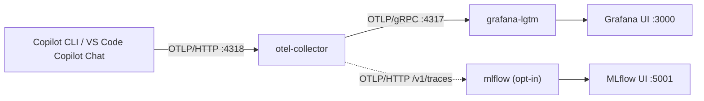

# Observability with OpenTelemetry

The Copilot SDK can emit [OpenTelemetry](https://opentelemetry.io/) traces from
the underlying Copilot CLI. This page shows how to enable tracing in the **Go**
and **Python** tutorials and inspect the spans in Grafana using a minimal,
two-service Docker Compose stack.

Reference:
[OpenTelemetry instrumentation for Copilot SDK](https://docs.github.com/en/copilot/how-tos/copilot-sdk/observability/opentelemetry).

---

## How it works



Telemetry is **opt-in**, so the tutorials behave exactly as before unless you
configure an endpoint. Python scripts expose shared `--otel-*` options, and Go
tutorial subcommands expose the same options as `tutorial` persistent flags;
both languages can also use the equivalent environment variables
(VS Code Copilot Chat is wired separately via `.vscode/settings.json` — see
[Visualizing VS Code Copilot Chat metrics](#visualizing-vs-code-copilot-chat-metrics)):

| Environment variable | CLI option | Description |
|----------------------|------------|-------------|
| `OTEL_EXPORTER_OTLP_ENDPOINT` | `--otel-endpoint` | OTLP HTTP endpoint (e.g. `http://localhost:4318`). When unset, telemetry is disabled. |
| `OTEL_INSTRUMENTATION_GENAI_CAPTURE_MESSAGE_CONTENT` | `--otel-capture-content` | Optional `true`/`false` to capture prompt/response content in spans. |
| `OTEL_BSP_SCHEDULE_DELAY` | `--otel-bsp-schedule-delay` | Span batch flush interval in ms. Keep low (e.g. `500`) — see [Troubleshooting](#troubleshooting-no-spans-arrive). |

The shared helpers that build the `TelemetryConfig`:

- **Python** — [`src/python/scripts/tutorials/_telemetry.py`](https://github.com/ks6088ts/template-github-copilot/blob/main/src/python/scripts/tutorials/_telemetry.py) (`make_client()`).
- **Go** — [`src/go/cmd/tutorial/telemetry.go`](https://github.com/ks6088ts/template-github-copilot/blob/main/src/go/cmd/tutorial/telemetry.go) (`newClientOptions()`).

### Observability considerations

Use these points when you move from the tutorial stack to a real application:

- `TelemetryConfig` is the SDK-level switch. The official guide lists
  language-specific options for the OTLP endpoint, exporter type
  (`"otlp-http"` or `"file"`), JSON-lines file path, instrumentation source
  name, and message-content capture. This repository's helpers intentionally
  expose only the endpoint and content-capture settings; the Python scripts and
  Go tutorial CLI expose these settings as `--otel-*` options.
- Keep content capture disabled by default. Enable it only in trusted
  environments because spans can include prompts, responses, and tool
  arguments.
- Prefer OTLP/HTTP for collector-based setups like this tutorial. Use file
  export only for local diagnostics or disconnected review, then treat the
  output like any other log that may contain sensitive data.
- Treat trace-context propagation as an advanced integration point.
  `TelemetryConfig` is enough to collect CLI spans; add explicit propagation
  only when your application creates its own spans and needs them in the same
  distributed trace as the CLI.
- For cost attribution, combine traces with `assistant.usage` streaming events
  and inspect the `apiEndpoint` value to identify which inference API handled
  the turn.

> **SDK v1.0.2+ telemetry options.** `TelemetryConfig` adds an `otlpProtocol`
> option (`http/json` or `http/protobuf`) to select the OTLP export transport,
> and the client now calls `runtime.shutdown` on a normal stop so telemetry is
> flushed deterministically before the process exits
> ([Copilot SDK v1.0.2](https://github.com/github/copilot-sdk/releases/tag/v1.0.2)).

---

## 1. Start the observability stack

All Docker assets live under [`docker/`](https://github.com/ks6088ts/template-github-copilot/tree/main/docker).

```bash
# from the repository root
docker compose -f docker/compose.yaml up -d
```

This launches two services:

| Service | Image | Host ports |
|---------|-------|------------|
| `otel-collector` | `otel/opentelemetry-collector-contrib` | `4317` (gRPC), `4318` (HTTP) |
| `grafana-lgtm` | `grafana/otel-lgtm` (Loki + Grafana + Tempo + Prometheus) | `3000` (Grafana UI) |

An optional third service, an MLflow tracking server, can be enabled as a second
trace sink. See [Forwarding traces to MLflow](#forwarding-traces-to-mlflow).

---

## 2. Point the tutorials at the collector

```bash
export OTEL_EXPORTER_OTLP_ENDPOINT=http://localhost:4318
# Flush spans quickly (see "Troubleshooting" below)
export OTEL_BSP_SCHEDULE_DELAY=500
# optional:
export OTEL_INSTRUMENTATION_GENAI_CAPTURE_MESSAGE_CONTENT=true
```

### Python

```bash
cd src/python
uv run python scripts/tutorials/01_chat_bot.py \
  --otel-endpoint http://localhost:4318 \
  --otel-bsp-schedule-delay 500 \
  --prompt "Hello, Copilot!"
```

### Go

```bash
cd src/go
make build
./dist/template-github-copilot-go tutorial chat-bot \
  --otel-endpoint http://localhost:4318 \
  --otel-bsp-schedule-delay 500 \
  --prompt "Hello, Copilot!"
```

---

## 3. Explore the traces

Open Grafana at [http://localhost:3000](http://localhost:3000) (login
`admin` / `admin`), then go to **Explore → Tempo** and search for recent traces.

You can also confirm spans are flowing straight from the collector logs:

```bash
docker compose -f docker/compose.yaml logs -f otel-collector
```

---

## 4. Verify the SDK is emitting spans

Use this check to confirm the OpenTelemetry wiring works end to end for the
**Python** and **Go** scripts, independent of Grafana. It relies on the
collector's `debug` exporter, which logs a one-line summary for every batch of
spans it receives.

Run one of the scripts with telemetry enabled.

### Python

```bash
cd src/python
uv run python scripts/tutorials/01_chat_bot.py \
  --otel-endpoint http://localhost:4318 \
  --otel-bsp-schedule-delay 500 \
  --prompt "OTEL check (python)"
```

### Go

```bash
cd src/go
make build
./dist/template-github-copilot-go tutorial chat-bot \
  --otel-endpoint http://localhost:4318 \
  --otel-bsp-schedule-delay 500 \
  --prompt "OTEL check (go)"
```

Then read the collector logs and look for `traces` batches with a non-zero
`spans` count:

```bash
docker compose -f docker/compose.yaml logs otel-collector | grep '"otelcol.signal": "traces"'
```

A working setup prints a line whose `spans` value is greater than zero:

```text
otel-collector-1 | ... Traces {... "otelcol.component.id": "debug", "otelcol.signal": "traces", "resource spans": 1, "spans": 2}
```

Confirm the following:

1. The script exits with code `0` and prints the assistant's reply. A missing reply (`(no response)` or `[Error] ...`) points to a CLI or authentication problem rather than a telemetry problem.
2. The collector logs show `"spans": N` with `N` greater than zero shortly after the run. When no `traces` line appears, see [Troubleshooting](#troubleshooting-no-spans-arrive); the usual cause is the CLI being terminated before it flushes, which `--otel-bsp-schedule-delay 500` resolves.
3. Optionally, open **Grafana → Explore → Tempo** (previous step) and confirm the same trace appears there.

---

## 5. Tear down

```bash
docker compose -f docker/compose.yaml down
```

---

## Visualizing VS Code Copilot Chat metrics

The same collector can also receive OpenTelemetry **traces, metrics, and logs**
emitted directly by **GitHub Copilot Chat in VS Code** — no extra services or
dependencies, the existing two-container stack is enough.

This repository ships [`.vscode/settings.json`](https://github.com/ks6088ts/template-github-copilot/blob/main/.vscode/settings.json)
pre-wired to the local collector:

```json
{
  "github.copilot.chat.otel.enabled": true,
  "github.copilot.chat.otel.exporterType": "otlp-http",
  "github.copilot.chat.otel.otlpEndpoint": "http://localhost:4318",
  "github.copilot.chat.otel.captureContent": false
}
```

Steps:

1. Start the stack: `docker compose -f docker/compose.yaml up -d`.
2. Open this folder in VS Code (the workspace settings above are applied
   automatically). Reload the window if Copilot was already running.
3. Use Copilot Chat / an agent as usual — VS Code exports OTLP to the collector.
4. In Grafana ([http://localhost:3000](http://localhost:3000), `admin`/`admin`)
   open **Explore**:
   - **Tempo** data source → agent traces (`invoke_agent`, `chat`, `execute_tool`).
   - **Prometheus** data source → metrics such as `github_copilot_agent_turn_count`
     and `github_copilot_mcp_server_connection_count_total`.

Notes:

- Signal names follow the
  [OTel GenAI Semantic Conventions](https://github.com/open-telemetry/semantic-conventions/blob/main/docs/gen-ai/)
  under the `gen_ai.*` and `github.copilot.*` namespaces.
- When the collector is **not** running, VS Code's export fails silently
  (connection refused) and Copilot keeps working normally.
- `captureContent` is `false` by default. Enable it only in trusted
  environments — it records full prompts, responses, and tool arguments.
- For the equivalent **Azure** pipeline (OTel Collector → Application Insights →
  Azure Managed Grafana), see
  [Monitor AI coding agents with Grafana](https://learn.microsoft.com/azure/managed-grafana/grafana-opentelemetry-app-insights).

---

## Forwarding traces to MLflow

[MLflow](https://mlflow.org/) can ingest the Copilot CLI traces through its
OTLP/HTTP endpoint at `/v1/traces`, rendering them as MLflow traces next to
Grafana. This helps when your team already reviews GenAI traces in MLflow.
MLflow accepts **traces only** (no metrics or logs) and supports OTLP/HTTP but
not OTLP/gRPC
([Collect OpenTelemetry Traces into MLflow](https://mlflow.org/docs/latest/genai/tracing/opentelemetry/ingest/)).

Enabling MLflow forwarding uses two independent opt-in switches, both **off by
default**: the `mlflow` **Compose profile** that creates the tracking-server
container, and the `otlphttp/mlflow` **exporter** in the collector config that
routes traces to it. You need both.

### 1. Start the stack with the `mlflow` profile

The `mlflow` service declares `profiles: [mlflow]`, so a plain
`docker compose up` skips it. Pass the profile to create the container:

```bash
docker compose -f docker/compose.yaml --profile mlflow up -d
```

Keep the `--profile mlflow` flag on every later `up`, `down`, `ps`, and `logs`
command that should include the server. Confirm it is running:

```bash
docker compose -f docker/compose.yaml --profile mlflow ps mlflow
```

### 2. Enable the `otlphttp/mlflow` exporter in the collector config

Both edits below are in
[`docker/otel-collector-config.yaml`](https://github.com/ks6088ts/template-github-copilot/blob/main/docker/otel-collector-config.yaml).
Apply **both**: the collector refuses to start if an exporter is defined but
unused, or referenced by a pipeline but undefined.

First, in the `exporters:` section, uncomment the pre-written `otlphttp/mlflow`
block (remove the leading `# ` from each line) so it reads:

```yaml
  otlphttp/mlflow:
    endpoint: ${env:MLFLOW_TRACKING_URI:-http://mlflow:5000}
    headers:
      x-mlflow-experiment-id: ${env:MLFLOW_EXPERIMENT_ID:-0}
    compression: gzip
```

Second, under `service.pipelines`, add `otlphttp/mlflow` to the `traces`
pipeline exporters. Change this:

```yaml
    traces:
      receivers: [otlp]
      processors: [batch]
      exporters: [otlp/lgtm, debug]
```

into this (leave the `metrics` and `logs` pipelines unchanged, because MLflow
ingests traces only):

```yaml
    traces:
      receivers: [otlp]
      processors: [batch]
      exporters: [otlp/lgtm, debug, otlphttp/mlflow]
```

### 3. Reload the collector and confirm it started

```bash
docker compose -f docker/compose.yaml up -d --force-recreate otel-collector
docker compose -f docker/compose.yaml logs --tail 20 otel-collector
```

A clean start logs `Everything is ready. Begin running and processing data.`
with no `otlphttp/mlflow` errors. If the collector keeps restarting, re-check
that both edits in step 2 were applied.

### 4. Run a tutorial and browse the traces

Run any tutorial as usual (see the steps above), then open the MLflow UI at
[http://localhost:5001](http://localhost:5001) and check the **Traces** tab of
the `Default` experiment.

Inside the Compose network the collector reaches the server at
`http://mlflow:5000` and tags each trace with the destination experiment via the
`x-mlflow-experiment-id` header. Override the defaults (experiment id `0`, the
`Default` experiment) with `MLFLOW_TRACKING_URI` and `MLFLOW_EXPERIMENT_ID`, for
example in a `.env` file.

Notes:

- OTLP ingestion requires a SQL backend store; the bundled server uses SQLite on
  a named volume.
- The UI is published on host port `5001` to avoid clashing with a local MLflow
  instance or macOS AirPlay on `5000`.
- The `mlflow` service sets `--allowed-hosts=*` because it is a local-only dev
  sink. MLflow 3.x otherwise rejects the collector's `Host: mlflow:5000` header
  as a DNS-rebinding attempt. Restrict that list if you expose the server beyond
  localhost.
- MLflow accepts gzip-compressed payloads since 3.7.0, so the exporter sets
  `compression: gzip` to match the bundled image. Set it to `none` for an older
  MLflow server.

---

## Troubleshooting: no spans arrive

When the SDK launches the CLI over **stdio** (the tutorial default), it kills
the CLI with `SIGKILL` (`client.Stop()` → `process.Kill()`) the moment a
single-shot prompt finishes. The CLI batches spans and flushes on an interval
whose **default is 5 seconds**, so a short prompt is terminated before the first
flush and **no spans are ever sent**.

Set the standard OpenTelemetry batch env var so the CLI flushes before it is
killed:

```bash
export OTEL_BSP_SCHEDULE_DELAY=500   # milliseconds
```

Alternatively, run the CLI in [server mode](server_mode.md) and connect the
tutorial with `--cli-url`; the long-lived process flushes on its normal
interval. A direct `copilot -p "..."` run always works because it exits
gracefully and flushes on shutdown.

---

## Advanced: distributed trace context

The `TelemetryConfig` above is all you need to collect CLI spans. If your own
application creates its own OpenTelemetry spans and you want them linked into
the **same** distributed trace as the CLI, see the *Trace context propagation*
section of the
[official guide](https://docs.github.com/en/copilot/how-tos/copilot-sdk/observability/opentelemetry).
For Python this also requires the `opentelemetry-api` package
(`pip install copilot-sdk[telemetry]`); Go already depends on
`go.opentelemetry.io/otel`.
