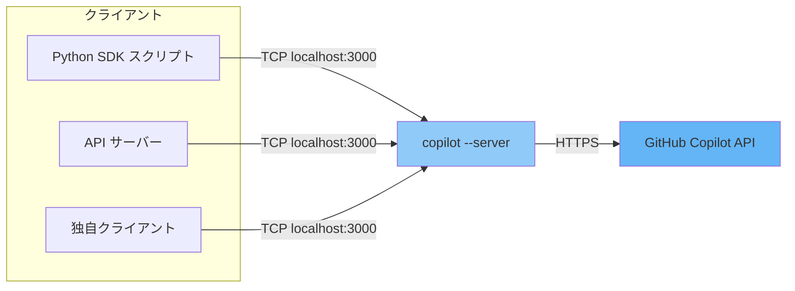

# Copilot CLI を単独サーバーモードで起動する

このページは、**GitHub Copilot CLI** を長時間稼働の単独 **TCP サーバー** として
起動し、他のプロセス（Python SDK、API サーバー、独自クライアントなど）がソケット
経由で接続するための詳細リファレンスです。

基本となるコマンドは次のとおりです。

```bash
copilot --server --port 3000 --log-level all --allow-all-tools --allow-all-paths --allow-all-urls
```

> **なぜ `copilot --help` に載っていないのか**
> `--server` と `--port` は、CLI をサービスとして稼働させるための *運用向け*
> フラグです。`copilot --help`（対話モードや `-p/--prompt` の利用を中心に説明）
> には意図的に載っていませんが、完全にサポートされています。`--help` に表示される
> よく似た `--acp` フラグは **Agent Client Protocol** サーバーを起動するもので、
> プロトコルが異なり、SDK の `RuntimeConnection` が接続する先では **ありません**。

---

## サーバーモードを使うべき場面

デフォルトでは SDK が `copilot` CLI を **stdio** 経由で自動起動するため、
チュートリアルではサーバーモードは **不要** です。次のような場合に単独サーバーを
起動します。

- **1 つのランタイムを複数クライアントで共有** — 各スクリプトが個別に CLI を
  起動するのではなく、複数のスクリプトや API ワーカーが 1 つのウォームな CLI
  プロセスに接続する。
- **プロセスを分離** — CLI を専用コンテナで起動し（後述の **Docker / Make での実行**
  を参照）、API サーバーからネットワーク越しに接続する。
- **トラフィックを一元的に観測** — ログや OpenTelemetry シグナルを 1 か所で収集する。



---

## コマンドの構成

| フラグ | 意味 |
|--------|------|
| `--server` | 対話セッションではなく長時間稼働のサーバーとして CLI を起動する。 |
| `--port 3000` | サーバーが待ち受ける TCP ポート。空いている任意のポートを指定可能。 |
| `--log-level all` | 詳細ログ。全レベルは後述の **ログレベル** を参照。 |
| `--allow-all-tools` | すべてのツールを対話的な確認なしで実行可能にする。無人（非対話）運用に必須。 |
| `--allow-all-paths` | ファイルパス検証を無効化し、ファイルシステム上の任意のパスへのアクセスを許可する。 |
| `--allow-all-urls` | 確認なしですべての URL へのアクセスを許可する。 |
| `--model <model>` | （任意）サーバーが使用するデフォルトモデル。例: `--model gpt-5-mini`。リクエスト単位や `COPILOT_MODEL` で上書き可能。 |

> 3 つの `--allow-all-*` フラグは、単一のショートカット `--allow-all`
> （または `--yolo`）で置き換えられます。これは
> `--allow-all-tools --allow-all-paths --allow-all-urls` と完全に等価です。

### `--allow-all-*` フラグが必要な理由

単独サーバーは **無人** で動作するため、パーミッション確認に応答する人間が
ターミナルにいません。`--allow-all-*` フラグはツール・ファイル・ネットワーク
アクセスを事前承認し、ブロックせずにリクエストを処理できるようにします。より
厳密に制御したい場合は、後述の **`--allow-all-*` の代わりにパーミッションを限定する**
で説明する粒度の細かいフラグに置き換えられます。

---

## サーバーの起動

### 1. 認証する

サーバーには Copilot にアクセスできる GitHub アカウントが必要です。いずれかの
方法を使用します。

```bash
# 方法 A: GitHub CLI（サーバーがこの認証情報を再利用）
gh auth login

# 方法 B: パーソナルアクセストークン
export COPILOT_GITHUB_TOKEN="ghp_xxxxxxxxxxxxxxxxxxxx"
```

`COPILOT_GITHUB_TOKEN`、`GH_TOKEN`、`GITHUB_TOKEN` はこの優先順位で参照されます。

### 2. コマンドを実行する

```bash
copilot \
  --server \
  --port 3000 \
  --log-level all \
  --allow-all-tools --allow-all-paths --allow-all-urls \
  --model gpt-5-mini
```

### 3. 起動メッセージを確認する

正常に起動すると、サーバーは次を出力します。

```text
CLI server listening on port 3000
Warning: No COPILOT_CONNECTION_TOKEN was set, so connections will be accepted from any client
```

1 行目はリスナーが起動したことを示します。2 行目は **セキュリティ通知** です
（後述の **サーバーのセキュリティ確保** を参照）。その後、
停止するまでプロセスはフォアグラウンドで稼働し続けます。

---

## サーバーが待ち受けているかの確認

別のターミナルから次を実行します。

```bash
# 待ち受けソケットを表示
lsof -nP -iTCP:3000 -sTCP:LISTEN

# またはポートを疎通確認
nc -z -v 127.0.0.1 3000
```

疎通に成功すると `Connection to 127.0.0.1 port 3000 succeeded!` と表示されます。
ローカル実行ではサーバーはループバックインターフェース（`127.0.0.1`）に
バインドするため、デフォルトでは同一ホストから到達可能です。別のコンテナや
ホストから到達するには、後述の **Docker / Make での実行** と
**サーバーのセキュリティ確保** を参照してください。

---

## SDK からの接続

SDK クライアントが stdio 経由で独自に CLI を起動する代わりに、起動中のサーバーへ
向けます。`RuntimeConnection` を渡します。

```python
from copilot import CopilotClient, RuntimeConnection

client = CopilotClient(
    connection=RuntimeConnection.for_uri("localhost:3000")
)
await client.start()
```

チュートリアルスクリプトはこれを `--cli-url` フラグとして公開しています。

```bash
cd src/python
uv run python scripts/tutorials/01_chat_bot.py \
  --prompt "What is GitHub Copilot?" \
  --cli-url localhost:3000
```

API サーバーは同じ値を `COPILOT_CLI_URL` 環境変数から読み取ります
（例: `COPILOT_CLI_URL=127.0.0.1:3000`）。

---

## ログレベル

`--log-level` は次の値を受け付けます（`copilot help logging`）。

| レベル | 出力 |
|--------|------|
| `none` | ログ出力なし |
| `error` | エラーメッセージのみ |
| `warning` | エラーと警告メッセージ |
| `info` | エラー・警告・情報メッセージ |
| `debug` | デバッグを含むすべてのメッセージ |
| `all` | `debug` と同じ |
| `default` | `info` と同じ |

`--log-dir <directory>` でログファイルの出力先を変更できます（デフォルト:
`~/.copilot/logs/`）。`--log-level all` は学習中に便利ですが、本番では `info` や
`warning` に下げて静かなログにします。

> OpenTelemetry の診断ログ（`OTEL_LOG_LEVEL`）やトレース・メトリクスのエクスポート
> については `copilot help monitoring` を参照してください。

---

## `--allow-all-*` の代わりにパーミッションを限定する

`--allow-all-*` はローカルでの実験には最も手軽ですが、CLI は粒度の細かい
パーミッションをサポートしています（`copilot help permissions`）。広範なフラグを
限定的なものに置き換えることで、サーバーの影響範囲を抑えられます。

```bash
# `git push` 以外のすべての git コマンドを許可
copilot --server --port 3000 \
  --allow-tool='shell(git:*)' --deny-tool='shell(git push)'

# ファイル編集と単一ドメインのみを許可
copilot --server --port 3000 \
  --allow-tool='write' \
  --allow-url=github.com
```

主なルール:

- **拒否が常に優先される。** `--deny-tool` / `--deny-url` は、`--allow-all-tools`
  を含むあらゆる許可ルールより優先されます。
- **`--available-tools` / `--excluded-tools`** はモデルが *見える* ツールを決め、
  `--allow-tool` / `--deny-tool` は *確認なしで実行できる* ツールを決めます。
- **URL ルールはプロトコルを区別します。** `github.com` の許可は `https://` のみを
  許可します。必要なら `http://` を明示的に追加してください。
- **パスアクセス** はデフォルトで作業ディレクトリ（およびシステムの一時ディレクトリ）
  に限定されます。`--allow-all-paths` でこの制限を解除し、`--disallow-temp-dir` で
  さらに厳しくできます。

---

## モデルの選択

`--model` フラグはサーバーのデフォルトモデルを設定します。環境変数でも設定できます。

```bash
export COPILOT_MODEL="gpt-5-mini"
copilot --server --port 3000 --allow-all
```

優先順位: `--model` フラグが `COPILOT_MODEL` を上書きし、`COPILOT_MODEL` が
永続化された設定のデフォルトを上書きします。`--model auto` を指定すると Copilot が
自動的にモデルを選択します。

---

## サーバーのセキュリティ確保

トークンがない場合、**ポートに到達できるすべてのクライアントが**、あなたの Copilot
アイデンティティでサーバーを利用 **できてしまいます**。起動時の警告はこれを示して
います。認証を要求するには次のようにします。

1. **サーバー側**の環境に共有シークレットを設定します。

   ```bash
   export COPILOT_CONNECTION_TOKEN="your-shared-secret"
   copilot --server --port 3000 --allow-all --model gpt-5-mini
   ```

2. すべてのクライアントから **同じ** トークンを渡します。

   ```python
   from copilot import CopilotClient, RuntimeConnection

   client = CopilotClient(
       connection=RuntimeConnection.for_uri(
           "localhost:3000",
           connection_token="your-shared-secret",
       )
   )
   ```

追加の堅牢化:

- **localhost に限定する。** 信頼できないネットワークにポートをバインド・転送
  しないでください。`--allow-all-*` と組み合わさると、公開されたサーバーは実質的に
  あなたのユーザー権限でのリモートコード実行になります。
- **SDK のシナリオでは `--no-auto-login` を渡さない。** サーバーが認証情報なしで
  起動し、セッションが
  `Session was not created with authentication info or custom provider`
  で失敗します。

---

## Docker / Make での実行

### Make ターゲット

リポジトリではこのコマンドを Make ターゲットとして用意しています。

```bash
cd src/python
export COPILOT_GITHUB_TOKEN="ghp_xxxxxxxxxxxxxxxxxxxx"
make copilot           # `copilot --server --port 3000 ... --model $(COPILOT_MODEL)` を実行
```

モデルはデフォルトで `gpt-5-mini` で、`make copilot COPILOT_MODEL=gpt-5.2` の
ように上書きできます。

### 専用コンテナ

[`copilot.Dockerfile`](https://github.com/ks6088ts/template-github-copilot/blob/main/src/python/copilot.Dockerfile)
は、**CLI サーバーのみ** を実行しポート 3000 を公開する Node.js イメージを
ビルドします。

```dockerfile
CMD ["bash", "-c", "copilot --server --port 3000 --log-level all --allow-all-tools --allow-all-paths --allow-all-urls --model ${COPILOT_MODEL}"]
```

### Docker Compose

[`compose.docker.yaml`](https://github.com/ks6088ts/template-github-copilot/blob/main/src/python/compose.docker.yaml)
は CLI サーバーと API を別々のサービスとして実行します。API は Compose ネットワーク
上でサービス名によりサーバーへ接続します。

```yaml
services:
  copilot:
    # ...
    ports:
      - "3000:3000"
  api:
    environment:
      - COPILOT_CLI_URL=copilot:3000   # copilot サービスへ接続
    depends_on:
      copilot:
        condition: service_healthy
```

`monolith` プロファイルは CLI サーバーと API を 1 つのコンテナ内で実行し、API は
`127.0.0.1:3000` でサーバーに到達します。
[モノリシックな `Dockerfile`](https://github.com/ks6088ts/template-github-copilot/blob/main/src/python/Dockerfile)
は **supervisord** で両プロセスを管理します。

コンテナの詳しい手順は CopilotReportForge の
[ローカルでのコンテナ実行](../copilot_report_forge/operations/container_local_run.md)
ガイドを参照してください。

---

## サーバーの停止

サーバーはフォアグラウンドで稼働します。`Ctrl+C` で停止します。バックグラウンドや
コンテナで起動した場合は次のようにします。

```bash
# ローカルプロセスを特定して停止
lsof -nP -iTCP:3000 -sTCP:LISTEN          # PID を確認
kill <PID>

# Docker Compose
docker compose down
```

---

## トラブルシューティング

| 症状 | 原因 / 対処 |
|------|-------------|
| 起動時に `address already in use` | 別プロセスがポートを使用中。停止する（`lsof -nP -iTCP:3000 -sTCP:LISTEN`）か、別の `--port` で起動する。 |
| `No COPILOT_CONNECTION_TOKEN was set` の警告 | トークンなしでは想定どおり。ローカルテストでは問題なし。アクセスを制限するには `COPILOT_CONNECTION_TOKEN` を設定する。 |
| `Session was not created with authentication info or custom provider` | サーバーに認証情報がない（多くは `--no-auto-login` が原因）。そのフラグを外し、`gh auth login` または `COPILOT_GITHUB_TOKEN` で認証する。 |
| 別コンテナからクライアントが接続できない | `localhost` ではなくサービス名（`copilot:3000`）を使い、ポートが公開されているか確認する。 |
| ツールが承認待ちでハングする | 無人運用に必要な `--allow-all-tools`（または対応する `--allow-tool` ルール）がサーバーに不足している。 |

---

## 関連項目

- [はじめに](getting_started.md) — 環境構築と本セクションの簡易版。
- [アーキテクチャ](architecture.md) — SDK・CLI サーバー・Copilot API の連携。
- [01: CLI チャットボット](tutorials/01_chat_bot.md) — 最初のスクリプト。`--cli-url`
  の利用と接続トークンの注意点を含む。
- `copilot help permissions`、`copilot help logging`、`copilot help monitoring`、
  `copilot help environment` — 組み込みのリファレンストピック。
