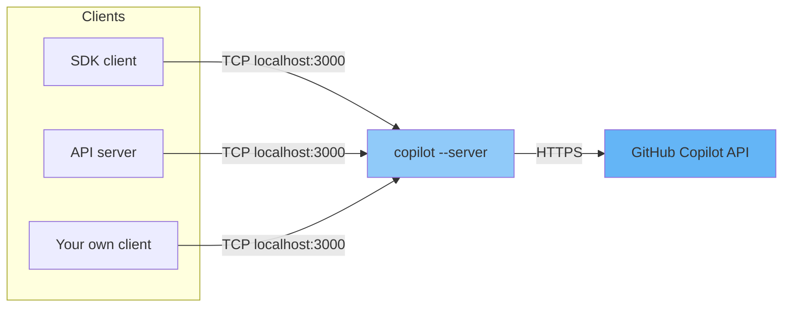

# Running the Copilot CLI in Standalone Server Mode

This page is a detailed reference for starting the **GitHub Copilot CLI** as a
long-lived, standalone **TCP server** that other processes — any language SDK,
the API server, or your own clients — connect to over a socket.

The canonical command is:

```bash
copilot --server --port 3000 --log-level all --allow-all-tools --allow-all-paths --allow-all-urls
```

> **Why this is not in `copilot --help`**
> `--server` and `--port` are *operational* flags for running the CLI as a
> service. They are intentionally omitted from the `copilot --help` listing
> (which focuses on interactive and `-p/--prompt` usage), but they are fully
> supported. The closely related `--acp` flag shown in `--help` starts an
> **Agent Client Protocol** server instead, which is a different protocol and
> is **not** what the SDK's runtime connection connects to.

---

## When to Use Server Mode

By default the SDK spawns the `copilot` CLI for you over **stdio**, so you do
**not** need server mode for the tutorials. Start a standalone server when you
want to:

- **Share one runtime across many clients** — multiple scripts or API workers
  connect to a single warm CLI process instead of each spawning its own.
- **Decouple processes** — run the CLI in its own container (see
  [Docker](#running-with-docker-and-make)) and connect the API server to it
  over the network.
- **Inspect traffic centrally** — one place to collect logs and OpenTelemetry
  signals.



---

## Anatomy of the Command

| Flag | Meaning |
|------|---------|
| `--server` | Run the CLI as a long-lived server instead of an interactive session. |
| `--port 3000` | TCP port the server listens on. Pick any free port. |
| `--log-level all` | Verbose logging. See [Log Levels](#log-levels) for the full set. |
| `--allow-all-tools` | Allow every tool to run without an interactive confirmation prompt. Required for unattended (non-interactive) operation. |
| `--allow-all-paths` | Disable file-path verification and allow access to any path on the filesystem. |
| `--allow-all-urls` | Allow access to all URLs without confirmation. |
| `--model <model>` | (Optional) Default model the server uses, e.g. `--model gpt-5-mini`. Overridable per request and via `COPILOT_MODEL`. |

> The three `--allow-all-*` flags can be replaced by the single shortcut
> `--allow-all` (or `--yolo`), which is exactly equivalent to
> `--allow-all-tools --allow-all-paths --allow-all-urls`.

### Why the `--allow-all-*` flags are needed

A standalone server runs **unattended** — there is no human at a terminal to
answer permission prompts. The `--allow-all-*` flags pre-approve tool, file,
and network access so the server can act on requests without blocking. For
tighter control you can swap them for the granular flags described under
[Scoping Permissions](#scoping-permissions-instead-of-allow-all).

---

## Starting the Server

### 1. Authenticate

The server needs a GitHub account with Copilot access. Use either method:

```bash
# Option A: GitHub CLI (the server reuses these credentials)
gh auth login

# Option B: Personal access token
export COPILOT_GITHUB_TOKEN="ghp_xxxxxxxxxxxxxxxxxxxx"
```

`COPILOT_GITHUB_TOKEN`, `GH_TOKEN`, and `GITHUB_TOKEN` are honored in that order
of precedence.

### 2. Run the command

```bash
copilot \
  --server \
  --port 3000 \
  --log-level all \
  --allow-all-tools --allow-all-paths --allow-all-urls \
  --model gpt-5-mini
```

### 3. Confirm the startup output

On a successful start the server prints:

```text
CLI server listening on port 3000
Warning: No COPILOT_CONNECTION_TOKEN was set, so connections will be accepted from any client
```

The first line confirms the listener is up. The second line is a **security
notice** — see [Securing the Server](#securing-the-server). The process then
stays in the foreground until you stop it.

---

## Verifying the Server Is Listening

From another terminal:

```bash
# Show the listening socket
lsof -nP -iTCP:3000 -sTCP:LISTEN

# Or probe the port
nc -z -v 127.0.0.1 3000
```

A successful probe reports `Connection to 127.0.0.1 port 3000 succeeded!`. On a
local run the server binds to the loopback interface (`127.0.0.1`), so it is
reachable from the same host by default. To reach it from another container or
host, see [Running with Docker and Make](#running-with-docker-and-make) and
[Securing the Server](#securing-the-server).

---

## Connecting from a Client

Point any SDK client at the running server instead of letting it spawn its own
CLI over stdio. In code, you construct the client with a **runtime connection**
pointing at `host:port` instead of the default stdio transport.

Each tutorial edition exposes this as a `--cli-url host:port` flag:

- **Python:** `uv run python scripts/tutorials/01_chat_bot.py --cli-url localhost:3000` — see the [Python CLI Chatbot tutorial](python/tutorials/01_chat_bot.md)
- **Go:** `./dist/template-github-copilot-go tutorial chat-bot --cli-url localhost:3000` — see the [Go CLI Chatbot tutorial](go/tutorials/01_chat_bot.md)

The API server reads the same value from the `COPILOT_CLI_URL` environment
variable (e.g. `COPILOT_CLI_URL=127.0.0.1:3000`).

---

## Log Levels

`--log-level` accepts the following values (`copilot help logging`):

| Level | Output |
|-------|--------|
| `none` | No logging output |
| `error` | Only error messages |
| `warning` | Error and warning messages |
| `info` | Error, warning, and info messages |
| `debug` | All messages including debug |
| `all` | Same as `debug` |
| `default` | Same as `info` |

Use `--log-dir <directory>` to redirect log files (default: `~/.copilot/logs/`).
`--log-level all` is convenient while learning; drop to `info` or `warning` for
quieter production logs.

> For OpenTelemetry diagnostic logging (`OTEL_LOG_LEVEL`) and exporting traces
> and metrics, see `copilot help monitoring`.

---

## Scoping Permissions Instead of Allow-All

`--allow-all-*` is the simplest choice for local experimentation, but the CLI
supports fine-grained permissions (`copilot help permissions`). Replace the
broad flags with targeted ones to reduce the server's blast radius:

```bash
# Allow all git commands except `git push`
copilot --server --port 3000 \
  --allow-tool='shell(git:*)' --deny-tool='shell(git push)'

# Allow only file edits and a single domain
copilot --server --port 3000 \
  --allow-tool='write' \
  --allow-url=github.com
```

Key rules:

- **Denial always wins.** `--deny-tool` / `--deny-url` take precedence over any
  allow rule, including `--allow-all-tools`.
- **`--available-tools` / `--excluded-tools`** decide which tools the model can
  *see*; `--allow-tool` / `--deny-tool` decide which run *without a prompt*.
- **URL rules are protocol-aware.** Allowing `github.com` permits `https://`
  only; add `http://` explicitly if needed.
- **Path access** defaults to the working directory (plus the system temp dir).
  `--allow-all-paths` removes that restriction; `--disallow-temp-dir` tightens
  it.

---

## Choosing the Model

The `--model` flag sets the default model for the server. It can also be set
through the environment:

```bash
export COPILOT_MODEL="gpt-5-mini"
copilot --server --port 3000 --allow-all
```

Precedence: the `--model` flag overrides `COPILOT_MODEL`, which overrides the
persisted config default. Use `--model auto` to let Copilot pick automatically.

---

## Securing the Server

Without a token, **any client that can reach the port can use the server** with
your Copilot identity. The startup warning highlights this. To require
authentication:

1. Set a shared secret in the **server's** environment:

   ```bash
   export COPILOT_CONNECTION_TOKEN="your-shared-secret"
   copilot --server --port 3000 --allow-all --model gpt-5-mini
   ```

2. Pass the **same** token from every client when constructing its runtime
   connection — alongside the `host:port` URL, supply the connection token
   (for example a `connection_token` option in Python or the equivalent in Go).

Additional hardening:

- **Keep it on localhost.** Do not bind or forward the port to untrusted
  networks. Combined with `--allow-all-*`, an exposed server is effectively
  remote code execution as your user.
- **Do not pass `--no-auto-login`** for SDK scenarios — the server would start
  without credentials, and sessions fail with
  `Session was not created with authentication info or custom provider`.

---

## Running with Docker and Make

### Make target

The Python service in this repo wraps the command in a Make target (the same
`copilot --server` command works regardless of which SDK connects):

```bash
cd src/python
export COPILOT_GITHUB_TOKEN="ghp_xxxxxxxxxxxxxxxxxxxx"
make copilot           # runs `copilot --server --port 3000 ... --model $(COPILOT_MODEL)`
```

The model defaults to `gpt-5-mini` and can be overridden with
`make copilot COPILOT_MODEL=gpt-5.2`.

### Dedicated container

[`copilot.Dockerfile`](https://github.com/ks6088ts/template-github-copilot/blob/main/src/python/copilot.Dockerfile)
builds a Node.js image that runs **only** the CLI server and exposes port 3000:

```dockerfile
CMD ["bash", "-c", "copilot --server --port 3000 --log-level all --allow-all-tools --allow-all-paths --allow-all-urls --model ${COPILOT_MODEL}"]
```

### Docker Compose

[`compose.docker.yaml`](https://github.com/ks6088ts/template-github-copilot/blob/main/src/python/compose.docker.yaml)
runs the CLI server and the API as separate services. The API connects to the
server by service name over the Compose network:

```yaml
services:
  copilot:
    # ...
    ports:
      - "3000:3000"
  api:
    environment:
      - COPILOT_CLI_URL=copilot:3000   # connect to the copilot service
    depends_on:
      copilot:
        condition: service_healthy
```

A `monolith` profile runs both the CLI server and the API inside one container,
where the API reaches the server via `127.0.0.1:3000`. The
[monolithic `Dockerfile`](https://github.com/ks6088ts/template-github-copilot/blob/main/src/python/Dockerfile)
uses **supervisord** to manage both processes.

For a full container walkthrough, see the CopilotReportForge
[Running Containers Locally](../copilot_report_forge/operations/container_local_run.md)
guide.

---

## Stopping the Server

The server runs in the foreground. Stop it with `Ctrl+C`. If it was started in
the background or in a container:

```bash
# Find and stop a local process
lsof -nP -iTCP:3000 -sTCP:LISTEN          # note the PID
kill <PID>

# Docker Compose
docker compose down
```

---

## Troubleshooting

| Symptom | Cause / Fix |
|---------|-------------|
| `address already in use` on startup | Another process holds the port. Stop it (`lsof -nP -iTCP:3000 -sTCP:LISTEN`) or start with a different `--port`. |
| `No COPILOT_CONNECTION_TOKEN was set` warning | Expected without a token; fine for local testing. Set `COPILOT_CONNECTION_TOKEN` to restrict access. |
| `Session was not created with authentication info or custom provider` | The server has no credentials — usually from `--no-auto-login`. Remove that flag and authenticate via `gh auth login` or `COPILOT_GITHUB_TOKEN`. |
| Client cannot connect from another container | Use the service name (`copilot:3000`), not `localhost`, and ensure the port is published. |
| Tools hang waiting for approval | The server is missing `--allow-all-tools` (or a matching `--allow-tool` rule) for unattended use. |

---

## See Also

- [Getting Started](getting_started.md) — common setup and the quick
  version of this section.
- [Architecture](architecture.md) — how the SDK, CLI server, and Copilot API
  interact.
- CLI Chatbot tutorial — first program, including `--cli-url` usage and
  connection-token notes: [Python](python/tutorials/01_chat_bot.md) ·
  [Go](go/tutorials/01_chat_bot.md).
- `copilot help permissions`, `copilot help logging`, `copilot help monitoring`,
  `copilot help environment` — built-in reference topics.
