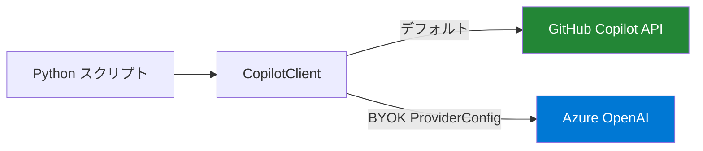

# チュートリアル 6: BYOK — Azure OpenAI を使った Bring Your Own Key

**スクリプト:** [`src/python/scripts/tutorials/06_byok_azure_openai.py`](https://github.com/ks6088ts/template-github-copilot/blob/main/src/python/scripts/tutorials/06_byok_azure_openai.py)

---

## 学べること

- Copilot SDK における BYOK（Bring Your Own Key）の意味
- Azure OpenAI を指す `ProviderConfig` の設定方法
- API キーと Entra ID（ベアラートークン）での認証方法
- BYOK がデフォルトの Copilot バックエンドとどう異なるか

---

## 前提条件

- `copilot` CLI がインストール済みかつ認証済み（[はじめに](../getting_started.md) を参照）
- `github-copilot-sdk` がインストール済み
- デプロイされたモデル（例: `gpt-4o`）を持つ Azure OpenAI リソース
- Entra ID 認証の場合: `azure-identity` がインストール済み

---

## BYOK とは？

デフォルトでは、Copilot SDK は LLM リクエストを **GitHub Copilot API** を通じてルーティングし、GitHub Copilot サブスクリプションが必要です。BYOK では、任意のセッションに対して**異なるモデルエンドポイント**（Azure OpenAI など）を代替として使えます。



BYOK が有用なケース:

- プライベートなモデルデプロイ（データ主権）
- Copilot で利用できない特定のモデルバージョン
- Azure AI Foundry との統合
- エアギャップ環境

---

## ステップ 1 — ProviderConfig を構築する

`ProviderConfig` は Copilot CLI サーバーにリクエストをどこにルーティングするかを伝えます:

### API キー認証

```python
from copilot.types import ProviderConfig

provider = ProviderConfig(
    type="azure",
    base_url="https://<resource>.openai.azure.com/openai/deployments/<deployment>",
    api_key="<your-azure-openai-api-key>",
)
```

### Entra ID（ベアラートークン）認証

```python
from azure.identity import DefaultAzureCredential
from copilot.types import ProviderConfig

credential = DefaultAzureCredential()
token = credential.get_token("https://cognitiveservices.azure.com/.default").token

provider = ProviderConfig(
    type="azure",
    base_url="https://<resource>.openai.azure.com/openai/deployments/<deployment>",
    bearer_token=token,
)
```

---

## ステップ 2 — SessionConfig にプロバイダーとモデルを渡す

```python
session = await client.create_session(
    SessionConfig(
        on_permission_request=approve_all,
        tools=[],
        streaming=True,
        model="gpt-4o",            # ← デプロイ名と一致する必要がある
        provider=provider,          # ← BYOK プロバイダー設定
        system_message=SystemMessageAppendConfig(
            content="You are a helpful assistant powered by Azure OpenAI."
        ),
    )
)
```

> **注意:** `model` フィールドは Azure OpenAI の**デプロイ名**と一致する必要があります（基礎となるモデル名ではありません）。

---

## ステップ 3 — 送信と受信

残りのフローは標準のチャットボットと同じです:

```python
reply = await session.send_and_wait(
    MessageOptions(prompt="Hello from Azure OpenAI!"),
    timeout=300,
)
print(reply.data.content)
```

---

## 環境変数

チュートリアルスクリプトは利便性のために環境変数から設定を読み込みます:

| 変数名 | 説明 |
|--------|------|
| `BYOK_BASE_URL` | Azure OpenAI デプロイのベース URL |
| `BYOK_API_KEY` | Azure OpenAI API キー（api-key 認証） |
| `BYOK_MODEL` | デプロイ名（デフォルト: `gpt-4o`） |

---

## スクリプトの実行

```bash
cd src/python

# API キー認証
export BYOK_BASE_URL="https://<resource>.openai.azure.com/openai/deployments/<deploy>"
export BYOK_API_KEY="<your-azure-openai-api-key>"
export BYOK_MODEL="gpt-4o"
uv run python scripts/tutorials/06_byok_azure_openai.py

# Entra ID 認証（DefaultAzureCredential を使用）
export BYOK_BASE_URL="https://<resource>.openai.azure.com/openai/deployments/<deploy>"
export BYOK_MODEL="gpt-4o"
uv run python scripts/tutorials/06_byok_azure_openai.py --auth entra

# カスタムプロンプト
uv run python scripts/tutorials/06_byok_azure_openai.py \
    --prompt "BYOK パターンを 3 文で要約してください。"
```

---

## 比較: デフォルト vs BYOK

| 側面 | デフォルト（Copilot） | BYOK（Azure OpenAI） |
|------|---------------------|---------------------|
| 認証 | GitHub Copilot トークン | API キーまたは Entra ID ベアラートークン |
| モデル | Copilot が決定 | Azure OpenAI のデプロイ |
| データ所在地 | GitHub / OpenAI インフラ | Azure リージョン |
| サブスクリプション要件 | GitHub Copilot サブスクリプション | Azure OpenAI クォータ |
| セッション設定 | `provider` や `model` 不要 | `ProviderConfig` + `model` を渡す |

---

## まとめ

- BYOK を使うとデフォルトの Copilot バックエンドの代わりに Azure OpenAI（または他のプロバイダー）を使用できる
- `type`、`base_url`、`api_key` または `bearer_token` で `ProviderConfig` を構築する
- セッションの BYOK を有効にするために `SessionConfig` に `provider` と `model` を渡す
- SDK の残りの API（ストリーミング、ツール、フック）はまったく同じように動作する
- パスワードレスの Entra ID 認証には `DefaultAzureCredential` を使用する

---

## さらに読む

- [Azure OpenAI Service ドキュメント](https://learn.microsoft.com/azure/ai-services/openai/)
- [DefaultAzureCredential](https://learn.microsoft.com/python/api/azure-identity/azure.identity.defaultazurecredential)
- [GitHub Copilot SDK API リファレンス](../appendix/references.md)
