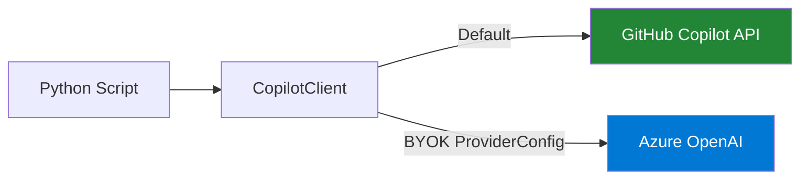

# Tutorial 6: BYOK — Bring Your Own Key with Azure OpenAI

**Script:** [`src/python/scripts/tutorials/06_byok_azure_openai.py`](https://github.com/ks6088ts/template-github-copilot/blob/main/src/python/scripts/tutorials/06_byok_azure_openai.py)

---

## What You Will Learn

- What BYOK (Bring Your Own Key) means in the context of the Copilot SDK
- How to configure a `ProviderConfig` to point to Azure OpenAI
- How to authenticate with an API key and with Entra ID (bearer token)
- How BYOK differs from the default Copilot backend

---

## Prerequisites

- The `copilot` CLI installed and authenticated (see [Getting Started](../getting_started.md))
- `github-copilot-sdk` installed
- An Azure OpenAI resource with a deployed model (e.g. `gpt-4o`)
- For Entra ID auth: `azure-identity` installed

---

## What Is BYOK?

By default, the Copilot SDK routes LLM requests through the **GitHub Copilot API**, which requires a GitHub Copilot subscription. BYOK lets you **substitute a different model endpoint** — such as Azure OpenAI — for any session.



BYOK is useful when you need:

- Private model deployments (data sovereignty)
- Specific model versions not available in Copilot
- Azure AI Foundry integrations
- Air-gapped environments

---

## Step 1 — Build a ProviderConfig

`ProviderConfig` tells the Copilot CLI server where to route requests:

### API Key authentication

```python
from copilot.types import ProviderConfig

provider = ProviderConfig(
    type="azure",
    base_url="https://<resource>.openai.azure.com/openai/deployments/<deployment>",
    api_key="<your-azure-openai-api-key>",
)
```

### Entra ID (bearer token) authentication

```python
from azure.identity import DefaultAzureCredential
from copilot.types import ProviderConfig

credential = DefaultAzureCredential()
token = credential.get_token("https://cognitiveservices.azure.com/.default").token

provider = ProviderConfig(
    type="azure",
    base_url="https://<resource>.openai.azure.com/openai/deployments/<deployment>",
    bearer_token=token,
)
```

---

## Step 2 — Pass the provider and model to SessionConfig

```python
session = await client.create_session(
    SessionConfig(
        on_permission_request=approve_all,
        tools=[],
        streaming=True,
        model="gpt-4o",            # ← must match your deployment name
        provider=provider,          # ← BYOK provider config
        system_message=SystemMessageAppendConfig(
            content="You are a helpful assistant powered by Azure OpenAI."
        ),
    )
)
```

> **Note:** The `model` field must match the **deployment name** in Azure OpenAI, not the underlying model name.

---

## Step 3 — Send and receive

The rest of the flow is identical to the standard chatbot:

```python
reply = await session.send_and_wait(
    MessageOptions(prompt="Hello from Azure OpenAI!"),
    timeout=300,
)
print(reply.data.content)
```

---

## Environment Variables

The tutorial script reads configuration from environment variables for convenience:

| Variable | Description |
|----------|-------------|
| `BYOK_BASE_URL` | Azure OpenAI deployment base URL |
| `BYOK_API_KEY` | Azure OpenAI API key (api-key auth) |
| `BYOK_MODEL` | Deployment name (default: `gpt-4o`) |

---

## Run the Script

```bash
# API-key authentication
export BYOK_BASE_URL="https://<resource>.openai.azure.com/openai/deployments/<deploy>"
export BYOK_API_KEY="<your-azure-openai-api-key>"
export BYOK_MODEL="gpt-4o"
python src/python/scripts/tutorials/06_byok_azure_openai.py

# Entra ID authentication (uses DefaultAzureCredential)
export BYOK_BASE_URL="https://<resource>.openai.azure.com/openai/deployments/<deploy>"
export BYOK_MODEL="gpt-4o"
python src/python/scripts/tutorials/06_byok_azure_openai.py --auth entra

# Custom prompt
python src/python/scripts/tutorials/06_byok_azure_openai.py \
    --prompt "Summarise the BYOK pattern in 3 sentences."
```

---

## Comparison: Default vs BYOK

| Aspect | Default (Copilot) | BYOK (Azure OpenAI) |
|--------|-----------------|---------------------|
| Authentication | GitHub Copilot token | API key or Entra ID bearer token |
| Model | Determined by Copilot | Your Azure OpenAI deployment |
| Data residency | GitHub / OpenAI infrastructure | Your Azure region |
| Requires subscription | GitHub Copilot subscription | Azure OpenAI quota |
| Session setup | No `provider` or `model` needed | Pass `ProviderConfig` + `model` |

---

## Key Takeaways

- BYOK lets you use Azure OpenAI (or another provider) instead of the default Copilot backend
- Build a `ProviderConfig` with `type`, `base_url`, and either `api_key` or `bearer_token`
- Pass `provider` and `model` to `SessionConfig` to activate BYOK for that session
- The rest of the SDK API (streaming, tools, hooks) works exactly the same
- Use `DefaultAzureCredential` for passwordless Entra ID authentication

---

## Further Reading

- [Azure OpenAI Service documentation](https://learn.microsoft.com/azure/ai-services/openai/)
- [DefaultAzureCredential](https://learn.microsoft.com/python/api/azure-identity/azure.identity.defaultazurecredential)
- [GitHub Copilot SDK API Reference](../appendix/references.md)
