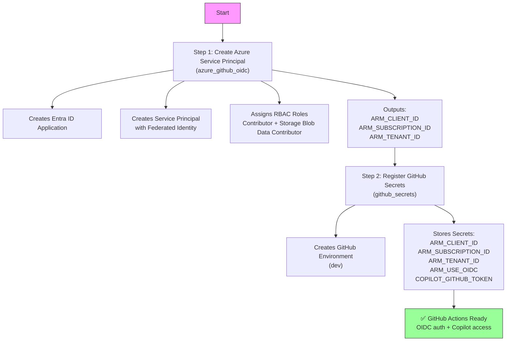
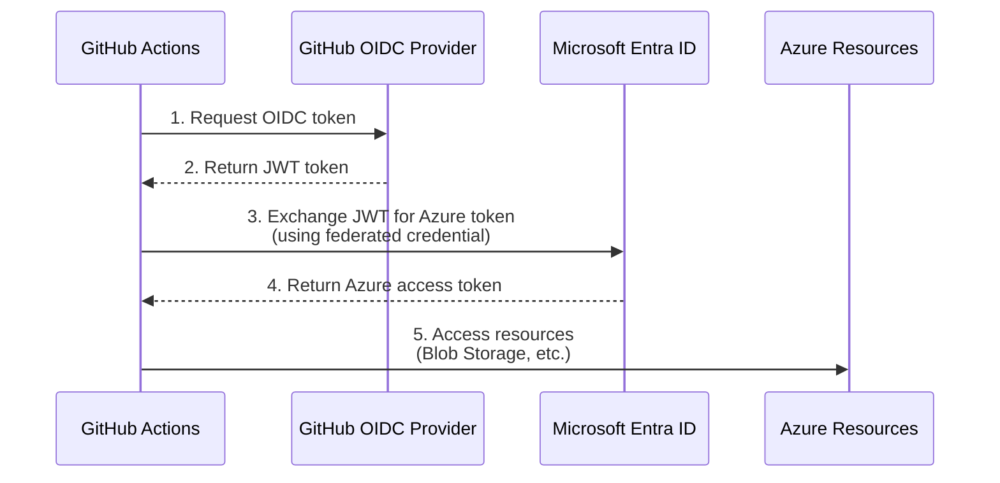
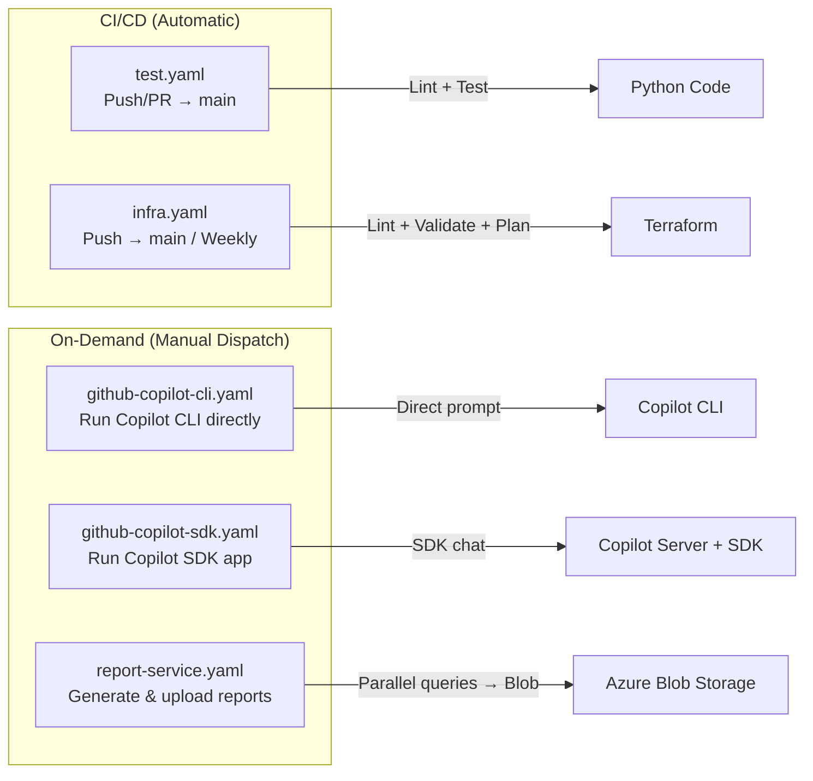
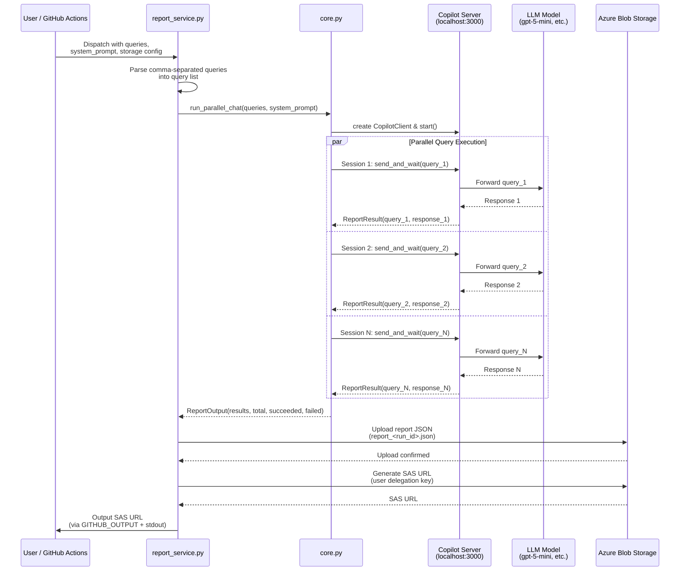
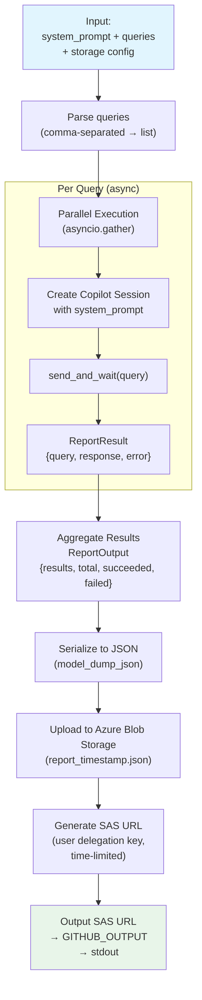

# Getting Started

This repository provides a comprehensive template for building automation workflows powered by the **GitHub Copilot SDK**. It integrates GitHub Actions, Azure Blob Storage, and Terraform-managed infrastructure to enable AI-driven report generation, parallel chat sessions, and more.

> **See also:** [References](references.md) for external links and resources.

## Table of Contents

- [Prerequisites](#prerequisites)
- [Quick Start (Local Development)](#quick-start-local-development)
- [Infrastructure Setup](#infrastructure-setup)
- [GitHub Actions Workflows](#github-actions-workflows)
- [CLI Scripts Reference](#cli-scripts-reference)
- [Configuration](#configuration)

## Prerequisites

| Tool | Version | Notes |
|---|---|---|
| Python | >= 3.13 | |
| Node.js | >= 22.12.0 | |
| [uv](https://docs.astral.sh/uv/) | latest | Python package manager |
| Terraform | >= 1.6.0 | For infrastructure management |
| Azure CLI (`az`) | latest | For Azure authentication |
| GitHub Copilot CLI | latest | `curl -fsSL https://gh.io/copilot-install \| bash` |

---

## Quick Start (Local Development)

```shell
# 1. Clone the repository
git clone https://github.com/ks6088ts/template-github-copilot.git
cd template-github-copilot/src/python

# 2. Install dependencies (including dev tools)
make install-deps-dev

# 3. Copy environment template and configure
cp .env.template .env
# Edit .env with your settings (see Configuration section below)

# 4. Run CI tests locally
make ci-test

# 5. Start the Copilot CLI server (requires COPILOT_GITHUB_TOKEN)
export COPILOT_GITHUB_TOKEN="your-github-pat"
make copilot

# 6. In another terminal, run the chat app
make copilot-app
```

---

## Infrastructure Setup

The infrastructure is managed via Terraform and consists of two scenarios that must be set up in order.



### Step 1: Azure Service Principal with OIDC (`azure_github_oidc`)

This scenario creates an Azure Service Principal with federated identity credentials, enabling GitHub Actions to authenticate with Azure via OIDC (no stored secrets needed for Azure auth).

**What it creates:**

| Resource | Purpose |
|---|---|
| Entra ID Application | App registration for GitHub Actions |
| Service Principal | Identity for RBAC-based access |
| Federated Identity Credential | OIDC trust with GitHub Actions |
| Role Assignment (Contributor) | Manage Azure resources |
| Role Assignment (Storage Blob Data Contributor) | Read/write blob data |
| Role Assignment (Storage Blob Delegator) | Generate user delegation keys for SAS URLs |

> **Detailed setup instructions:** See [azure_github_oidc/README.md](../infra/scenarios/azure_github_oidc/README.md)

### Step 2: GitHub Secrets Registration (`github_secrets`)

This scenario registers the Azure credentials and other secrets into the GitHub repository environment.

> **Detailed setup instructions:** See [github_secrets/README.md](../infra/scenarios/github_secrets/README.md)

### OIDC Authentication Flow



---

## GitHub Actions Workflows

All dispatch-able workflows are triggered via **`workflow_dispatch`** from the GitHub Actions UI or API.



### `test.yaml` — CI Tests

- **Trigger:** Push to `main`, `feature/**`, `copilot/**` branches; PRs to `main`
- **Actions:** Installs dependencies, runs `make ci-test` (format check, lint, tests)
- **No secrets required**

### `infra.yaml` — Infrastructure CI

- **Trigger:** Push to `main`, weekly schedule (Wednesday 00:00 UTC), manual dispatch
- **Jobs:**
  - `lint`: TFLint + Trivy security scan (no auth)
  - `test-azure`: `terraform init/validate/test/plan` for `azure_github_oidc` (requires `dev` environment)
  - `test-github`: `terraform init/validate/test/plan` for `github_secrets` (requires `dev` environment)
- **Requires:** `dev` environment secrets for Azure OIDC

### `github-copilot-cli.yaml` — Direct Copilot CLI

- **Trigger:** Manual dispatch
- **Inputs:**

| Input | Type | Default | Description |
|---|---|---|---|
| `prompt` | string | `"Hello"` | The prompt to send |
| `model` | choice | `gpt-5-mini` | Model: `gpt-5-mini`, `claude-opus-4.6`, `claude-sonnet-4.6` |

- **What it does:** Installs Copilot CLI and runs a single prompt directly

### `github-copilot-sdk.yaml` — Copilot SDK App

- **Trigger:** Manual dispatch
- **Inputs:**

| Input | Type | Default | Description |
|---|---|---|---|
| `prompt` | string | `"Hello"` | The prompt to send |
| `model` | choice | `gpt-5-mini` | Model selection |

- **What it does:** Starts Copilot CLI as a server, then runs the Python SDK chat app against it

### `report-service.yaml` — Report Generation Service

- **Trigger:** Manual dispatch
- **Inputs:**

| Input | Type | Default | Description |
|---|---|---|---|
| `system_prompt` | string | `"You are a helpful assistant."` | System prompt for the assistant |
| `queries` | string | *(required)* | Comma-separated queries |
| `model` | choice | `gpt-5-mini` | Model selection |
| `azure_blob_storage_account_url` | string | *(required)* | Storage account URL |
| `azure_blob_storage_container_name` | string | *(required)* | Container name |
| `sas_expiry_hours` | number | `1` | SAS URL expiry in hours |

- **What it does:** Sends multiple queries in parallel, uploads JSON report to Azure Blob Storage, outputs a time-limited SAS URL

<details>
<summary>Report Service Detailed Workflow (click to expand)</summary>





</details>

---

## CLI Scripts Reference

All scripts are located under `src/python/scripts/` and use [Typer](https://typer.tiangolo.com/) for CLI argument parsing.

### `scripts/chat.py` — Chat CLI

A multi-command CLI for interacting with the Copilot SDK.

#### Commands

| Command | Description |
|---|---|
| `hello` | Greet and print current settings from `.env` |
| `chat` | Send a single prompt and get a response |
| `chat-loop` | Interactive chat REPL (Ctrl+C to exit) |
| `chat-parallel` | Send multiple prompts in parallel sessions |

#### Usage Examples

```shell
# Simple greeting (test settings)
uv run python scripts/chat.py hello --name "World" --verbose

# Single chat prompt
uv run python scripts/chat.py chat --prompt "Explain Python decorators" --cli-url localhost:3000

# Interactive chat loop
uv run python scripts/chat.py chat-loop --cli-url localhost:3000

# Parallel prompts (structured JSON output)
uv run python scripts/chat.py chat-parallel \
  -p "What is Python?" \
  -p "What is Rust?" \
  -p "What is Go?" \
  --cli-url localhost:3000
```

#### `chat-parallel` Output Schema

```json
{
  "results": [
    { "prompt": "What is Python?", "response": "...", "error": null },
    { "prompt": "What is Rust?", "response": "...", "error": null }
  ],
  "total": 2,
  "succeeded": 2,
  "failed": 0
}
```

### `scripts/blob.py` — Azure Blob Storage CLI

A CLI for Azure Blob Storage operations. Uses settings from `.env` or environment variables.

#### Commands

| Command | Description |
|---|---|
| `list-blobs` | List all blobs in the configured container |
| `upload-blob` | Upload a string as a blob |
| `generate-sas-url` | Generate a time-limited SAS URL for a blob |

#### Usage Examples

```shell
# List blobs
uv run python scripts/blob.py list-blobs --verbose

# Upload data
uv run python scripts/blob.py upload-blob \
  --data "Hello, World!" \
  --blob-name "test.txt"

# Generate SAS URL (1 hour expiry)
uv run python scripts/blob.py generate-sas-url \
  --blob-name "test.txt" \
  --expiry-hours 1
```

#### Required Environment Variables

| Variable | Description | Example |
|---|---|---|
| `AZURE_BLOB_STORAGE_ACCOUNT_URL` | Storage account URL | `https://myaccount.blob.core.windows.net` |
| `AZURE_BLOB_STORAGE_CONTAINER_NAME` | Container name | `adhoc` |

### `scripts/report_service.py` — Report Generation CLI

Generates reports by sending multiple queries to Copilot in parallel, uploads results to Azure Blob Storage, and returns a SAS URL for sharing.

#### Commands

| Command | Description |
|---|---|
| `generate` | Generate report, upload to blob, and output SAS URL |

#### Usage Example

```shell
uv run python scripts/report_service.py generate \
  --system-prompt "You are a helpful assistant." \
  --queries "What is AI?,What is ML?,What is DL?" \
  --account-url "https://myaccount.blob.core.windows.net" \
  --container-name "reports" \
  --blob-name "report_custom.json" \
  --sas-expiry-hours 2 \
  --verbose
```

#### Options

| Option | Short | Required | Default | Description |
|---|---|---|---|---|
| `--system-prompt` | `-s` | Yes | — | System prompt for the assistant |
| `--queries` | `-q` | Yes | — | Comma-separated queries |
| `--account-url` | `-a` | Yes | — | Azure Blob Storage account URL |
| `--container-name` | `-n` | Yes | — | Azure Blob Storage container name |
| `--blob-name` | `-b` | No | `report_<timestamp>.json` | Blob name |
| `--cli-url` | `-c` | No | `localhost:3000` | Copilot CLI server URL |
| `--sas-expiry-hours` | — | No | `1` | SAS URL expiry hours |
| `--verbose` | `-v` | No | `false` | Enable debug logging |

#### Output Schema (ReportOutput)

```json
{
  "system_prompt": "You are a helpful assistant.",
  "results": [
    { "query": "What is AI?", "response": "...", "error": null },
    { "query": "What is ML?", "response": "...", "error": null }
  ],
  "total": 2,
  "succeeded": 2,
  "failed": 0
}
```

---

## Configuration

### Environment Variables (`.env`)

Copy `.env.template` to `.env` and configure:

```shell
# Project Settings
PROJECT_NAME=adhoc                    # Project identifier
PROJECT_LOG_LEVEL=INFO                # Logging level (DEBUG, INFO, WARNING, ERROR)

# Azure Blob Storage Settings
AZURE_BLOB_STORAGE_ACCOUNT_URL=https://<account>.blob.core.windows.net
AZURE_BLOB_STORAGE_CONTAINER_NAME=adhoc
```

### Makefile Targets

Run `make help` in `src/python/` to see all available targets:

| Target | Description |
|---|---|
| `info` | Show Git revision and tag information |
| `install-deps-dev` | Install all dependencies including dev tools |
| `install-deps` | Install production dependencies only |
| `format` | Format code with ruff |
| `format-check` | Check formatting without changes |
| `lint` | Run ruff, ty, pyrefly, and actionlint |
| `test` | Run pytest |
| `ci-test` | Full CI pipeline (install + format-check + lint + test) |
| `fix` | Auto-fix linting issues |
| `update` | Update all packages |
| `copilot` | Start Copilot CLI server on port 3000 |
| `copilot-app` | Run interactive chat loop |
