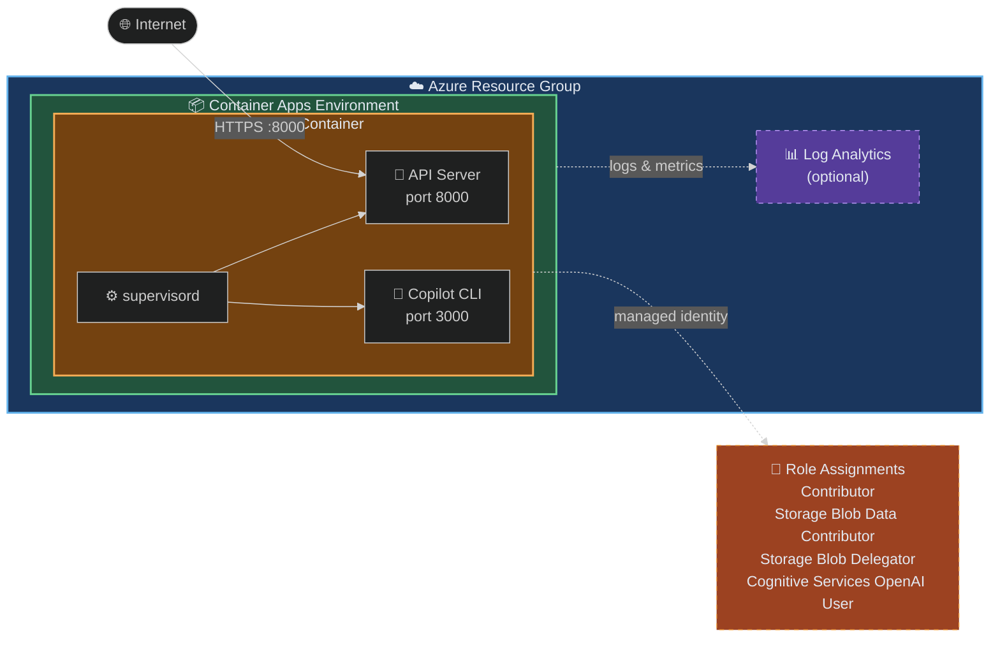

# Container Apps Scenario

Deploy an Azure Container App running the monolith image (Copilot CLI + API server in a single container), equivalent to the `monolith` service in `compose.docker.yaml`.

## Overview

This scenario creates:

- **Random String**: Generates a unique suffix for resource naming to avoid conflicts
- **Resource Group**: Container for all resources (named with a random suffix)
- **Log Analytics Workspace** (optional): For Container Apps Environment monitoring
- **Container Apps Environment**: Managed environment for running container apps
- **Monolith Container App**: Runs the Copilot CLI and API server in a single container (externally accessible, port 8000). Uses [supervisord](http://supervisord.org/) internally to manage both the Copilot CLI (port 3000) and the API server (port 8000) processes.
- **Role Assignments**: Grants the Container App's system-assigned managed identity the following roles at subscription scope:
  - Contributor
  - Storage Blob Data Contributor
  - Storage Blob Delegator
  - Cognitive Services OpenAI User

## Prerequisites

- Terraform CLI installed (>= 1.6.0)
- Azure CLI installed and logged in (`az login`)
- Azure subscription with permissions to create resources
- A valid GitHub token for Copilot authentication (passed via `secret_environment_variables`)

## Architecture



## How to use

```shell
# Login to Azure
az login

# Set the subscription ID (required by the azurerm provider)
export ARM_SUBSCRIPTION_ID=$(az account show --query id --output tsv)

# Initialize Terraform
terraform init

# Plan the deployment
terraform plan

# Apply the deployment
terraform apply -auto-approve

# Get the application URL
terraform output app_url

# Get the application FQDN
terraform output app_fqdn

# Test the deployment
curl $(terraform output -raw app_url)

# Destroy the deployment
terraform destroy -auto-approve
```

## Variables

| Name | Description | Type | Default | Required |
|------|-------------|------|---------|----------|
| `name` | Base name for resources | `string` | `"azurecontainerapps"` | no |
| `location` | Azure region for resources | `string` | `"japaneast"` | no |
| `tags` | Tags to apply to resources | `map(string)` | See variables.tf | no |
| `enable_log_analytics` | Whether to create a Log Analytics Workspace | `bool` | `false` | no |
| `container_image` | Docker image for the monolith service (API + Copilot CLI) | `string` | `"docker.io/ks6088ts/template-github-copilot-monolith:latest"` | no |
| `environment_variables` | Environment variables for the monolith container (non-sensitive) | `map(string)` | `{}` | no |
| `secret_environment_variables` | Sensitive environment variables for the monolith container (stored as secrets) | `map(string)` | `{}` | no |

## Outputs

| Name | Description |
|------|-------------|
| `resource_group_name` | Name of the resource group |
| `container_app_environment_id` | ID of the Container Apps Environment |
| `container_app_environment_name` | Name of the Container Apps Environment |
| `app_id` | ID of the Monolith Container App |
| `app_name` | Name of the Monolith Container App |
| `app_fqdn` | FQDN of the Monolith Container App |
| `app_url` | Full URL to access the Monolith Container App |
| `identity_principal_id` | Principal ID of the Monolith Container App's system-assigned managed identity |
| `container_app_environment_name` | Name of the Container Apps Environment |
| `app_id` | ID of the Monolith Container App |
| `app_name` | Name of the Monolith Container App |
| `app_fqdn` | FQDN of the Monolith Container App |
| `app_url` | Full URL to access the Monolith Container App |

## Examples

### Basic deployment

```hcl
# terraform.tfvars
name = "myapp"

environment_variables = {
  API_HOST        = "0.0.0.0"
  API_PORT        = "8000"
  COPILOT_CLI_URL = "127.0.0.1:3000"
  COPILOT_MODEL   = "gpt-5-mini"
}

secret_environment_variables = {
  COPILOT_GITHUB_TOKEN = "ghu_xxxxxxxxxxxxxxxxxxxx"
}
```

### Deploy with GitHub OAuth and custom settings

```hcl
# terraform.tfvars
name = "myapp"

environment_variables = {
  API_HOST         = "0.0.0.0"
  API_PORT         = "8000"
  COPILOT_CLI_URL  = "127.0.0.1:3000"
  COPILOT_MODEL    = "gpt-5-mini"
  GITHUB_CLIENT_ID = "Ov23liXXXXXXXXXXXXXX"
}

secret_environment_variables = {
  COPILOT_GITHUB_TOKEN = "ghu_xxxxxxxxxxxxxxxxxxxx"
  GITHUB_CLIENT_SECRET = "xxxxxxxxxxxxxxxxxxxxxxxxxxxxxxxxxxxxxxxxxxxx"
}
```

### Production deployment with scaling and monitoring

```hcl
# terraform.tfvars
name                 = "prod"
location             = "japaneast"
enable_log_analytics = true

container_image = "myregistry.azurecr.io/template-github-copilot:v1.0.0"

environment_variables = {
  API_HOST                = "0.0.0.0"
  API_PORT                = "8000"
  COPILOT_CLI_URL         = "127.0.0.1:3000"
  COPILOT_MODEL           = "gpt-5"
  AZURE_OPENAI_ENDPOINT   = "https://my-openai.openai.azure.com/"
  AZURE_OPENAI_MODEL_NAME = "gpt-5"
}

secret_environment_variables = {
  COPILOT_GITHUB_TOKEN = "ghu_xxxxxxxxxxxxxxxxxxxx"
  AZURE_OPENAI_API_KEY = "sk-xxxxxxxxxxxxxxxxxxxx"
}

tags = {
  environment = "production"
  team        = "platform"
  cost-center = "12345"
}
```

## Environment Variables

Environment variables are configured using two `map(string)` variables: `environment_variables` (non-sensitive) and `secret_environment_variables` (sensitive, stored as Container Apps Secrets).

### terraform.tfvars example

```hcl
environment_variables = {
  API_HOST        = "0.0.0.0"
  API_PORT        = "8000"
  COPILOT_CLI_URL = "127.0.0.1:3000"
  COPILOT_MODEL   = "gpt-5-mini"
  LOG_LEVEL       = "info"
  # Add any additional keys as needed
}

secret_environment_variables = {
  COPILOT_GITHUB_TOKEN = "ghu_xxxxxxxxxxxxxxxxxxxx"
  # Add any additional secrets as needed
}
```

### Using -var flags

```shell
terraform apply \
  -var='secret_environment_variables={"COPILOT_GITHUB_TOKEN":"ghu_xxx"}' \
  -var='environment_variables={"COPILOT_MODEL":"gpt-5-mini","API_HOST":"0.0.0.0","API_PORT":"8000","COPILOT_CLI_URL":"127.0.0.1:3000"}'
```

### Using TF_VAR_ environment variables

```shell
export TF_VAR_secret_environment_variables='{"COPILOT_GITHUB_TOKEN":"ghu_xxx"}'
export TF_VAR_environment_variables='{"COPILOT_MODEL":"gpt-5-mini"}'
terraform apply
```

## Notes

- The monolith container runs both Copilot CLI and API server using supervisord; `COPILOT_CLI_URL` defaults to `127.0.0.1:3000` (localhost communication within the container)
- Container Apps automatically provides HTTPS endpoints
- The resource group name includes a random suffix to avoid naming conflicts across deployments
- The container scales between 0 and 3 replicas by default (`min_replicas = 0`, `max_replicas = 3`)
- To enable GitHub OAuth login on the Web UI, set `GITHUB_CLIENT_ID` in `environment_variables` and `GITHUB_CLIENT_SECRET` in `secret_environment_variables` (see [GitHub OAuth App Setup](../../../docs/copilot_report_forge/github_oauth_app.md))
- A remote backend (Azure Storage) is configured in `backend.tf` — update the storage account details or remove the backend block for local state
- For private registries, additional configuration is required (see Azure documentation)
