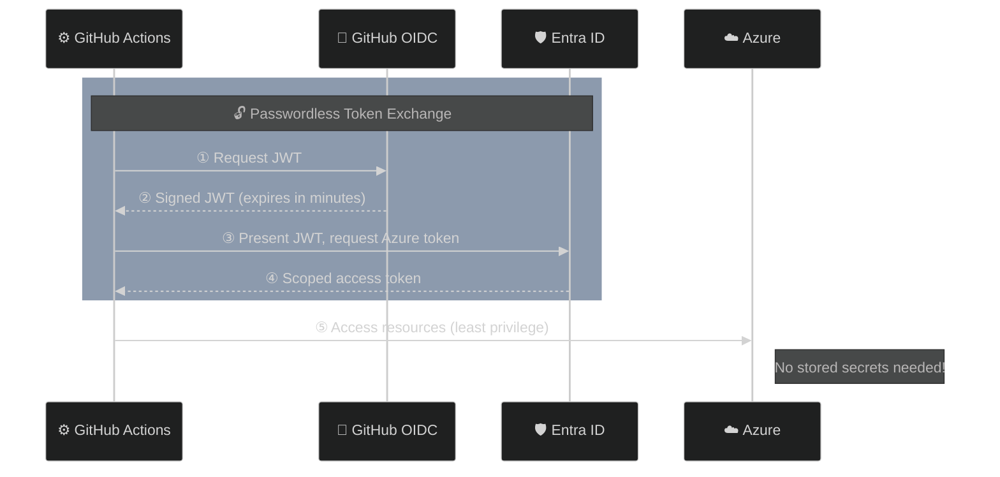

# Azure GitHub OIDC

> **Navigation:** [README](../../../README.md) > [Getting Started](../../../docs/copilot_report_forge/getting_started.md) > Azure GitHub OIDC
>
> **Next step:** [GitHub Secrets](../github_secrets/README.md)

---

## Purpose

This Terraform scenario establishes **passwordless trust** between GitHub Actions and Azure using OpenID Connect (OIDC) federation. After deployment, GitHub Actions workflows can authenticate to Azure without any stored credentials — tokens are issued per workflow run and expire within minutes.

A service principal password is also created as a fallback (expires after 1 year).

### Why OIDC?

Traditional CI/CD authentication relies on long-lived client secrets stored as GitHub repository secrets. This approach creates security risks (credential leakage, rotation burden, broad access) and compliance challenges (auditing who used which credential). OIDC federation eliminates all of these problems by replacing stored secrets with short-lived, scoped tokens issued through a trust relationship.

---

## Architecture



---

## What Gets Created

| Resource | Purpose |
|---|---|
| Entra ID Application | Identity for the GitHub Actions workflow (with Microsoft Graph permissions) |
| Service Principal | Azure-side representation of the application |
| Service Principal Password | Fallback credential (expires after 1 year) |
| Federated Credential | Trust link between GitHub OIDC and Entra ID (scoped to `repo:<org>/<repo>:environment:<env>`) |
| RBAC Role Assignments | Scoped permissions at subscription level (Contributor, Storage Blob Data Contributor, Storage Blob Delegator, Cognitive Services OpenAI User) |

---

## Usage

```bash
cd infra/scenarios/azure_github_oidc

# Set the subscription ID (required by the azurerm provider)
export ARM_SUBSCRIPTION_ID=$(az account show --query id --output tsv)

terraform init
terraform plan -out=tfplan
terraform apply tfplan
```

### Variables

| Variable | Description | Type | Default | Required |
|---|---|---|---|---|
| `service_principal_name` | Display name for the Entra ID Application and Service Principal | `string` | `"template-github-copilot_dev"` | no |
| `role_definition_name` | Primary RBAC role assigned to the Service Principal | `string` | `"Contributor"` | no |
| `github_organization` | GitHub organization or user name | `string` | `"ks6088ts"` | no |
| `github_repository` | GitHub repository name | `string` | `"template-github-copilot"` | no |
| `github_environment` | GitHub environment name for federated credential subject | `string` | `"dev"` | no |
| `resource_access_permissions` | Microsoft Graph API permissions for the application | `list(object)` | Domain.Read.All, Group.ReadWrite.All, GroupMember.ReadWrite.All, User.ReadWrite.All, Application.ReadWrite.All | no |

### Outputs

| Output | Description |
|---|---|
| `service_principal_client_id` | Service Principal Client ID |
| `application_object_id` | Application Object ID |
| `tenant_id` | Entra ID tenant ID |
| `service_principal_password` | Service Principal password (sensitive) |

These outputs are consumed by the [GitHub Secrets](../github_secrets/README.md) scenario.

---

## FAQ

| Question | Answer |
|---|---|
| Can I use an existing Service Principal? | Not with this scenario — it creates a new one. Fork and modify for existing SP reuse. |
| What RBAC roles are assigned? | Contributor, Storage Blob Data Contributor, Storage Blob Delegator, Cognitive Services OpenAI User |
| How do I restrict to a specific branch? | Set the `github_environment` variable to match your branch protection rules. |
| What Microsoft Graph permissions are configured? | Domain.Read.All, Group.ReadWrite.All, GroupMember.ReadWrite.All, User.ReadWrite.All, Application.ReadWrite.All |
| When does the Service Principal password expire? | 1 year from creation. The `end_date` is ignored in lifecycle to prevent drift. |
