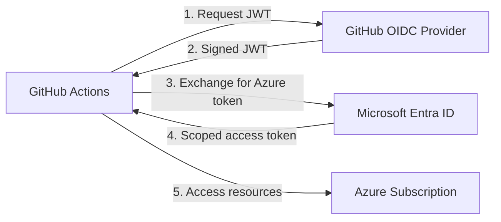

# Azure GitHub OIDC

> **Navigation:** [README](../../../README.md) > [Getting Started](../../../docs/copilot_report_forge/getting_started.md) > Azure GitHub OIDC
>
> **Next step:** [GitHub Secrets](../github_secrets/README.md)

---

## Purpose

This Terraform scenario establishes **passwordless trust** between GitHub Actions and Azure using OpenID Connect (OIDC) federation. After deployment, GitHub Actions workflows can authenticate to Azure without any stored credentials — tokens are issued per workflow run and expire within minutes.

### Why OIDC?

Traditional CI/CD authentication relies on long-lived client secrets stored as GitHub repository secrets. This approach creates security risks (credential leakage, rotation burden, broad access) and compliance challenges (auditing who used which credential). OIDC federation eliminates all of these problems by replacing stored secrets with short-lived, scoped tokens issued through a trust relationship.

---

## Architecture



---

## What Gets Created

| Resource | Purpose |
|---|---|
| Entra ID Application | Identity for the GitHub Actions workflow |
| Service Principal | Azure-side representation of the application |
| Federated Credential | Trust link between GitHub OIDC and Entra ID |
| RBAC Role Assignments | Scoped permissions (Contributor, Storage Blob roles, Cognitive Services) |

---

## Usage

```bash
cd infra/scenarios/azure_github_oidc
terraform init
terraform plan -out=tfplan
terraform apply tfplan
```

### Required Variables

| Variable | Description |
|---|---|
| `github_environment` | GitHub environment name (e.g., `dev`) |
| `github_repository` | Repository in `owner/repo` format |

### Outputs

| Output | Description |
|---|---|
| `client_id` | Entra ID application (client) ID |
| `subscription_id` | Azure subscription ID |
| `tenant_id` | Entra ID tenant ID |

These outputs are consumed by the [GitHub Secrets](../github_secrets/README.md) scenario.

---

## FAQ

| Question | Answer |
|---|---|
| Can I use an existing Service Principal? | Not with this scenario — it creates a new one. Fork and modify for existing SP reuse. |
| What RBAC roles are assigned? | Contributor, Storage Blob Data Contributor, Storage Blob Delegator, Cognitive Services OpenAI User |
| How do I restrict to a specific branch? | Set the `github_environment` variable to match your branch protection rules. |
