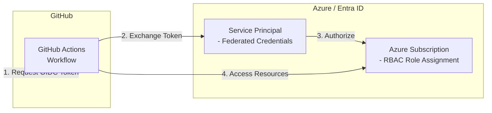

# Azure GitHub OIDC

> **Navigation:** [README](../../../README.md) > [Getting Started](../../../docs/copilot_report_forge/getting_started.md) > Azure GitHub OIDC
>
> **Next step:** [GitHub Secrets](../github_secrets/README.md)

This Terraform scenario creates an Azure Service Principal with federated identity credentials for GitHub Actions to authenticate with Azure using OpenID Connect (OIDC). This eliminates the need for storing long-lived Azure credentials as GitHub secrets.

## Architecture



## What It Creates

| Resource | Purpose |
|---|---|
| Entra ID Application | App registration for GitHub Actions |
| Service Principal | Identity with federated credentials for OIDC |
| Federated Identity Credential | Trust relationship with GitHub Actions OIDC provider |
| Role Assignment (Contributor) | Manage Azure resources at subscription scope |
| Role Assignment (Storage Blob Data Contributor) | Read/write Azure Blob Storage data |
| Role Assignment (Storage Blob Delegator) | Generate user delegation keys for SAS URLs |
| Service Principal Password | Credential with 1-year expiry for non-OIDC scenarios |

## Prerequisites

- Terraform CLI (>= 1.6.0)
- Azure CLI installed and authenticated
- Azure subscription with sufficient permissions (ability to create App registrations and role assignments)

## How to Use

```shell
# create backend.tf if needed
cat <<EOF > backend.tf
terraform {
  backend "azurerm" {
    resource_group_name  = "YOUR_RESOURCE_GROUP_NAME"
    storage_account_name = "YOUR_STORAGE_ACCOUNT_NAME"
    container_name       = "YOUR_CONTAINER_NAME"
    key                  = "azure_github_oidc.template-github-copilot_dev.tfstate"
  }
}
EOF

# Log in to Azure
az login

# (Optional) Confirm the details for the currently logged-in user
az ad signed-in-user show

# Set environment variables
export ARM_SUBSCRIPTION_ID=$(az account show --query id --output tsv)

# Initialize Terraform
terraform init

# Format check (matches CI)
terraform fmt -check

# Validate configuration
terraform validate

# Plan the deployment
terraform plan

# Apply the deployment
terraform apply -auto-approve

# Confirm the output
terraform output

# Destroy the deployment (when no longer needed)
terraform destroy -auto-approve
```

## Outputs

| Output | Description |
|---|---|
| `service_principal_client_id` | Service Principal Client ID (used as `ARM_CLIENT_ID`) |
| `application_object_id` | Application Object ID |
| `tenant_id` | Azure AD Tenant ID (used as `ARM_TENANT_ID`) |
| `service_principal_password` | Service Principal password (sensitive) |

## FAQ

### Error: Listing service principals for filter "appId eq '00000003-0000-0000-c000-000000000000'"

This error may occur if the logged-in user does not have sufficient permissions to list service principals in Microsoft Entra ID. Ensure that the user has at least the **Directory Readers** role assigned in Microsoft Entra ID.

To resolve:
1. Go to the Azure portal
2. Navigate to **App registrations** > **Manage** > **API permissions**
3. Ensure the necessary permissions are granted
