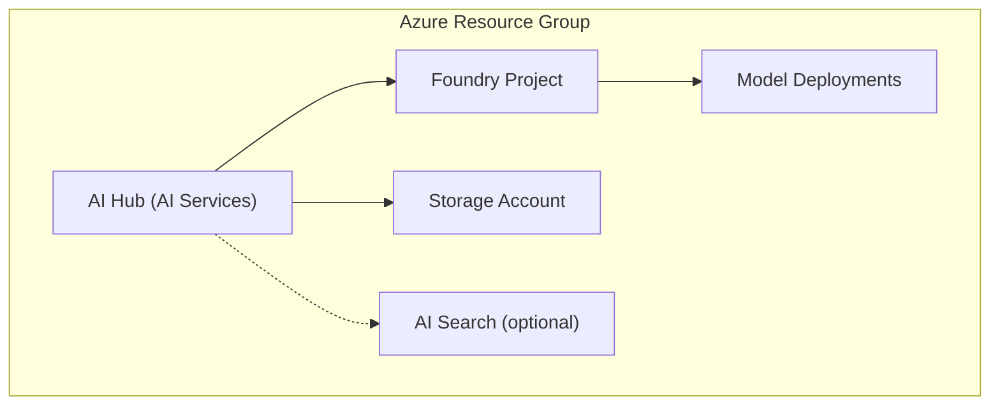

# Azure Microsoft Foundry

> **Navigation:** [README](../../../README.md) > [Getting Started](../../../docs/copilot_report_forge/getting_started.md) > Azure Microsoft Foundry

---

## Purpose

This Terraform scenario deploys Azure AI Foundry infrastructure — the AI Hub, model endpoints, Storage Account, and optional AI Search index. This scenario is **optional**: you only need it if you want to use domain-specific AI agents that require access to reference data (documents, images, specifications).

### When to Use This

| Use Case | Need This Scenario? |
|---|---|
| Basic chat and report generation via Copilot SDK | No |
| AI agents with access to domain documents | Yes |
| Vector search over reference data | Yes |
| Grounded evaluations using uploaded specifications | Yes |

---

## Architecture



---

## What Gets Created

| Resource | Purpose |
|---|---|
| AI Hub (AI Services) | Central management for AI capabilities |
| Foundry Project | Workspace for agents and experiments |
| Model Deployments | LLM endpoints (GPT-4o, GPT-4o-mini, embeddings) |
| Storage Account | Reference data and agent artifacts |
| AI Search (optional) | Vector/hybrid search over reference data |

---

## Usage

```bash
cd infra/scenarios/azure_microsoft_foundry
terraform init
terraform plan -out=tfplan
terraform apply tfplan
```

### Key Variables

| Variable | Description | Default |
|---|---|---|
| `location` | Azure region | `eastus` |
| `create_search` | Whether to deploy AI Search | `false` |

### Outputs

| Output | Description |
|---|---|
| `resource_group_name` | Name of the created resource group |
| `ai_services_endpoint` | Endpoint URL for AI Services |
| `storage_account_name` | Name of the Storage Account |

---

## FAQ

| Question | Answer |
|---|---|
| Is this required for basic usage? | No — basic chat and reports work with just the Copilot SDK. Deploy this only for AI Foundry Agents. |
| What models are deployed? | GPT-4o, GPT-4o-mini, text-embedding-3-large, text-embedding-3-small by default |
| Can I add more models? | Yes — add `azurerm_cognitive_deployment` resources in the Foundry module |
| What about costs? | AI Services uses pay-per-use pricing. Storage and Search have their own pricing tiers. |
