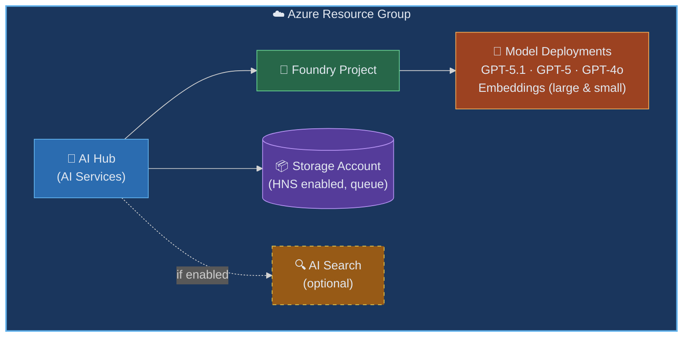

# Azure Microsoft Foundry

> **Navigation:** [README](../../../README.md) > [Getting Started](../../../docs/copilot_report_forge/getting_started.md) > Azure Microsoft Foundry

---

## Purpose

This Terraform scenario deploys Azure AI Foundry infrastructure — the AI Hub, model endpoints, Storage Account, and optional AI Search index. This scenario is **optional**: you only need it if you want to use domain-specific AI agents that require access to reference data (documents, images, specifications).

### When to Use This

| Use Case | Need This Scenario? |
|---|---|
| Basic chat and report generation via Copilot SDK | No |
| AI agents with access to domain documents | Yes |
| Vector search over reference data | Yes |
| Grounded evaluations using uploaded specifications | Yes |

---

## Architecture



---

## What Gets Created

| Resource | Purpose |
|---|---|
| AI Hub (AI Services) | Central management for AI capabilities |
| Foundry Project | Workspace for agents and experiments |
| Model Deployments | LLM endpoints (GPT-5.1, GPT-5, GPT-4o, text-embedding-3-large, text-embedding-3-small) |
| Storage Account | Reference data and agent artifacts (HNS enabled, with queue) |
| AI Search (optional) | Vector/hybrid search over reference data |

---

## Usage

```bash
cd infra/scenarios/azure_microsoft_foundry

# Set the subscription ID (required by the azurerm provider)
export ARM_SUBSCRIPTION_ID=$(az account show --query id --output tsv)

terraform init
terraform plan -out=tfplan
terraform apply tfplan
```

### Variables

| Variable | Description | Type | Default | Required |
|---|---|---|---|---|
| `name` | Base name for resources | `string` | `"azuremicrosoftfoundry"` | no |
| `location` | Azure region | `string` | `"eastus2"` | no |
| `tags` | Tags to apply to resources | `map(string)` | See variables.tf | no |
| `model_deployments` | Model deployment configurations (format, name, model, version, sku_name, capacity) | `list(object)` | GPT-5.1, GPT-5, GPT-4o, text-embedding-3-large, text-embedding-3-small | no |
| `storage_account_tier` | Storage account tier (`Standard` or `Premium`) | `string` | `"Standard"` | no |
| `storage_account_replication_type` | Storage account replication type (LRS, GRS, etc.) | `string` | `"LRS"` | no |
| `deploy_search` | Whether to deploy Azure AI Search | `bool` | `false` | no |
| `search_sku` | Pricing tier of the Azure AI Search service | `string` | `"free"` | no |
| `search_replica_count` | Number of replicas for AI Search (1–12) | `number` | `1` | no |
| `search_partition_count` | Number of partitions for AI Search (1, 2, 3, 4, 6, or 12) | `number` | `1` | no |

### Outputs

| Output | Description |
|---|---|
| `resource_group_name` | Name of the created resource group |
| `microsoft_foundry_account_name` | Microsoft Foundry account name |
| `microsoft_foundry_account_endpoint` | Microsoft Foundry account endpoint URL |
| `microsoft_foundry_project_name` | Microsoft Foundry project name |
| `search_service_name` | Azure AI Search service name (null if `deploy_search` is false) |
| `search_service_endpoint` | Azure AI Search service endpoint (null if `deploy_search` is false) |

---

## FAQ

| Question | Answer |
|---|---|
| Is this required for basic usage? | No — basic chat and reports work with just the Copilot SDK. Deploy this only for AI Foundry Agents. |
| What models are deployed? | GPT-5.1, GPT-5, GPT-4o, text-embedding-3-large, text-embedding-3-small by default |
| Can I add more models? | Yes — add entries to the `model_deployments` variable or add `azurerm_cognitive_deployment` resources in the Foundry module |
| What about costs? | AI Services uses pay-per-use pricing. Storage and Search have their own pricing tiers. |
