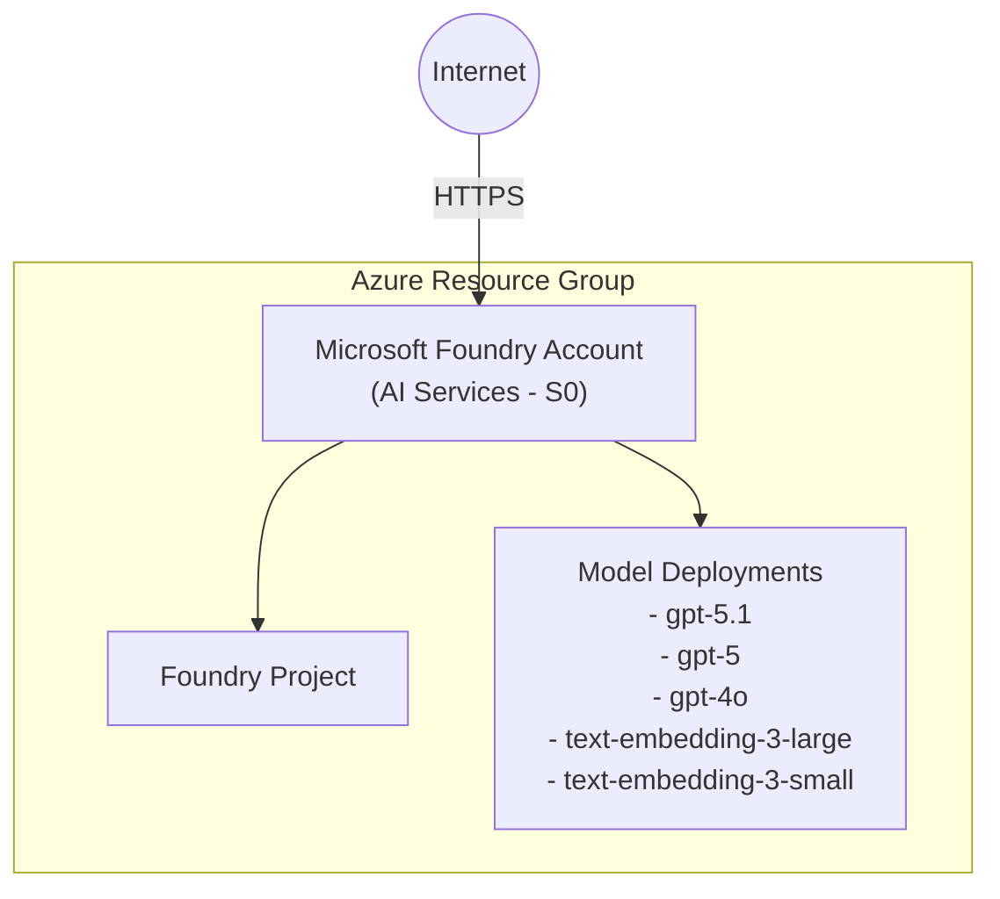

# Azure Microsoft Foundry Scenario

> **Navigation:** [README](../../../README.md) > [Getting Started](../../../docs/getting_started.md) > Azure Microsoft Foundry

This Terraform scenario deploys a Microsoft Foundry environment on Azure. It provisions an AI Hub with AI Services, creates a Foundry project, and configures OpenAI model deployments.

## Architecture



## What It Creates

| Resource | Purpose |
|---|---|
| Resource Group | Container for all Microsoft Foundry resources |
| Microsoft Foundry Account | Cognitive Services account (AI Services, S0 SKU) with AI Foundry capabilities |
| Microsoft Foundry Project | Project workspace within the Foundry account |
| Model Deployments | OpenAI model endpoints (configurable via `model_deployments` variable) |

## Prerequisites

- Terraform CLI (>= 1.6.0)
- Azure CLI installed and authenticated
- Azure subscription with sufficient permissions

## How to Use

```shell
# (Optional) Create backend.tf for remote state storage
cat <<EOF > backend.tf
terraform {
  backend "azurerm" {
    resource_group_name  = "YOUR_RESOURCE_GROUP_NAME"
    storage_account_name = "YOUR_STORAGE_ACCOUNT_NAME"
    container_name       = "YOUR_CONTAINER_NAME"
    key                  = "azure_microsoft_foundry.template-github-copilot_dev.tfstate"
  }
}
EOF

# Log in to Azure
az login

# (Optional) Confirm the details for the currently logged-in user
az ad signed-in-user show

# Set environment variables
export ARM_SUBSCRIPTION_ID=$(az account show --query id --output tsv)

# Initialize Terraform
terraform init

# Format check (matches CI)
terraform fmt -check

# Validate configuration
terraform validate

# Plan the deployment
terraform plan

# Apply the deployment (parallelism=1 required to avoid deployment conflicts)
terraform apply -auto-approve -parallelism=1

# Confirm the output
terraform output

# Destroy the deployment (when no longer needed)
terraform destroy -auto-approve -parallelism=1
```

> [!NOTE]
> The `-parallelism=1` flag is required for `apply` and `destroy` to avoid conflicts when creating or removing model deployments sequentially.

## Variables

| Variable | Type | Default | Description |
|---|---|---|---|
| `name` | `string` | `azuremicrosoftfoundry` | Base name for resources |
| `location` | `string` | `eastus2` | Azure region |
| `tags` | `map(string)` | *(see variables.tf)* | Tags applied to all resources |
| `model_deployments` | `list(object)` | *(5 default models)* | Model deployment configurations |

## Outputs

| Output | Description |
|---|---|
| `resource_group_name` | Created resource group name |
| `microsoft_foundry_account_name` | Microsoft Foundry account name |
| `microsoft_foundry_account_endpoint` | Microsoft Foundry account endpoint URL |
| `microsoft_foundry_project_name` | Microsoft Foundry project name |
