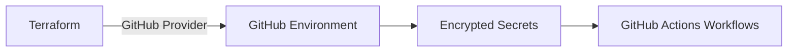

# GitHub Secrets and Environment Setup

> **Navigation:** [README](../../../README.md) > [Getting Started](../../../docs/copilot_report_forge/getting_started.md) > GitHub Secrets
>
> **Previous step:** [Azure GitHub OIDC](../azure_github_oidc/README.md)

---

## Purpose

This Terraform scenario automates the creation of GitHub repository environments and encrypted secrets. It takes the OIDC outputs from the previous step and injects them — along with runtime secrets — into a GitHub environment that workflows can reference.

### Why Automate Secrets?

Manually configuring GitHub environments is error-prone and difficult to audit. By managing secrets through Terraform:
- Secret values are sourced from variables, not copy-pasted from UIs.
- The configuration is version-controlled (secret *names* and *structure*, not values).
- Environments can be reproduced consistently across repositories.

---

## Architecture



---

## What Gets Created

| Resource | Purpose |
|---|---|
| GitHub Environment | Named environment (e.g., `dev`) with protection rules |
| Environment Secrets | Encrypted secrets accessible only to workflows in this environment |

### Secrets Configured

| Secret | Source | Description |
|---|---|---|
| `ARM_CLIENT_ID` | From OIDC scenario output | Azure service principal client ID |
| `ARM_SUBSCRIPTION_ID` | From OIDC scenario output | Azure subscription ID |
| `ARM_TENANT_ID` | From OIDC scenario output | Azure tenant ID |
| `ARM_USE_OIDC` | Always `true` | Enable OIDC authentication |
| `COPILOT_GITHUB_TOKEN` | User-provided | GitHub PAT with Copilot scope |
| `SLACK_WEBHOOK_URL` | User-provided | Slack webhook for notifications |
| `AZURE_BLOB_STORAGE_ACCOUNT_URL` | User-provided | Azure Blob Storage account URL (e.g. `https://<account>.blob.core.windows.net`) |
| `AZURE_BLOB_STORAGE_CONTAINER_NAME` | User-provided | Azure Blob Storage container name |
| `MICROSOFT_FOUNDRY_PROJECT_ENDPOINT` | User-provided | Microsoft Foundry project endpoint URL |
| `BYOK_PROVIDER_TYPE` | User-provided | BYOK provider type (`openai`, `azure`, or `anthropic`) |
| `BYOK_BASE_URL` | User-provided | BYOK base URL for the model endpoint |
| `BYOK_API_KEY` | User-provided | BYOK API key |
| `BYOK_MODEL` | User-provided | BYOK model name (e.g. `gpt-5`) |
| `BYOK_WIRE_API` | User-provided | BYOK wire API format (`completions` or `responses`) |

---

## Usage

```bash
cd infra/scenarios/github_secrets

# Edit terraform.tfvars with your values
terraform init
terraform plan -out=tfplan
terraform apply tfplan
```

### Required Variables

Secrets are managed through a single list variable `actions_environment_secrets` in `terraform.tfvars`. Each entry is an object with `name` and `value` fields.

| Variable | Description |
|---|---|
| `github_owner` | Repository owner (user or organization) |
| `repository_name` | Repository name |
| `environment_name` | GitHub environment name (e.g., `dev`) |
| `actions_environment_secrets` | List of `{ name, value }` objects for environment secrets |

The `github_token` is provided via the `GITHUB_TOKEN` environment variable or the GitHub provider configuration.

#### Example `terraform.tfvars`

```hcl
github_owner    = "ks6088ts"
repository_name = "template-github-copilot"
environment_name = "dev"
actions_environment_secrets = [
  { name = "ARM_CLIENT_ID",                    value = "<from-oidc-output>" },
  { name = "ARM_SUBSCRIPTION_ID",              value = "<from-oidc-output>" },
  { name = "ARM_TENANT_ID",                    value = "<from-oidc-output>" },
  { name = "ARM_USE_OIDC",                     value = "true" },
  { name = "COPILOT_GITHUB_TOKEN",             value = "<your-copilot-token>" },
  { name = "SLACK_WEBHOOK_URL",                value = "<your-slack-webhook-url>" },
  { name = "AZURE_BLOB_STORAGE_ACCOUNT_URL",   value = "https://<account>.blob.core.windows.net" },
  { name = "AZURE_BLOB_STORAGE_CONTAINER_NAME",value = "adhoc" },
  { name = "MICROSOFT_FOUNDRY_PROJECT_ENDPOINT",value = "https://<resource>.services.ai.azure.com/api/projects/<project>" },
  { name = "BYOK_PROVIDER_TYPE",               value = "openai" },
  { name = "BYOK_BASE_URL",                    value = "https://<resource>.openai.azure.com/openai/v1/" },
  { name = "BYOK_API_KEY",                     value = "<your-api-key>" },
  { name = "BYOK_MODEL",                       value = "gpt-5" },
  { name = "BYOK_WIRE_API",                    value = "responses" },
]
```

---

## FAQ

| Question | Answer |
|---|---|
| Where does the GitHub provider token come from? | Set via the `GITHUB_TOKEN` environment variable or configure in `providers.tf` |
| Can I add more secrets? | Yes — add entries to the `actions_environment_secrets` list in `terraform.tfvars` |
| Are secret values stored in state? | Yes — use encrypted remote state (Azure Storage backend) in production |
| How do I remove a secret? | Remove the entry from `actions_environment_secrets` and run `terraform apply` |
