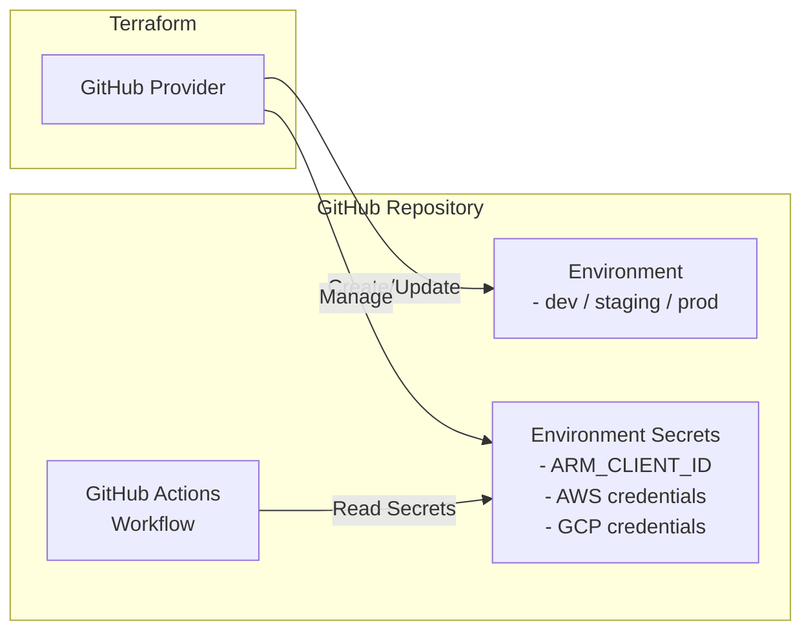

# GitHub Secrets and Environment Setup

This Terraform scenario demonstrates how to create and manage GitHub repository environment secrets using the GitHub provider. It sets up secrets for a specified GitHub repository environment, which can be used in GitHub Actions workflows.

## Architecture



## Prerequisites

- Terraform CLI installed
- GitHub account

## How to use

```shell
# create backend.tf if needed
cat <<EOF > backend.tf
terraform {
  backend "azurerm" {
    resource_group_name  = "YOUR_RESOURCE_GROUP_NAME"
    storage_account_name = "YOUR_STORAGE_ACCOUNT_NAME"
    container_name       = "YOUR_CONTAINER_NAME"
    key                  = "github_secrets.template-github-copilot_dev.tfstate"
  }
}
EOF

# Set environment variables if azure backend is used
export ARM_SUBSCRIPTION_ID=$(az account show --query id --output tsv)

# create terraform.tfvars

# Log in to Azure
az login

# (Optional) Confirm the details for the currently logged-in user
az ad signed-in-user show

# Azure
APPLICATION_NAME="template-github-copilot_dev"
APPLICATION_ID=$(az ad sp list --display-name "$APPLICATION_NAME" --query "[0].appId" --output tsv)
SUBSCRIPTION_ID=$(az account show --query id --output tsv)
TENANT_ID=$(az account show --query tenantId --output tsv)

# GitHub
COPILOT_GITHUB_TOKEN="YOUR_GITHUB_PAT_WITH_REPO_AND_SECRET_PERMISSIONS"

cat <<EOF > terraform.tfvars
github_owner = "ks6088ts"
repository_name = "template-github-copilot"
environment_name = "dev"
actions_environment_secrets = [
  {
    name  = "ARM_CLIENT_ID"
    value = "$APPLICATION_ID"
  },
  {
    name  = "ARM_SUBSCRIPTION_ID"
    value = "$SUBSCRIPTION_ID"
  },
  {
    name  = "ARM_TENANT_ID"
    value = "$TENANT_ID"
  },
  {
    name  = "ARM_USE_OIDC"
    value = "true"
  },
  {
    name  = "COPILOT_GITHUB_TOKEN"
    value = "$COPILOT_GITHUB_TOKEN"
  }
]
EOF

# Initialize Terraform
terraform init

# Plan the deployment
terraform plan

# Apply the deployment
terraform apply -auto-approve

# Confirm the output
terraform output

# Destroy the deployment
terraform destroy -auto-approve
```
