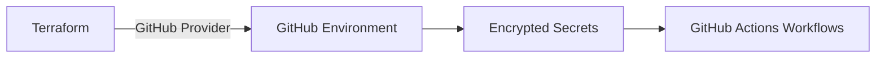

# GitHub Secrets and Environment Setup

> **Navigation:** [README](../../../README.md) > [Getting Started](../../../docs/copilot_report_forge/getting_started.md) > GitHub Secrets
>
> **Previous step:** [Azure GitHub OIDC](../azure_github_oidc/README.md)

---

## Purpose

This Terraform scenario automates the creation of GitHub repository environments and encrypted secrets. It takes the OIDC outputs from the previous step and injects them — along with runtime secrets — into a GitHub environment that workflows can reference.

### Why Automate Secrets?

Manually configuring GitHub environments is error-prone and difficult to audit. By managing secrets through Terraform:
- Secret values are sourced from variables, not copy-pasted from UIs.
- The configuration is version-controlled (secret *names* and *structure*, not values).
- Environments can be reproduced consistently across repositories.

---

## Architecture



---

## What Gets Created

| Resource | Purpose |
|---|---|
| GitHub Environment | Named environment (e.g., `dev`) with protection rules |
| Environment Secrets | Encrypted secrets accessible only to workflows in this environment |

### Secrets Configured

| Secret | Source |
|---|---|
| `ARM_CLIENT_ID` | From OIDC scenario output |
| `ARM_SUBSCRIPTION_ID` | From OIDC scenario output |
| `ARM_TENANT_ID` | From OIDC scenario output |
| `ARM_USE_OIDC` | Always `true` |
| `COPILOT_GITHUB_TOKEN` | User-provided |
| `SLACK_WEBHOOK_URL` | User-provided |

---

## Usage

```bash
cd infra/scenarios/github_secrets

# Edit terraform.tfvars with your values
terraform init
terraform plan -out=tfplan
terraform apply tfplan
```

### Required Variables

| Variable | Description |
|---|---|
| `github_token` | GitHub PAT with `repo` and `environment` scopes |
| `github_owner` | Repository owner (user or organization) |
| `github_repository_name` | Repository name |
| `environment_name` | GitHub environment name (e.g., `dev`) |
| `arm_client_id` | From OIDC scenario output |
| `arm_subscription_id` | From OIDC scenario output |
| `arm_tenant_id` | From OIDC scenario output |
| `copilot_github_token` | Copilot authentication token |
| `slack_webhook_url` | Slack webhook for notifications |

---

## FAQ

| Question | Answer |
|---|---|
| Where does `github_token` come from? | Generate a GitHub PAT at Settings → Developer Settings → Personal Access Tokens |
| Can I add more secrets? | Yes — add variables and `github_actions_environment_secret` resources in `main.tf` |
| Are secret values stored in state? | Yes — use encrypted remote state (Azure Storage backend) in production |
